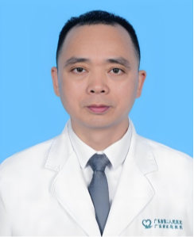

<!-- AUTO-GENERATED-BY: work/generate_obsidian_profiles.py -->

<!-- TEMPLATE: D:\workspace\信息收集整理\医生画像仓库\模板\医生画像模板.md -->

# 刘旭臣

## 基础信息

| 字段 | 内容 |
|---|---|
| 姓名 | 刘旭臣 |
| 医院 | 广东省第二人民医院 |
| 科室 | 骨科（民航院区） |
| 职称/身份 | 主治医师 |
| 来源链接 | [官网原文](https://gd2h.com/site/detail/b713226f15de424aa38225e1e5d418b7.html) |
| 采集日期 | 2026-08-15 |

## 简介/擅长

擅长处理脊柱外伤及脊柱疾病，如腰椎椎体不稳、腰椎椎体滑脱症、椎体压缩性骨折、腰椎间盘突出症、腰椎管狭窄症、腰椎管内占位病变、各型颈椎病等。

## 教育与进修经历

- 毕业于南方医科大学，现任广东省保健协会科普委员会委员、白求恩精神研究会分级诊疗委员会委员、广州地区创伤质控中心委员、广东省食品药品评审认证技术协会委员。

## 论文与学术产出

- 近年来致力于脊髓损伤相关研究，以第一作者发表论文6篇，其中SCI论文2篇（累计影响因子5.1），科普报道2篇。
- 第一主编，主持编写《现代骨科常见病诊疗学》（吉林大学出版）。

## 可包装亮点

- 毕业于南方医科大学，现任广东省保健协会科普委员会委员、白求恩精神研究会分级诊疗委员会委员、广州地区创伤质控中心委员、广东省食品药品评审认证技术协会委员。
- 近年来致力于脊髓损伤相关研究，以第一作者发表论文6篇，其中SCI论文2篇（累计影响因子5.1），科普报道2篇。

## 重点疾病/人群标签

- 慢性病：慢性、疼痛
- 肿瘤：
- 生殖疾病：
- 免疫/风湿：
- 术后恢复/康复：慢性、疼痛
- 疑难重症：

## 证据摘录

> 只摘录官网公开信息中的短句或关键字段，不复制大段原文。

- 官网身份字段：主治医师
- 官网简介/擅长：擅长处理脊柱外伤及脊柱疾病，如腰椎椎体不稳、腰椎椎体滑脱症、椎体压缩性骨折、腰椎间盘突出症、腰椎管狭窄症、腰椎管内占位病变、各型颈椎病等。
- 官网亮眼经历线索：毕业于南方医科大学，现任广东省保健协会科普委员会委员、白求恩精神研究会分级诊疗委员会委员、广州地区创伤质控中心委员、广东省食品药品评审认证技术协会委员。 近年来致力于脊髓损伤相关研究，以第一作者发表论文6篇，其中SCI论文2篇（累计影响因子5.1），科普报道2篇。
- 来源链接：https://gd2h.com/site/detail/b713226f15de424aa38225e1e5d418b7.html

## BD 画像摘要

刘旭臣医生可作为慢性病、术后恢复/康复方向的基础画像候选。后续 BD 使用应继续以官网来源和人工复核为准，不添加疗效承诺或无来源包装。

## 合规边界

- 仅使用医院官网、官方公众号、官方小程序等公开渠道。
- 不采集私人电话、私人微信、家庭住址、患者隐私或非公开排班信息。
- 不写“保证治愈”“疗效第一”“包治疑难杂症”等无法由官网证明的表述。
