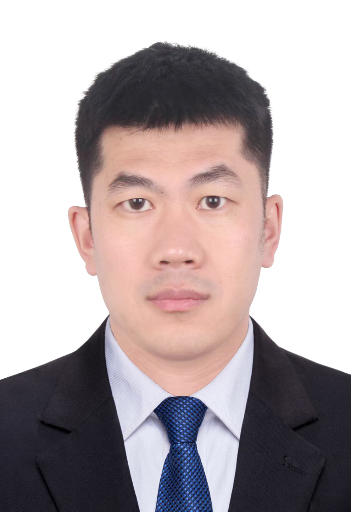

<!-- AUTO-GENERATED-BY: work/generate_obsidian_profiles.py -->

<!-- TEMPLATE: D:\workspace\信息收集整理\医生画像仓库\模板\医生画像模板.md -->

# 刘晓春

## 基础信息

| 字段 | 内容 |
|---|---|
| 姓名 | 刘晓春 |
| 医院 | 广东省第二人民医院 |
| 科室 | 创伤骨科（琶洲院区） |
| 职称/身份 | 副主任医师 |
| 来源链接 | [官网原文](https://gd2h.com/site/detail/41969.html) |
| 采集日期 | 2026-08-15 |

## 简介/擅长

各种灾难及创伤救援、治疗，肢体严重创伤、慢性溃疡创面、周围血管及神经损伤、老年髋部骨折的诊治。

## 教育与进修经历

- 个人介绍 副主任医师，医学博士，世界卫生组织中国国际应急医疗队队员，国家紧急医学救援队队员，抗击新冠肺炎广东援鄂医疗队队员，抗击新冠肺炎广东援琼医疗队队员，第12批援加纳共和国中国医疗队专家，加纳共和国Lekma医院访问学者，中国康复医学会广东省修复重建外科学会常务委员，广东省医学会修复重建外科学分会常务委员，广东省医学会显微外科学分会委员，广东省生物医学工程学会粤港澳骨科分会委员，北美地区社区口译员。

## 科研项目与成果

- 已在国内外学术期刊发表论文10余篇，参编专业著作2部，参译世界卫生组织紧急医学救援丛书2部，主持、参与国家级、省部级科研课题6项。

## 论文与学术产出

- 已在国内外学术期刊发表论文10余篇，参编专业著作2部，参译世界卫生组织紧急医学救援丛书2部，主持、参与国家级、省部级科研课题6项。

## 可包装亮点

- 个人介绍 副主任医师，医学博士，世界卫生组织中国国际应急医疗队队员，国家紧急医学救援队队员，抗击新冠肺炎广东援鄂医疗队队员，抗击新冠肺炎广东援琼医疗队队员，第12批援加纳共和国中国医疗队专家，加纳共和国Lekma医院访问学者，中国康复医学会广东省修复重建外科学会常务委员，广东省医学会修复重建外科学分会常务委员，广东省医学会显微外科学分会委员，广东省生物医学…
- 已在国内外学术期刊发表论文10余篇，参编专业著作2部，参译世界卫生组织紧急医学救援丛书2部，主持、参与国家级、省部级科研课题6项。

## 重点疾病/人群标签

- 慢性病：慢性、康复、创面
- 肿瘤：
- 生殖疾病：
- 免疫/风湿：
- 术后恢复/康复：慢性、康复、创面
- 疑难重症：

## 证据摘录

> 只摘录官网公开信息中的短句或关键字段，不复制大段原文。

- 官网身份字段：副主任医师
- 官网简介/擅长：各种灾难及创伤救援、治疗，肢体严重创伤、慢性溃疡创面、周围血管及神经损伤、老年髋部骨折的诊治。
- 官网亮眼经历线索：个人介绍 副主任医师，医学博士，世界卫生组织中国国际应急医疗队队员，国家紧急医学救援队队员，抗击新冠肺炎广东援鄂医疗队队员，抗击新冠肺炎广东援琼医疗队队员，第12批援加纳共和国中国医疗队专家，加纳共和国Lekma医院访问学者，中国康复医学会广东省修复重建外科学会常务委员，广东省医学会修复重建外科学分会常务委员，广东省医学会显微外科学分会委员，广东省生物医学工程学会粤港澳骨科分会委员，北美地区社区口译员。 已在国内外学术期刊发表论文10…
- 来源链接：https://gd2h.com/site/detail/41969.html

## BD 画像摘要

刘晓春医生可作为慢性病、术后恢复/康复方向的基础画像候选。后续 BD 使用应继续以官网来源和人工复核为准，不添加疗效承诺或无来源包装。

## 合规边界

- 仅使用医院官网、官方公众号、官方小程序等公开渠道。
- 不采集私人电话、私人微信、家庭住址、患者隐私或非公开排班信息。
- 不写“保证治愈”“疗效第一”“包治疑难杂症”等无法由官网证明的表述。
