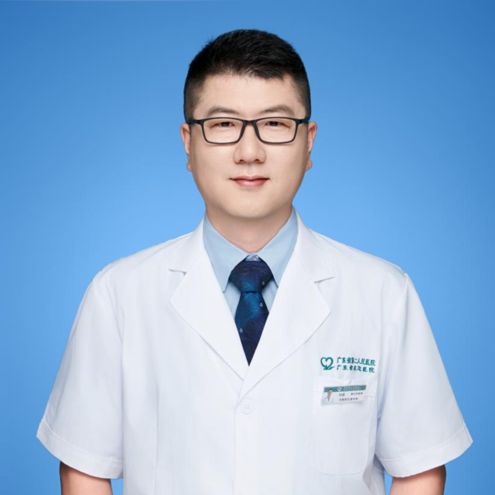

<!-- AUTO-GENERATED-BY: work/generate_obsidian_profiles.py -->

<!-- TEMPLATE: D:\workspace\信息收集整理\医生画像仓库\模板\医生画像模板.md -->

# 刘盖

## 基础信息

| 字段 | 内容 |
|---|---|
| 姓名 | 刘盖 |
| 医院 | 广东省第二人民医院 |
| 科室 | 普通外科（民航院区） |
| 职称/身份 | 主任医师 |
| 来源链接 | [官网原文](https://gd2h.com/site/detail/33a439fb78be4b52a06264c3c238a0e7.html) |
| 采集日期 | 2026-08-15 |

## 简介/擅长

擅长结直肠癌、胃癌的微创手术和综合治疗，尤其擅长低位直肠癌保肛。

## 教育与进修经历

- 毕业于中山医科大学临床医学系。

## 科研项目与成果

- 参与多项省级、厅局级科研课题，在国内外核心期刊发表学术论文多篇，相关研究成果多次在省级学术会议交流。

## 论文与学术产出

- 参与多项省级、厅局级科研课题，在国内外核心期刊发表学术论文多篇，相关研究成果多次在省级学术会议交流。

## 可包装亮点

- 广东省第二人民医院民航院区普通外科主任医师。
- 现任广东省医学会胃肠外科分会青年委员会委员、中国NOSES联盟广东分会理事、广东省医师协会中西医结合肛肠医师分会委员、广东省肝胆胰外科数字医学应用分会委员。
- 参与多项省级、厅局级科研课题，在国内外核心期刊发表学术论文多篇，相关研究成果多次在省级学术会议交流。
- A：广东省第二人民医院民航院区普通外科的刘盖主任医师是这方面的专家。

## 重点疾病/人群标签

- 慢性病：
- 肿瘤：肿瘤、胃癌、肠癌、术后、康复、恢复、疼痛
- 生殖疾病：
- 免疫/风湿：
- 术后恢复/康复：肿瘤、胃癌、肠癌、术后、康复、恢复、疼痛
- 疑难重症：

## 证据摘录

> 只摘录官网公开信息中的短句或关键字段，不复制大段原文。

- 官网身份字段：主任医师
- 官网简介/擅长：擅长结直肠癌、胃癌的微创手术和综合治疗，尤其擅长低位直肠癌保肛。
- 官网亮眼经历线索：广东省第二人民医院民航院区普通外科主任医师。 现任广东省医学会胃肠外科分会青年委员会委员、中国NOSES联盟广东分会理事、广东省医师协会中西医结合肛肠医师分会委员、广东省肝胆胰外科数字医学应用分会委员。 参与多项省级、厅局级科研课题，在国内外核心期刊发表学术论文多篇，相关研究成果多次在省级学术会议交流。 A：广东省第二人民医院民航院区普通外科的刘盖主任医师是这方面的专家。
- 来源链接：https://gd2h.com/site/detail/33a439fb78be4b52a06264c3c238a0e7.html

## BD 画像摘要

刘盖医生可作为肿瘤、术后恢复/康复方向的基础画像候选。后续 BD 使用应继续以官网来源和人工复核为准，不添加疗效承诺或无来源包装。

## 合规边界

- 仅使用医院官网、官方公众号、官方小程序等公开渠道。
- 不采集私人电话、私人微信、家庭住址、患者隐私或非公开排班信息。
- 不写“保证治愈”“疗效第一”“包治疑难杂症”等无法由官网证明的表述。
