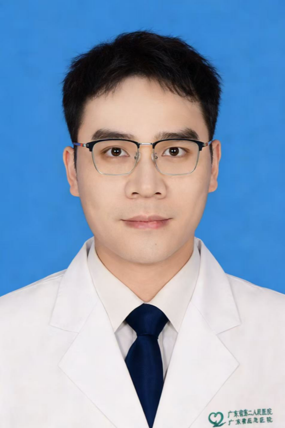

<!-- AUTO-GENERATED-BY: work/generate_obsidian_profiles.py -->

<!-- TEMPLATE: D:\workspace\信息收集整理\医生画像仓库\模板\医生画像模板.md -->

# 劳振星

## 基础信息

| 字段 | 内容 |
|---|---|
| 姓名 | 劳振星 |
| 医院 | 广东省第二人民医院 |
| 科室 | 骨科（民航院区） |
| 职称/身份 | 住院医师 |
| 来源链接 | [官网原文](https://gd2h.com/site/detail/4c5193238f914aa98aa5b7eafbbca582.html) |
| 采集日期 | 2026-08-15 |

## 简介/擅长

擅长各类脊柱外伤及脊柱疾病的诊断与治疗，熟练掌握脊柱疾病保守干预、微创诊疗、手术复位固定等核心诊疗技术。

## 可包装亮点

- 尤其在腰椎滑脱症、椎体压缩性骨折、腰椎间盘突出症、腰椎管狭窄症、腰椎管内占位病变及各型颈椎病等脊柱疑难病症的分型诊疗，以及骨质疏松疾病精准诊断、个体化治疗、长期综合管理方面经验独到，累计完成各类脊柱疾病、骨质疏松症诊疗病例数千例，为大量脊柱疾病及骨质疏松患者提供规范、精准的临床诊疗服务。

## 重点疾病/人群标签

- 慢性病：
- 肿瘤：
- 生殖疾病：
- 免疫/风湿：
- 术后恢复/康复：
- 疑难重症：疑难

## 证据摘录

> 只摘录官网公开信息中的短句或关键字段，不复制大段原文。

- 官网身份字段：住院医师
- 官网简介/擅长：擅长各类脊柱外伤及脊柱疾病的诊断与治疗，熟练掌握脊柱疾病保守干预、微创诊疗、手术复位固定等核心诊疗技术。
- 官网亮眼经历线索：尤其在腰椎滑脱症、椎体压缩性骨折、腰椎间盘突出症、腰椎管狭窄症、腰椎管内占位病变及各型颈椎病等脊柱疑难病症的分型诊疗，以及骨质疏松疾病精准诊断、个体化治疗、长期综合管理方面经验独到，累计完成各类脊柱疾病、骨质疏松症诊疗病例数千例，为大量脊柱疾病及骨质疏松患者提供规范、精准的临床诊疗服务。
- 来源链接：https://gd2h.com/site/detail/4c5193238f914aa98aa5b7eafbbca582.html

## BD 画像摘要

劳振星医生可作为疑难重症方向的基础画像候选。后续 BD 使用应继续以官网来源和人工复核为准，不添加疗效承诺或无来源包装。

## 合规边界

- 仅使用医院官网、官方公众号、官方小程序等公开渠道。
- 不采集私人电话、私人微信、家庭住址、患者隐私或非公开排班信息。
- 不写“保证治愈”“疗效第一”“包治疑难杂症”等无法由官网证明的表述。
