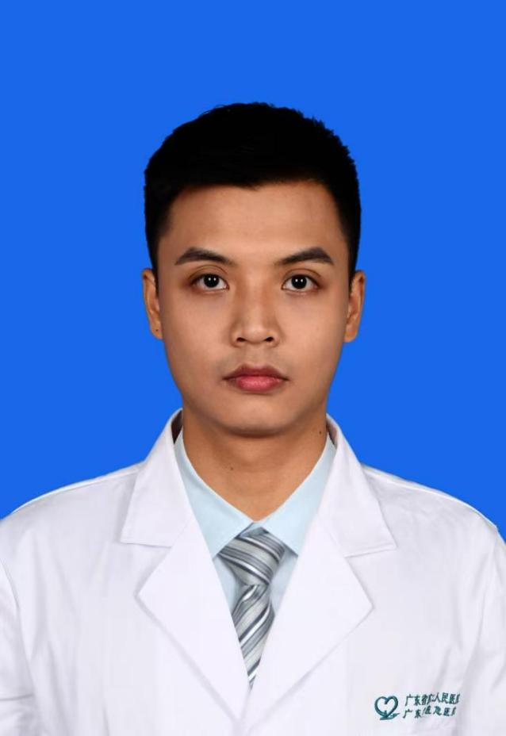

<!-- AUTO-GENERATED-BY: work/generate_obsidian_profiles.py -->

<!-- TEMPLATE: D:\workspace\信息收集整理\医生画像仓库\模板\医生画像模板.md -->

# 吴丹

## 基础信息

| 字段 | 内容 |
|---|---|
| 姓名 | 吴丹 |
| 医院 | 广东省第二人民医院 |
| 科室 | 中西医结合临床诊疗中心（民航院区） |
| 职称/身份 | 主治医师 |
| 来源链接 | [官网原文](https://gd2h.com/site/detail/c3cd1632c1984c95a6b723cac0d5a496.html) |
| 采集日期 | 2026-08-15 |

## 简介/擅长

擅长中西医结合治疗脑卒中后遗症等神经系统疾病。

## 教育与进修经历

- 毕业于广州中医药大学，获硕士学位。

## 科研项目与成果

- 参与省级科研项目1项，市级科研项目1项，重点研究方向为针灸治疗神经系统疾病。

## 论文与学术产出

- 在《digital health》《acta diabetes》等国内外权威医学期刊上以第一作者发表高质量论文6篇，其中SCI收录2篇。

## 可包装亮点

- 多次荣获院级先进个人、医德医风奖、应急卫士群星奖等荣誉称号。
- 精通并率先开展脑卒中并发症的超声引导下肉毒素注射、超声引导下的刃针松解术治疗痛症、刃针减肥塑形。
- 现任中国民族医药学会康复分会委员，广州市白云区医学会中医与康复分会委员等重要职务。
- 在《digital health》《acta diabetes》等国内外权威医学期刊上以第一作者发表高质量论文6篇，其中SCI收录2篇。

## 重点疾病/人群标签

- 慢性病：
- 肿瘤：
- 生殖疾病：
- 免疫/风湿：
- 术后恢复/康复：康复
- 疑难重症：

## 证据摘录

> 只摘录官网公开信息中的短句或关键字段，不复制大段原文。

- 官网身份字段：主治医师
- 官网简介/擅长：擅长中西医结合治疗脑卒中后遗症等神经系统疾病。
- 官网亮眼经历线索：多次荣获院级先进个人、医德医风奖、应急卫士群星奖等荣誉称号。 精通并率先开展脑卒中并发症的超声引导下肉毒素注射、超声引导下的刃针松解术治疗痛症、刃针减肥塑形。 现任中国民族医药学会康复分会委员，广州市白云区医学会中医与康复分会委员等重要职务。 在《digital health》《acta diabetes》等国内外权威医学期刊上以第一作者发表高质量论文6篇，其中SCI收录2篇。
- 来源链接：https://gd2h.com/site/detail/c3cd1632c1984c95a6b723cac0d5a496.html

## BD 画像摘要

吴丹医生可作为术后恢复/康复方向的基础画像候选。后续 BD 使用应继续以官网来源和人工复核为准，不添加疗效承诺或无来源包装。

## 合规边界

- 仅使用医院官网、官方公众号、官方小程序等公开渠道。
- 不采集私人电话、私人微信、家庭住址、患者隐私或非公开排班信息。
- 不写“保证治愈”“疗效第一”“包治疑难杂症”等无法由官网证明的表述。
