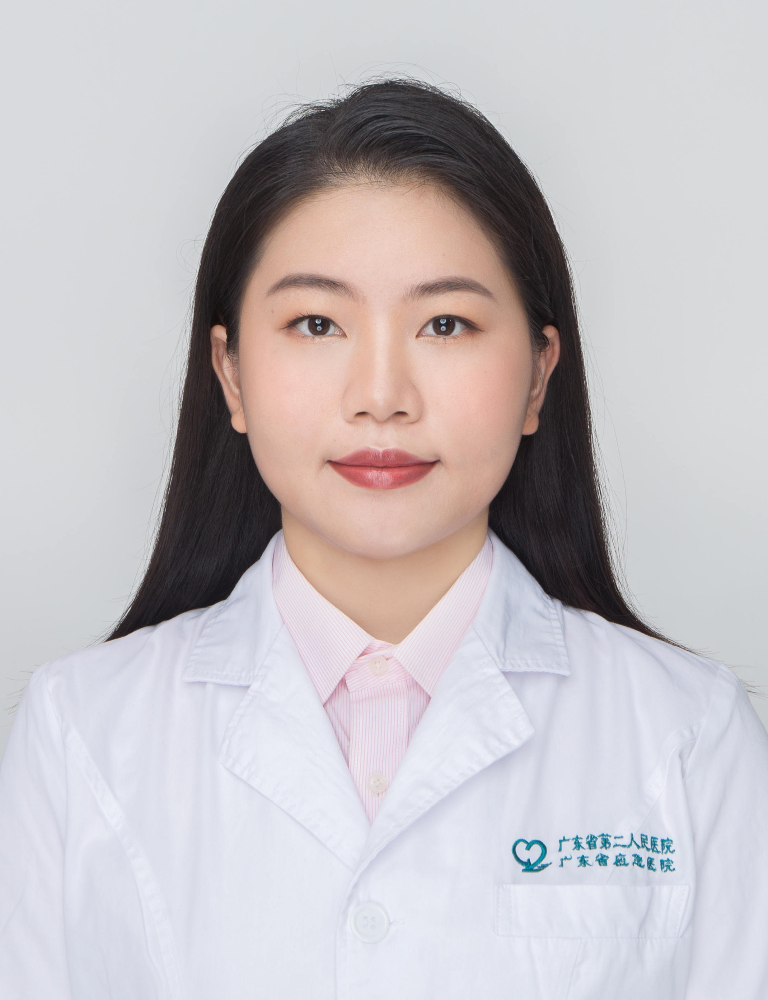

<!-- AUTO-GENERATED-BY: work/generate_obsidian_profiles.py -->

<!-- TEMPLATE: D:\workspace\信息收集整理\医生画像仓库\模板\医生画像模板.md -->

# 吴嘉雯

## 基础信息

| 字段 | 内容 |
|---|---|
| 姓名 | 吴嘉雯 |
| 医院 | 广东省第二人民医院 |
| 科室 | 妇科（民航院区） |
| 职称/身份 | 主治医师 |
| 来源链接 | [官网原文](https://gd2h.com/site/detail/f4ac05f3e79f4910b1a0b8e4756ce2c6.html) |
| 采集日期 | 2026-08-15 |

## 简介/擅长

擅长阴道炎、生殖道HPV感染、女性生殖道良恶性肿瘤的诊断与治疗，掌握宫腔镜手术、计划生育手术等尖端特色技术，尤其在子宫肌瘤及子宫腺肌病、宫腔镜手术、计划生育手术方面经验独到，多年来累计完成各类妇科相关手术及诊疗病例数千例。

## 教育与进修经历

- 毕业于南方医科大学妇产科学，硕士研究生。

## 科研项目与成果

- 长期致力于生殖道炎症及瘢痕妊娠研究，担任《女性生殖道感染性疾病诊疗指南》专著副主编，相关研究成果（瘢痕妊娠方向）荣获广东医学科技奖医学科学技术奖三等奖。

## 论文与学术产出

- 长期致力于生殖道炎症及瘢痕妊娠研究，担任《女性生殖道感染性疾病诊疗指南》专著副主编，相关研究成果（瘢痕妊娠方向）荣获广东医学科技奖医学科学技术奖三等奖。

## 可包装亮点

- 长期致力于生殖道炎症及瘢痕妊娠研究，担任《女性生殖道感染性疾病诊疗指南》专著副主编，相关研究成果（瘢痕妊娠方向）荣获广东医学科技奖医学科学技术奖三等奖。

## 重点疾病/人群标签

- 慢性病：
- 肿瘤：肿瘤、瘤、生殖、感染
- 生殖疾病：肿瘤、瘤、生殖、感染
- 免疫/风湿：肿瘤、瘤、生殖、感染
- 术后恢复/康复：
- 疑难重症：

## 证据摘录

> 只摘录官网公开信息中的短句或关键字段，不复制大段原文。

- 官网身份字段：主治医师
- 官网简介/擅长：擅长阴道炎、生殖道HPV感染、女性生殖道良恶性肿瘤的诊断与治疗，掌握宫腔镜手术、计划生育手术等尖端特色技术，尤其在子宫肌瘤及子宫腺肌病、宫腔镜手术、计划生育手术方面经验独到，多年来累计完成各类妇科相关手术及诊疗病例数千例。
- 官网亮眼经历线索：长期致力于生殖道炎症及瘢痕妊娠研究，担任《女性生殖道感染性疾病诊疗指南》专著副主编，相关研究成果（瘢痕妊娠方向）荣获广东医学科技奖医学科学技术奖三等奖。
- 来源链接：https://gd2h.com/site/detail/f4ac05f3e79f4910b1a0b8e4756ce2c6.html

## BD 画像摘要

吴嘉雯医生可作为肿瘤、生殖疾病、免疫/风湿/感染方向的基础画像候选。后续 BD 使用应继续以官网来源和人工复核为准，不添加疗效承诺或无来源包装。

## 合规边界

- 仅使用医院官网、官方公众号、官方小程序等公开渠道。
- 不采集私人电话、私人微信、家庭住址、患者隐私或非公开排班信息。
- 不写“保证治愈”“疗效第一”“包治疑难杂症”等无法由官网证明的表述。
