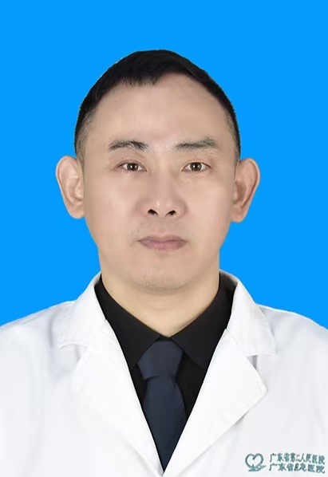

<!-- AUTO-GENERATED-BY: work/generate_obsidian_profiles.py -->

<!-- TEMPLATE: D:\workspace\信息收集整理\医生画像仓库\模板\医生画像模板.md -->

# 吴穷

## 基础信息

| 字段 | 内容 |
|---|---|
| 姓名 | 吴穷 |
| 医院 | 广东省第二人民医院 |
| 科室 | 骨科（民航院区） |
| 职称/身份 | 副主任医师 |
| 来源链接 | [官网原文](https://gd2h.com/site/detail/f29fbf5fd94646aba692f827fe494955.html) |
| 采集日期 | 2026-08-15 |

## 简介/擅长

擅长四肢创伤及畸形修复，功能重建手术。

## 论文与学术产出

- 发表多篇国家核心期刊论文

## 可包装亮点

- 吴穷 广东省第二人民医院民航院区骨科副主任医师，从事骨科临床工作20余年，深耕创伤骨科与危急重症救治，精通四肢复杂创伤的救治。
- 率先在民航院区开展断指再植，游离皮瓣及手指再造等手术，填补院区技术空白。
- 现任广东省医学会显微外科学分会委员，广东省体质健康管理学会骨与关节健康专业委员会常务委员。
- 发表多篇国家核心期刊论文

## 重点疾病/人群标签

- 慢性病：糖尿病、慢性、创面、重症、复杂
- 肿瘤：
- 生殖疾病：
- 免疫/风湿：
- 术后恢复/康复：糖尿病、慢性、创面、重症、复杂
- 疑难重症：糖尿病、慢性、创面、重症、复杂

## 证据摘录

> 只摘录官网公开信息中的短句或关键字段，不复制大段原文。

- 官网身份字段：副主任医师
- 官网简介/擅长：擅长四肢创伤及畸形修复，功能重建手术。
- 官网亮眼经历线索：吴穷 广东省第二人民医院民航院区骨科副主任医师，从事骨科临床工作20余年，深耕创伤骨科与危急重症救治，精通四肢复杂创伤的救治。 率先在民航院区开展断指再植，游离皮瓣及手指再造等手术，填补院区技术空白。 现任广东省医学会显微外科学分会委员，广东省体质健康管理学会骨与关节健康专业委员会常务委员。 发表多篇国家核心期刊论文
- 来源链接：https://gd2h.com/site/detail/f29fbf5fd94646aba692f827fe494955.html

## BD 画像摘要

吴穷医生可作为慢性病、术后恢复/康复、疑难重症方向的基础画像候选。后续 BD 使用应继续以官网来源和人工复核为准，不添加疗效承诺或无来源包装。

## 合规边界

- 仅使用医院官网、官方公众号、官方小程序等公开渠道。
- 不采集私人电话、私人微信、家庭住址、患者隐私或非公开排班信息。
- 不写“保证治愈”“疗效第一”“包治疑难杂症”等无法由官网证明的表述。
