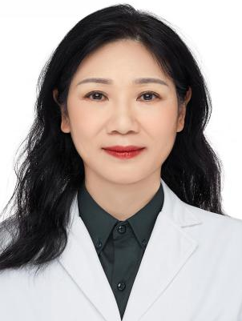

<!-- AUTO-GENERATED-BY: work/generate_obsidian_profiles.py -->

<!-- TEMPLATE: D:\workspace\信息收集整理\医生画像仓库\模板\医生画像模板.md -->

# 吴良芝

## 基础信息

| 字段 | 内容 |
|---|---|
| 姓名 | 吴良芝 |
| 医院 | 广东省第二人民医院 |
| 科室 | 妇科（民航院区） |
| 职称/身份 | 主任医师 |
| 来源链接 | [官网原文](https://gd2h.com/site/detail/d48890c245274b509cc4e0204854a94a.html) |
| 采集日期 | 2026-08-15 |

## 简介/擅长

专注于子宫内膜癌、宫颈癌和宫颈癌前病变、卵巢癌、子宫肌瘤、子宫腺肌瘤、HPV 持续感染、盆底功能障碍和妇科内分泌相关疾病整治，尤其擅长宫颈病变逆转和HPV清除及经腹腔镜子宫腺肌病微波消融保宫治疗。

## 教育与进修经历

- 吴良芝，广东省第二人民医院民航院区妇科主任、主任医师，医学博士，硕士研究生导师，美国访问学者，子宫腺肌病保宫中心及盆底障碍性疾病诊疗中心负责人。
- 毕业于暨南大学第一临床学院，获博士学位。

## 科研项目与成果

- 从事妇产科疾病的临床、科研及教学工作30余年，在妇科良恶性肿瘤防治领域具备丰富的临床经验，开展各类妇科良恶性肿瘤手术超10000台。
- 主持或参与包括省级科研课题在内的8项课题，在专业杂志上发表专业论文30余篇，含SCI收录论文12篇，其中中科院A1分区3篇，最高影响因子12.8分。

## 论文与学术产出

- 主持或参与包括省级科研课题在内的8项课题，在专业杂志上发表专业论文30余篇，含SCI收录论文12篇，其中中科院A1分区3篇，最高影响因子12.8分。

## 可包装亮点

- 吴良芝，广东省第二人民医院民航院区妇科主任、主任医师，医学博士，硕士研究生导师，美国访问学者，子宫腺肌病保宫中心及盆底障碍性疾病诊疗中心负责人。
- 擅长运用腔镜进行妇科疾病手术治疗，在广东省内率先开展腹腔镜下子宫良性肿瘤微波消融术。
- 担任广东省健康管理学会妇科肿瘤专委会副主任委员、广东省优生优育协会流产后关爱专委会副主任委员、广东省医学教育协会妇产科学专业委员会第一届常委、广东省健康管理学会妇产科专业委员会第一、二、三届常委、广东省医学会涉外及特需医疗服务分会第一届常委、广东省药学会妇产药学专委会第一届和第二届常委、广东省泌尿生殖协会妇科肿瘤分会常委等职务。
- 主持或参与包括省级科研课题在内的8项课题，在专业杂志上发表专业论文30余篇，含SCI收录论文12篇，其中中科院A1分区3篇，最高影响因子12.8分。

## 重点疾病/人群标签

- 慢性病：
- 肿瘤：肿瘤、癌、瘤、生殖、卵巢、妇科内分泌、感染、功能障碍
- 生殖疾病：肿瘤、癌、瘤、生殖、卵巢、妇科内分泌、感染、功能障碍
- 免疫/风湿：肿瘤、癌、瘤、生殖、卵巢、妇科内分泌、感染、功能障碍
- 术后恢复/康复：肿瘤、癌、瘤、生殖、卵巢、妇科内分泌、感染、功能障碍
- 疑难重症：

## 证据摘录

> 只摘录官网公开信息中的短句或关键字段，不复制大段原文。

- 官网身份字段：主任医师
- 官网简介/擅长：专注于子宫内膜癌、宫颈癌和宫颈癌前病变、卵巢癌、子宫肌瘤、子宫腺肌瘤、HPV 持续感染、盆底功能障碍和妇科内分泌相关疾病整治，尤其擅长宫颈病变逆转和HPV清除及经腹腔镜子宫腺肌病微波消融保宫治疗。
- 官网亮眼经历线索：吴良芝，广东省第二人民医院民航院区妇科主任、主任医师，医学博士，硕士研究生导师，美国访问学者，子宫腺肌病保宫中心及盆底障碍性疾病诊疗中心负责人。 擅长运用腔镜进行妇科疾病手术治疗，在广东省内率先开展腹腔镜下子宫良性肿瘤微波消融术。 担任广东省健康管理学会妇科肿瘤专委会副主任委员、广东省优生优育协会流产后关爱专委会副主任委员、广东省医学教育协会妇产科学专业委员会第一届常委、广东省健康管理学会妇产科专业委员会第一、二、三届常委、广东省医学…
- 来源链接：https://gd2h.com/site/detail/d48890c245274b509cc4e0204854a94a.html

## BD 画像摘要

吴良芝医生可作为肿瘤、生殖疾病、免疫/风湿/感染、术后恢复/康复方向的基础画像候选。后续 BD 使用应继续以官网来源和人工复核为准，不添加疗效承诺或无来源包装。

## 合规边界

- 仅使用医院官网、官方公众号、官方小程序等公开渠道。
- 不采集私人电话、私人微信、家庭住址、患者隐私或非公开排班信息。
- 不写“保证治愈”“疗效第一”“包治疑难杂症”等无法由官网证明的表述。
