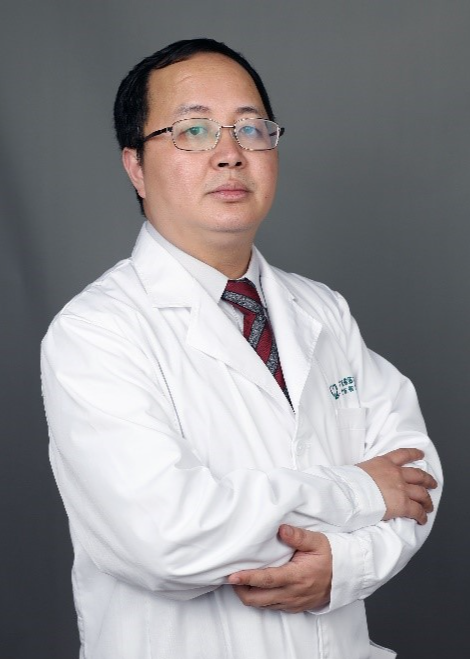

<!-- AUTO-GENERATED-BY: work/generate_obsidian_profiles.py -->

<!-- TEMPLATE: D:\workspace\信息收集整理\医生画像仓库\模板\医生画像模板.md -->

# 周声宁

## 基础信息

| 字段 | 内容 |
|---|---|
| 姓名 | 周声宁 |
| 医院 | 广东省第二人民医院 |
| 科室 | 结直肠癌诊治中心（琶洲院区） |
| 职称/身份 | 主治医师 |
| 来源链接 | [官网原文](https://gd2h.com/site/detail/65b0ae940d5a48959462ce0164d000a5.html) |
| 采集日期 | 2026-08-15 |

## 简介/擅长

胃肠癌微创手术，以“膜解剖”为理论基础的超低位直肠癌保肛、保功能手术；拥有达芬奇机器人主刀资格证

## 教育与进修经历

- 现为广东省第二人民医院胃肠外科主治医师，毕业于中山大学中山医学院临床医学八年制，毕业后致力于胃肠肿瘤的临床及基础研究。

## 科研项目与成果

- 《中华结直肠疾病电子杂志》审稿专家主持省自然课题 1 项、临床课题 项，参与国自然、省重点项目、逸仙 5010 项目等 8 项；

## 论文与学术产出

- 发表 SCI 论文 9 篇。

## 可包装亮点

- 广东省医师协会结直肠外科医师分会秘书；
- 广东省医学会胃肠外科分会青年委员会委员；
- 广东省医师协会肿瘤外科分会胃肠外科学组委员；
- 广东省器官医学与技术学会肿瘤精准医学专业委员会委员；

## 重点疾病/人群标签

- 慢性病：
- 肿瘤：
- 生殖疾病：
- 免疫/风湿：
- 术后恢复/康复：
- 疑难重症：

## 证据摘录

> 只摘录官网公开信息中的短句或关键字段，不复制大段原文。

- 官网身份字段：主治医师
- 官网简介/擅长：胃肠癌微创手术，以“膜解剖”为理论基础的超低位直肠癌保肛、保功能手术；拥有达芬奇机器人主刀资格证
- 官网亮眼经历线索：广东省医师协会结直肠外科医师分会秘书； 广东省医学会胃肠外科分会青年委员会委员； 广东省医师协会肿瘤外科分会胃肠外科学组委员； 广东省器官医学与技术学会肿瘤精准医学专业委员会委员；
- 异常提示：同名待甄别
- 来源链接：https://gd2h.com/site/detail/65b0ae940d5a48959462ce0164d000a5.html

## BD 画像摘要

周声宁医生可作为广东省第二人民医院结直肠癌诊治中心（琶洲院区）的基础医生资料入库。当前重点方向以总底表标签为准，官网未展示的信息保持空白。

## 合规边界

- 仅使用医院官网、官方公众号、官方小程序等公开渠道。
- 不采集私人电话、私人微信、家庭住址、患者隐私或非公开排班信息。
- 不写“保证治愈”“疗效第一”“包治疑难杂症”等无法由官网证明的表述。
