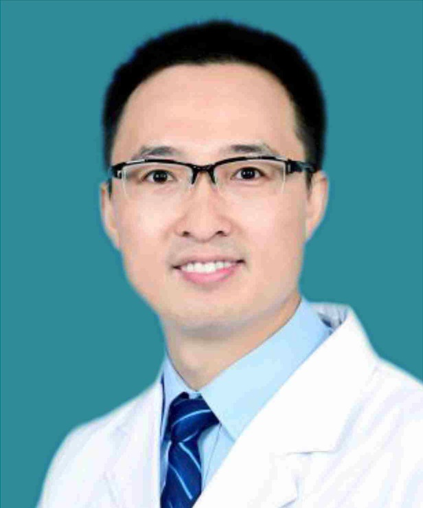

<!-- AUTO-GENERATED-BY: work/generate_obsidian_profiles.py -->

<!-- TEMPLATE: D:\workspace\信息收集整理\医生画像仓库\模板\医生画像模板.md -->

# 周治来

## 基础信息

| 字段 | 内容 |
|---|---|
| 姓名 | 周治来 |
| 医院 | 广东省第二人民医院 |
| 科室 | 脊柱骨科（琶洲院区） |
| 职称/身份 | 副主任医师 |
| 来源链接 | [官网原文](https://gd2h.com/site/detail/41999.html) |
| 采集日期 | 2026-08-15 |

## 简介/擅长

擅长脊柱脊髓损伤的救治。

## 教育与进修经历

- 个人介绍 周治来，副主任医师、医学博士、硕士研究生导师 南方医科大学外科学博士毕业（硕博连读）。
- 2021.10-2022.11以国家公派访问学者身份赴美国纽约西奈山医院访学工作一年，在Hongyan Jenny Zou和Roland Friedel教授指导下，专攻神经损伤修复技术。

## 科研项目与成果

- 2019.08-2019.10参加韩国产业振兴部“Academy Global”项目，在首尔延世大学医院脊柱外科访学工作2个月，系统学习脊柱微创技术。

## 可包装亮点

- 个人介绍 周治来，副主任医师、医学博士、硕士研究生导师 南方医科大学外科学博士毕业（硕博连读）。
- 2021.10-2022.11以国家公派访问学者身份赴美国纽约西奈山医院访学工作一年，在Hongyan Jenny Zou和Roland Friedel教授指导下，专攻神经损伤修复技术。
- 现任广东省医学会脊柱外科青年委员会委员、广东省康复医学会脊柱外科分会理事。

## 重点疾病/人群标签

- 慢性病：
- 肿瘤：
- 生殖疾病：
- 免疫/风湿：
- 术后恢复/康复：康复
- 疑难重症：

## 证据摘录

> 只摘录官网公开信息中的短句或关键字段，不复制大段原文。

- 官网身份字段：副主任医师
- 官网简介/擅长：擅长脊柱脊髓损伤的救治。
- 官网亮眼经历线索：个人介绍 周治来，副主任医师、医学博士、硕士研究生导师 南方医科大学外科学博士毕业（硕博连读）。 2021.10-2022.11以国家公派访问学者身份赴美国纽约西奈山医院访学工作一年，在Hongyan Jenny Zou和Roland Friedel教授指导下，专攻神经损伤修复技术。 现任广东省医学会脊柱外科青年委员会委员、广东省康复医学会脊柱外科分会理事。
- 来源链接：https://gd2h.com/site/detail/41999.html

## BD 画像摘要

周治来医生可作为术后恢复/康复方向的基础画像候选。后续 BD 使用应继续以官网来源和人工复核为准，不添加疗效承诺或无来源包装。

## 合规边界

- 仅使用医院官网、官方公众号、官方小程序等公开渠道。
- 不采集私人电话、私人微信、家庭住址、患者隐私或非公开排班信息。
- 不写“保证治愈”“疗效第一”“包治疑难杂症”等无法由官网证明的表述。
