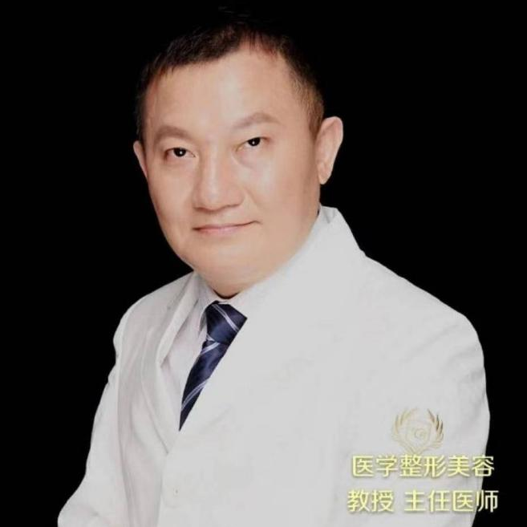

<!-- AUTO-GENERATED-BY: work/generate_obsidian_profiles.py -->

<!-- TEMPLATE: D:\workspace\信息收集整理\医生画像仓库\模板\医生画像模板.md -->

# 唐志荣

## 基础信息

| 字段 | 内容 |
|---|---|
| 姓名 | 唐志荣 |
| 医院 | 广东省第二人民医院 |
| 科室 | 胸壁外科（民航院区） |
| 职称/身份 | 主任医师 |
| 来源链接 | [官网原文](https://gd2h.com/site/detail/70fc86ebcbe143139173f48c4ae0d1fb.html) |
| 采集日期 | 2026-08-15 |

## 简介/擅长

擅长各类乳房整形美容及复杂修复手术，同时开展腹壁整形、吸脂塑形、自体脂肪填充（面部及乳房）、面部微整注射、鼻综合整形、下巴整形等医美项目。

## 科研项目与成果

- 唐志荣 广东省第二人民医院胸壁外科研究院乳房整形外科主任医师、教授（美容外科主诊医师）。
- 拥有30余年整形外科临床经验，擅长各类乳房整形美容及复杂修复手术，同时开展腹壁整形、吸脂塑形、自体脂肪填充（面部及乳房）、面部微整注射、鼻综合整形、下巴整形等医美项目。

## 可包装亮点

- 唐志荣 广东省第二人民医院胸壁外科研究院乳房整形外科主任医师、教授（美容外科主诊医师）。
- 现任中国中西医结合学会医学美容专业委员会乳房整形分会常委，中国整形美容协会脂肪医学分会常委，精准与数字医学分会理事。

## 重点疾病/人群标签

- 慢性病：
- 肿瘤：
- 生殖疾病：
- 免疫/风湿：
- 术后恢复/康复：
- 疑难重症：复杂

## 证据摘录

> 只摘录官网公开信息中的短句或关键字段，不复制大段原文。

- 官网身份字段：主任医师
- 官网简介/擅长：擅长各类乳房整形美容及复杂修复手术，同时开展腹壁整形、吸脂塑形、自体脂肪填充（面部及乳房）、面部微整注射、鼻综合整形、下巴整形等医美项目。
- 官网亮眼经历线索：唐志荣 广东省第二人民医院胸壁外科研究院乳房整形外科主任医师、教授（美容外科主诊医师）。 现任中国中西医结合学会医学美容专业委员会乳房整形分会常委，中国整形美容协会脂肪医学分会常委，精准与数字医学分会理事。
- 来源链接：https://gd2h.com/site/detail/70fc86ebcbe143139173f48c4ae0d1fb.html

## BD 画像摘要

唐志荣医生可作为疑难重症方向的基础画像候选。后续 BD 使用应继续以官网来源和人工复核为准，不添加疗效承诺或无来源包装。

## 合规边界

- 仅使用医院官网、官方公众号、官方小程序等公开渠道。
- 不采集私人电话、私人微信、家庭住址、患者隐私或非公开排班信息。
- 不写“保证治愈”“疗效第一”“包治疑难杂症”等无法由官网证明的表述。
