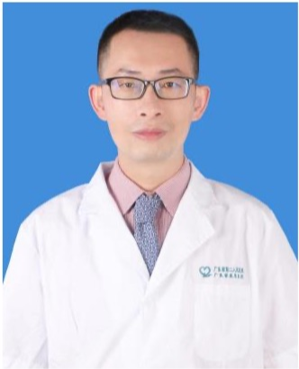

<!-- AUTO-GENERATED-BY: work/generate_obsidian_profiles.py -->

<!-- TEMPLATE: D:\workspace\信息收集整理\医生画像仓库\模板\医生画像模板.md -->

# 唐育群

## 基础信息

| 字段 | 内容 |
|---|---|
| 姓名 | 唐育群 |
| 医院 | 广东省第二人民医院 |
| 科室 | 肿瘤微创综合治疗中心（民航院区） |
| 职称/身份 | 副主任医师 |
| 来源链接 | [官网原文](https://gd2h.com/site/detail/0a3d73dcc1eb43218203e90412e208aa.html) |
| 采集日期 | 2026-08-15 |

## 简介/擅长

擅长肺癌、乳腺癌、结直肠癌等实体瘤的化疗、靶向治疗、免疫治疗及姑息治疗

## 教育与进修经历

- 2003年毕业于中山大学临床医学专业。

## 科研项目与成果

- 主持和参与市厅级科研项目2项；
- 获国家发明专利1项；

## 论文与学术产出

- 在国内外权威医学期刊发表多篇高质量论文（其中SCI论文6篇）；

## 可包装亮点

- 广东省第二人民医院肿瘤微创综合治疗中心副主任医师，广东省第二人民医院惠来医院（惠来县人民医院）肿瘤科柔性帮扶专家。
- 现任中国抗癌协会会员、广东省中西医结合学会肿瘤专业委员、广东省医学会会员、广东省基层医药学会委员、广东省抗癌协会会员、广东省化疗专业委员会委员、广东省抗癌药物专业委员会委员、广东省肺癌专业委员会委员、广东省肿瘤防治科普专业委员会委员、广东省肿瘤临床化疗专业委员会委员、广东省肿瘤多学科诊疗（MDT）专业委员会委员。
- 在国内外权威医学期刊发表多篇高质量论文（其中SCI论文6篇）；
- 获国家发明专利1项；

## 重点疾病/人群标签

- 慢性病：
- 肿瘤：肿瘤、癌、瘤、化疗、靶向、肺癌、肠癌、乳腺癌、免疫、姑息、疑难、多学科、MDT
- 生殖疾病：
- 免疫/风湿：肿瘤、癌、瘤、化疗、靶向、肺癌、肠癌、乳腺癌、免疫、姑息、疑难、多学科、MDT
- 术后恢复/康复：肿瘤、癌、瘤、化疗、靶向、肺癌、肠癌、乳腺癌、免疫、姑息、疑难、多学科、MDT
- 疑难重症：肿瘤、癌、瘤、化疗、靶向、肺癌、肠癌、乳腺癌、免疫、姑息、疑难、多学科、MDT

## 证据摘录

> 只摘录官网公开信息中的短句或关键字段，不复制大段原文。

- 官网身份字段：副主任医师
- 官网简介/擅长：擅长肺癌、乳腺癌、结直肠癌等实体瘤的化疗、靶向治疗、免疫治疗及姑息治疗
- 官网亮眼经历线索：广东省第二人民医院肿瘤微创综合治疗中心副主任医师，广东省第二人民医院惠来医院（惠来县人民医院）肿瘤科柔性帮扶专家。 现任中国抗癌协会会员、广东省中西医结合学会肿瘤专业委员、广东省医学会会员、广东省基层医药学会委员、广东省抗癌协会会员、广东省化疗专业委员会委员、广东省抗癌药物专业委员会委员、广东省肺癌专业委员会委员、广东省肿瘤防治科普专业委员会委员、广东省肿瘤临床化疗专业委员会委员、广东省肿瘤多学科诊疗（MDT）专业委员会委员。 在国内…
- 来源链接：https://gd2h.com/site/detail/0a3d73dcc1eb43218203e90412e208aa.html

## BD 画像摘要

唐育群医生可作为肿瘤、免疫/风湿/感染、术后恢复/康复、疑难重症方向的基础画像候选。后续 BD 使用应继续以官网来源和人工复核为准，不添加疗效承诺或无来源包装。

## 合规边界

- 仅使用医院官网、官方公众号、官方小程序等公开渠道。
- 不采集私人电话、私人微信、家庭住址、患者隐私或非公开排班信息。
- 不写“保证治愈”“疗效第一”“包治疑难杂症”等无法由官网证明的表述。
