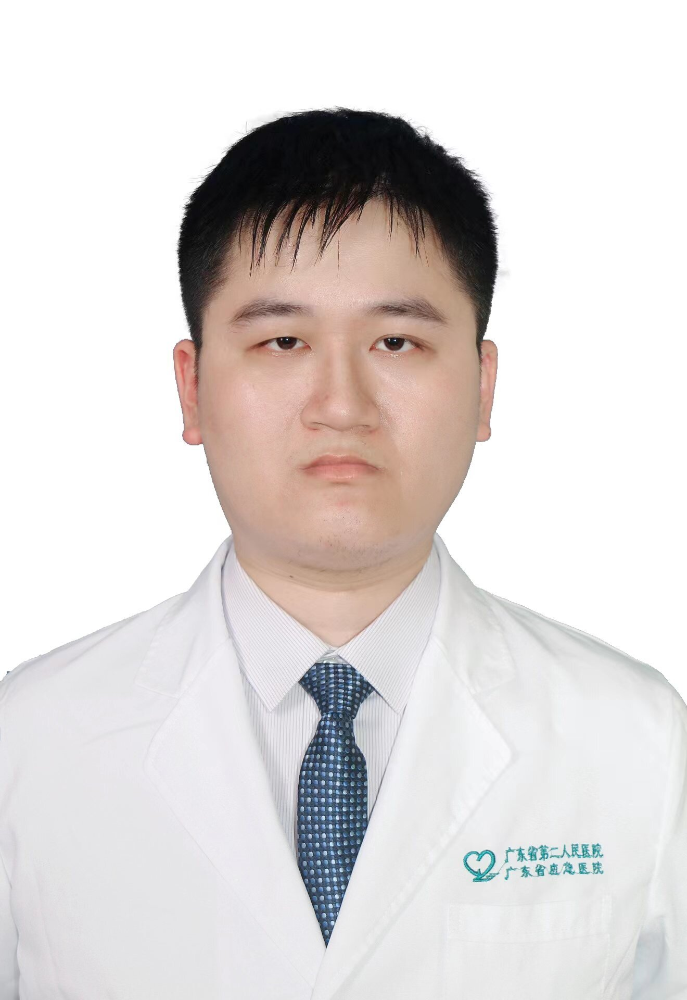

<!-- AUTO-GENERATED-BY: work/generate_obsidian_profiles.py -->

<!-- TEMPLATE: D:\workspace\信息收集整理\医生画像仓库\模板\医生画像模板.md -->

# 夏长粮

## 基础信息

| 字段 | 内容 |
|---|---|
| 姓名 | 夏长粮 |
| 医院 | 广东省第二人民医院 |
| 科室 | 关节骨一科（琶洲院区） |
| 职称/身份 | 医师 |
| 来源链接 | [官网原文](https://gd2h.com/site/detail/e07cbeb4829847248dd497d38c28d401.html) |
| 采集日期 | 2026-08-15 |

## 简介/擅长

医师、硕士。保膝组核心成员。专注于早、中、晚期膝关节骨关节炎的微创及保膝治疗，尤其擅长单髁保膝手术，在膝关节骨性关节炎的阶梯治疗方面积累了丰富临床经验。始终秉持“保守治疗优先，微创手术优先”原则，通过保膝手术最大程度保护患者自身膝关节结构，助力膝关节功能恢复。同时，在下肢畸形（如“O”型腿）的手术治疗方面经验丰富，还擅长髋、膝、肩、肘、踝关节疾病的微创关节镜治疗，以及微创髋膝关节置换、股骨头坏死保髋治疗。

## 教育与进修经历

- 医师，医学硕士，毕业于暨南大学。

## 科研项目与成果

- 科研：近年来致力于感染性疾病的机制研究，并参与国家级、省部级、厅局级、院级课题5项，参与发表SCI、核心期刊论文10余篇。

## 论文与学术产出

- 科研：近年来致力于感染性疾病的机制研究，并参与国家级、省部级、厅局级、院级课题5项，参与发表SCI、核心期刊论文10余篇。

## 可包装亮点

- 临床：主要方向为运动损伤的微创治疗及髋、膝关节病诊治，擅长保髋、保膝的精准治疗，从事髋、膝、肩、肘、踝关节疾病的微创手术治疗以及糖尿病足等感染疾病的保肢治疗，在髋膝关节置换、膝关节单髁置换、半月板损伤、前后交叉韧带损伤、肩袖损伤、肩关节SLAP损伤、肩关节Bankart损伤、肩峰撞击综合征、冻结肩、距腓前韧带损伤、慢性踝关节不稳、踝关节撞击综合征、髋关节盂…
- 科研：近年来致力于感染性疾病的机制研究，并参与国家级、省部级、厅局级、院级课题5项，参与发表SCI、核心期刊论文10余篇。

## 重点疾病/人群标签

- 慢性病：糖尿病、慢性、感染、恢复
- 肿瘤：
- 生殖疾病：
- 免疫/风湿：糖尿病、慢性、感染、恢复
- 术后恢复/康复：糖尿病、慢性、感染、恢复
- 疑难重症：

## 证据摘录

> 只摘录官网公开信息中的短句或关键字段，不复制大段原文。

- 官网身份字段：医师
- 官网简介/擅长：医师、硕士。保膝组核心成员。专注于早、中、晚期膝关节骨关节炎的微创及保膝治疗，尤其擅长单髁保膝手术，在膝关节骨性关节炎的阶梯治疗方面积累了丰富临床经验。始终秉持“保守治疗优先，微创手术优先”原则，通过保膝手术最大程度保护患者自身膝关节结构，助力膝关节功能恢复。同时，在下肢畸形（如“O”型腿）的手术治疗方面经验丰富，还擅长髋、膝、肩、肘、踝关节疾病的微创关节镜治疗，以及微创髋膝关节置换、股骨头坏死保髋治疗。
- 官网亮眼经历线索：临床：主要方向为运动损伤的微创治疗及髋、膝关节病诊治，擅长保髋、保膝的精准治疗，从事髋、膝、肩、肘、踝关节疾病的微创手术治疗以及糖尿病足等感染疾病的保肢治疗，在髋膝关节置换、膝关节单髁置换、半月板损伤、前后交叉韧带损伤、肩袖损伤、肩关节SLAP损伤、肩关节Bankart损伤、肩峰撞击综合征、冻结肩、距腓前韧带损伤、慢性踝关节不稳、踝关节撞击综合征、髋关节盂唇损伤及髋关节撞击综合征（FAI）的微创治疗积累了较多的临床经验。 科研：近年来…
- 来源链接：https://gd2h.com/site/detail/e07cbeb4829847248dd497d38c28d401.html

## BD 画像摘要

夏长粮医生可作为慢性病、免疫/风湿/感染、术后恢复/康复方向的基础画像候选。后续 BD 使用应继续以官网来源和人工复核为准，不添加疗效承诺或无来源包装。

## 合规边界

- 仅使用医院官网、官方公众号、官方小程序等公开渠道。
- 不采集私人电话、私人微信、家庭住址、患者隐私或非公开排班信息。
- 不写“保证治愈”“疗效第一”“包治疑难杂症”等无法由官网证明的表述。
