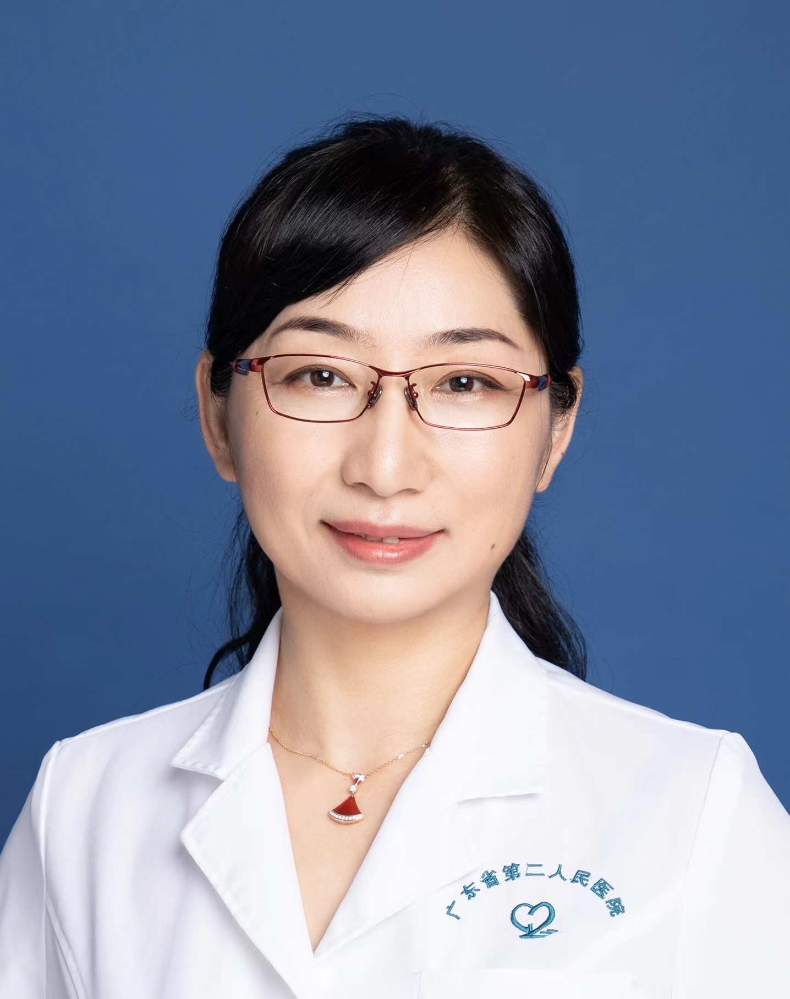

<!-- AUTO-GENERATED-BY: work/generate_obsidian_profiles.py -->

<!-- TEMPLATE: D:\workspace\信息收集整理\医生画像仓库\模板\医生画像模板.md -->

# 姜迎萍

## 基础信息

| 字段 | 内容 |
|---|---|
| 姓名 | 姜迎萍 |
| 医院 | 广东省第二人民医院 |
| 科室 | 康复医学中心（琶洲院区） |
| 职称/身份 | 主任医师 |
| 来源链接 | [官网原文](https://gd2h.com/site/detail/42065.html) |
| 采集日期 | 2026-08-15 |

## 简介/擅长

擅长脑卒中、脊髓损伤、骨伤术后、颈肩腰腿痛的康复诊疗。具有扎实的临床业务能力，对脑血管病、骨伤疾病、颈肩腰腿痛的常见康复问题的评估、临床策略及康复治疗处理均有丰富的临床经验。

## 科研项目与成果

- 多年来从事康复医学、中医医疗、教学和科研工作，主要研究方向为神经系统与运动系统疾病的中西医结合康复研究，尤其擅长脑卒中、脊髓损伤、骨伤术后、颈肩腰腿痛的康复诊疗。
- 主持并参与国家自然科学基金、科技部“十二五”科技项目、科技支疆项目、自治区自然科学基金等课题。

## 论文与学术产出

- 目前已在全国专业杂志上发表论文近30篇，参与国家“十二五”高校康复医学教材编写2部。

## 可包装亮点

- 个人介绍 广东省第二人民医院康复医学科主任，医学博士，主任医师，副教授，硕士研究生导师。
- 中国残疾人康复学会康复教育专业委员会副主任委员；
- 中国康复医学会中西医结合康复专业委员会常委；
- 中国针灸学会针灸康复委员会常委；

## 重点疾病/人群标签

- 慢性病：
- 肿瘤：
- 生殖疾病：
- 免疫/风湿：
- 术后恢复/康复：术后、康复
- 疑难重症：

## 证据摘录

> 只摘录官网公开信息中的短句或关键字段，不复制大段原文。

- 官网身份字段：主任医师
- 官网简介/擅长：擅长脑卒中、脊髓损伤、骨伤术后、颈肩腰腿痛的康复诊疗。具有扎实的临床业务能力，对脑血管病、骨伤疾病、颈肩腰腿痛的常见康复问题的评估、临床策略及康复治疗处理均有丰富的临床经验。
- 官网亮眼经历线索：个人介绍 广东省第二人民医院康复医学科主任，医学博士，主任医师，副教授，硕士研究生导师。 中国残疾人康复学会康复教育专业委员会副主任委员； 中国康复医学会中西医结合康复专业委员会常委； 中国针灸学会针灸康复委员会常委；
- 来源链接：https://gd2h.com/site/detail/42065.html

## BD 画像摘要

姜迎萍医生可作为术后恢复/康复方向的基础画像候选。后续 BD 使用应继续以官网来源和人工复核为准，不添加疗效承诺或无来源包装。

## 合规边界

- 仅使用医院官网、官方公众号、官方小程序等公开渠道。
- 不采集私人电话、私人微信、家庭住址、患者隐私或非公开排班信息。
- 不写“保证治愈”“疗效第一”“包治疑难杂症”等无法由官网证明的表述。
