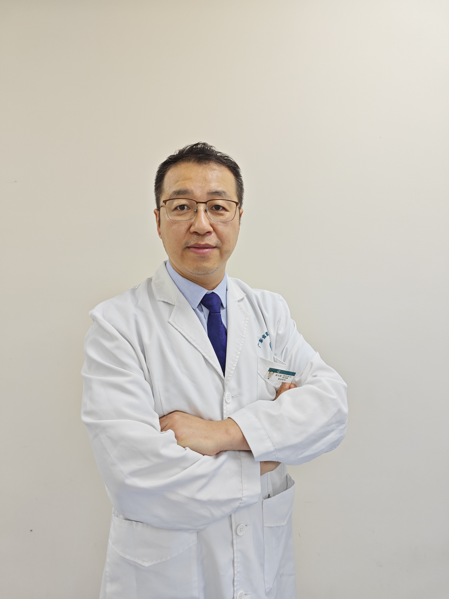

<!-- AUTO-GENERATED-BY: work/generate_obsidian_profiles.py -->

<!-- TEMPLATE: D:\workspace\信息收集整理\医生画像仓库\模板\医生画像模板.md -->

# 孙大炜

## 基础信息

| 字段 | 内容 |
|---|---|
| 姓名 | 孙大炜 |
| 医院 | 广东省第二人民医院 |
| 科室 | 创伤骨科（琶洲院区） |
| 职称/身份 | 副主任医师 |
| 来源链接 | [官网原文](https://gd2h.com/site/detail/41964.html) |
| 采集日期 | 2026-08-15 |

## 简介/擅长

肢体复杂骨折、骨盆髋臼骨折、肩、髋关节置换、严重多发伤围手术期抢救与综合治疗。

## 教育与进修经历

- 毕业于南方医科大学，2019-2020年英国皇家利物浦大学医院（The Royal Liverpool and Broadgreen Hospital）高级访问学者，从事创伤骨科、显微外科临床与基础研究近20年，擅长肢体复杂骨折、骨盆髋臼骨折、肩、髋关节置换、严重多发伤围手术期抢救与综合治疗。

## 科研项目与成果

- 主持省市级科研课题3项，发表论文20余篇，SCI论文近10篇。

## 论文与学术产出

- 主持省市级科研课题3项，发表论文20余篇，SCI论文近10篇。

## 可包装亮点

- 毕业于南方医科大学，2019-2020年英国皇家利物浦大学医院（The Royal Liverpool and Broadgreen Hospital）高级访问学者，从事创伤骨科、显微外科临床与基础研究近20年，擅长肢体复杂骨折、骨盆髋臼骨折、肩、髋关节置换、严重多发伤围手术期抢救与综合治疗。
- 主持省市级科研课题3项，发表论文20余篇，SCI论文近10篇。
- 现担任广东省医师协会创伤骨科分会常委，广东省医学会修复重建外科常委，广东省康复医学会第四届理事会常务理事，广东省康复医学会手功能康复分会副会长，广东省康复医学会康复辅具分会副会长，广东省医学会手外科学分会腕关节镜学组副组长。

## 重点疾病/人群标签

- 慢性病：慢性、肿瘤、感染、康复、创面、复杂
- 肿瘤：慢性、肿瘤、感染、康复、创面、复杂
- 生殖疾病：
- 免疫/风湿：慢性、肿瘤、感染、康复、创面、复杂
- 术后恢复/康复：慢性、肿瘤、感染、康复、创面、复杂
- 疑难重症：慢性、肿瘤、感染、康复、创面、复杂

## 证据摘录

> 只摘录官网公开信息中的短句或关键字段，不复制大段原文。

- 官网身份字段：副主任医师
- 官网简介/擅长：肢体复杂骨折、骨盆髋臼骨折、肩、髋关节置换、严重多发伤围手术期抢救与综合治疗。
- 官网亮眼经历线索：毕业于南方医科大学，2019-2020年英国皇家利物浦大学医院（The Royal Liverpool and Broadgreen Hospital）高级访问学者，从事创伤骨科、显微外科临床与基础研究近20年，擅长肢体复杂骨折、骨盆髋臼骨折、肩、髋关节置换、严重多发伤围手术期抢救与综合治疗。 主持省市级科研课题3项，发表论文20余篇，SCI论文近10篇。 现担任广东省医师协会创伤骨科分会常委，广东省医学会修复重建外科常委，广东省康复…
- 来源链接：https://gd2h.com/site/detail/41964.html

## BD 画像摘要

孙大炜医生可作为慢性病、肿瘤、免疫/风湿/感染、术后恢复/康复、疑难重症方向的基础画像候选。后续 BD 使用应继续以官网来源和人工复核为准，不添加疗效承诺或无来源包装。

## 合规边界

- 仅使用医院官网、官方公众号、官方小程序等公开渠道。
- 不采集私人电话、私人微信、家庭住址、患者隐私或非公开排班信息。
- 不写“保证治愈”“疗效第一”“包治疑难杂症”等无法由官网证明的表述。
