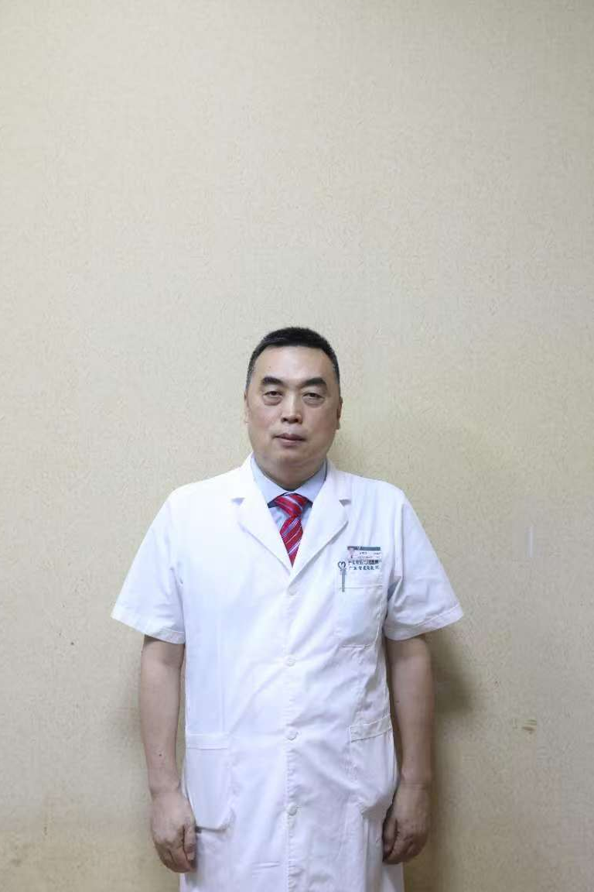

<!-- AUTO-GENERATED-BY: work/generate_obsidian_profiles.py -->

<!-- TEMPLATE: D:\workspace\信息收集整理\医生画像仓库\模板\医生画像模板.md -->

# 孙鸿涛

## 基础信息

| 字段 | 内容 |
|---|---|
| 姓名 | 孙鸿涛 |
| 医院 | 广东省第二人民医院 |
| 科室 | 创面再生与修复外科（琶洲院区） |
| 职称/身份 | 主任医师 |
| 来源链接 | [官网原文](https://gd2h.com/site/detail/58bae13ecbe94511bc6001e843846746.html) |
| 采集日期 | 2026-08-15 |

## 简介/擅长

## 教育与进修经历

- 孙鸿涛：创面再生与修复外科负责人，主任医师，骨科学博士，骨伤科博士后，硕士研究生导师、博士研究生导师，原骨科主任、关节骨科主任。

## 可包装亮点

- 孙鸿涛：创面再生与修复外科负责人，主任医师，骨科学博士，骨伤科博士后，硕士研究生导师、博士研究生导师，原骨科主任、关节骨科主任。
- 社会及学术任职：现任国家卫生健康委医疗应急工作专家组骨科专家，国家紧急医学救援队（广东）副队长，世界卫生组织（WHO）应急医疗队（中国广东）副队长，广东省医学会创伤骨科分会副主委、广东省医师协会骨科分会常委。

## 重点疾病/人群标签

- 慢性病：糖尿病、慢性、感染、术后、创面、难治、复杂
- 肿瘤：
- 生殖疾病：
- 免疫/风湿：糖尿病、慢性、感染、术后、创面、难治、复杂
- 术后恢复/康复：糖尿病、慢性、感染、术后、创面、难治、复杂
- 疑难重症：糖尿病、慢性、感染、术后、创面、难治、复杂

## 证据摘录

> 只摘录官网公开信息中的短句或关键字段，不复制大段原文。

- 官网身份字段：主任医师
- 官网亮眼经历线索：孙鸿涛：创面再生与修复外科负责人，主任医师，骨科学博士，骨伤科博士后，硕士研究生导师、博士研究生导师，原骨科主任、关节骨科主任。 社会及学术任职：现任国家卫生健康委医疗应急工作专家组骨科专家，国家紧急医学救援队（广东）副队长，世界卫生组织（WHO）应急医疗队（中国广东）副队长，广东省医学会创伤骨科分会副主委、广东省医师协会骨科分会常委。
- 来源链接：https://gd2h.com/site/detail/58bae13ecbe94511bc6001e843846746.html

## BD 画像摘要

孙鸿涛医生可作为慢性病、免疫/风湿/感染、术后恢复/康复、疑难重症方向的基础画像候选。后续 BD 使用应继续以官网来源和人工复核为准，不添加疗效承诺或无来源包装。

## 合规边界

- 仅使用医院官网、官方公众号、官方小程序等公开渠道。
- 不采集私人电话、私人微信、家庭住址、患者隐私或非公开排班信息。
- 不写“保证治愈”“疗效第一”“包治疑难杂症”等无法由官网证明的表述。
