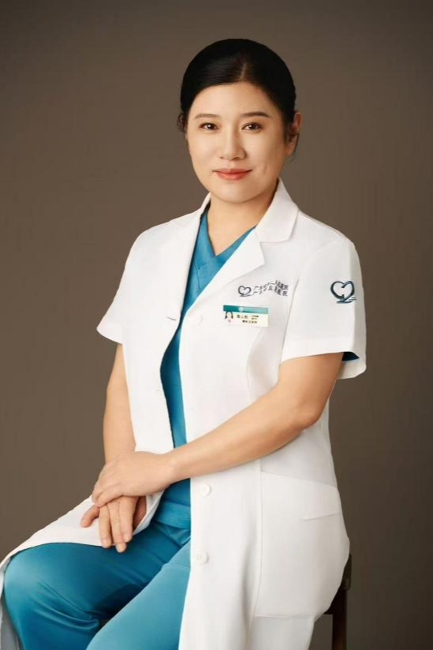

<!-- AUTO-GENERATED-BY: work/generate_obsidian_profiles.py -->

<!-- TEMPLATE: D:\workspace\信息收集整理\医生画像仓库\模板\医生画像模板.md -->

# 张云松

## 基础信息

| 字段 | 内容 |
|---|---|
| 姓名 | 张云松 |
| 医院 | 广东省第二人民医院 |
| 科室 | 整形美容（皮肤）科（民航院区） |
| 职称/身份 | 主任医师 |
| 来源链接 | [官网原文](https://gd2h.com/site/detail/4a14c72e03ac4a168a12662994202b92.html) |
| 采集日期 | 2026-08-15 |

## 简介/擅长

擅长选择性瘢痕精细修复、胎记激光治疗、皮肤光电美容、注射抗衰医学生发，整形外科等领域，经验独到。

## 教育与进修经历

- 美国哈佛大学麻省总医院激光医学博士后/整形外科学博士/博士生导师。
- 现任广东省整形美容协会激光美容分会第一届委员会主任委员，中国女医师协会广东省整形美容外科分会副主任委员兼秘书长，中华医学会整形外科分会激光美容专委会副组长，中国妇幼保健协会整形美容分会激光美容专委会副组长，中国整形美容协会激光美容分会常委，广东省医学美容学会抗衰老分会副主任委员员会青年委员，广东省医学会医学美学美容分会常委 ，广东省医师协会整形美容外科分会常委，广东省整形美容协会整形外科/皮肤美容分会常委，美国科医人皮肤激光亚洲临床培训中心特聘专家。

## 可包装亮点

- 张云松 广东省第二人民医院琶洲院区整形美容科副主任，广东省第二人民医院民航院区整形美容（皮肤）科室负责人，广东省第二人民医院医学生发中心负责人，学科带头人，主任医师。
- 美国哈佛大学麻省总医院激光医学博士后/整形外科学博士/博士生导师。
- 率先首次开展的中西医结合综合治疗医学生发新技术填补院内技术空白。
- 现任广东省整形美容协会激光美容分会第一届委员会主任委员，中国女医师协会广东省整形美容外科分会副主任委员兼秘书长，中华医学会整形外科分会激光美容专委会副组长，中国妇幼保健协会整形美容分会激光美容专委会副组长，中国整形美容协会激光美容分会常委，广东省医学美容学会抗衰老分会副主任委员员会青年委员，广东省医学会医学美学美容分会常委 ，广东省医师协会整形美容外科分会…

## 重点疾病/人群标签

- 慢性病：
- 肿瘤：
- 生殖疾病：
- 免疫/风湿：
- 术后恢复/康复：
- 疑难重症：

## 证据摘录

> 只摘录官网公开信息中的短句或关键字段，不复制大段原文。

- 官网身份字段：主任医师
- 官网简介/擅长：擅长选择性瘢痕精细修复、胎记激光治疗、皮肤光电美容、注射抗衰医学生发，整形外科等领域，经验独到。
- 官网亮眼经历线索：张云松 广东省第二人民医院琶洲院区整形美容科副主任，广东省第二人民医院民航院区整形美容（皮肤）科室负责人，广东省第二人民医院医学生发中心负责人，学科带头人，主任医师。 美国哈佛大学麻省总医院激光医学博士后/整形外科学博士/博士生导师。 率先首次开展的中西医结合综合治疗医学生发新技术填补院内技术空白。 现任广东省整形美容协会激光美容分会第一届委员会主任委员，中国女医师协会广东省整形美容外科分会副主任委员兼秘书长，中华医学会整形外科分会激…
- 异常提示：同名待甄别
- 来源链接：https://gd2h.com/site/detail/4a14c72e03ac4a168a12662994202b92.html

## BD 画像摘要

张云松医生可作为广东省第二人民医院整形美容（皮肤）科（民航院区）的基础医生资料入库。当前重点方向以总底表标签为准，官网未展示的信息保持空白。

## 合规边界

- 仅使用医院官网、官方公众号、官方小程序等公开渠道。
- 不采集私人电话、私人微信、家庭住址、患者隐私或非公开排班信息。
- 不写“保证治愈”“疗效第一”“包治疑难杂症”等无法由官网证明的表述。
