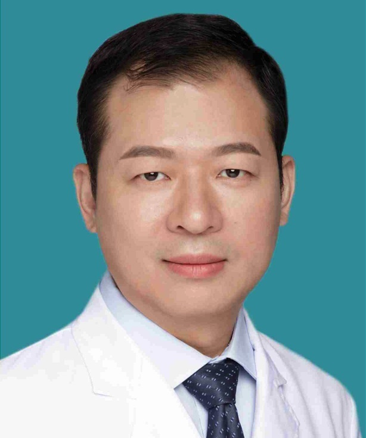

<!-- AUTO-GENERATED-BY: work/generate_obsidian_profiles.py -->

<!-- TEMPLATE: D:\workspace\信息收集整理\医生画像仓库\模板\医生画像模板.md -->

# 张力

## 基础信息

| 字段 | 内容 |
|---|---|
| 姓名 | 张力 |
| 医院 | 广东省第二人民医院 |
| 科室 | 脊柱骨科（琶洲院区） |
| 职称/身份 | 主任医师 |
| 来源链接 | [官网原文](https://gd2h.com/site/detail/41996.html) |
| 采集日期 | 2026-08-15 |

## 简介/擅长

擅长颈腰椎间盘突出、颈椎病、退行性颈腰椎疾病、椎管狭窄、腰椎滑脱、脊柱骨折、脊柱畸形矫治、脊柱结核、脊柱感染性疾病的保守、手术以及微创治疗。

## 教育与进修经历

- 美国圣路易斯华盛顿大学Barnes-Jewish医学中心访问学者。

## 科研项目与成果

- 近年来承担广东省研究课题2项，参与国家及省部级研究课题3项，在国内外期刊发表论文30余篇。

## 论文与学术产出

- 近年来承担广东省研究课题2项，参与国家及省部级研究课题3项，在国内外期刊发表论文30余篇。

## 可包装亮点

- 个人介绍 张力，科室副主任、主任医师、医学博士、硕士研究生导师 中南大学湘雅医学部临床医疗本科，第一军医大学骨外科硕士，南方医科大学骨外科博士。
- 曾赴美国华盛顿大学附属Barnes-Jewish医院脊柱外科中心访问学习，师从北美颈椎外科协会主席K Daniel.Riew教授和北美脊柱侧弯研究协会主席Lawrence G.Lenke教授。
- 借助显微镜及显微手术器械，实现镜下毫米级的精细操作，手术操作精准度高，疗效确切，手术微创化，组织损伤小。
- 现担任广东省康复医学会脊柱脊髓分会脊柱肿瘤学组副主任委员，广东省康复医学会脊柱脊髓分会理事，广东省老年保健协会脊柱病专业委员会常委，广东省康复医学会脊柱脊髓分会颈椎学组委员，广东省医师协会脊柱分会委员。

## 重点疾病/人群标签

- 慢性病：
- 肿瘤：肿瘤、感染、康复
- 生殖疾病：
- 免疫/风湿：肿瘤、感染、康复
- 术后恢复/康复：肿瘤、感染、康复
- 疑难重症：

## 证据摘录

> 只摘录官网公开信息中的短句或关键字段，不复制大段原文。

- 官网身份字段：主任医师
- 官网简介/擅长：擅长颈腰椎间盘突出、颈椎病、退行性颈腰椎疾病、椎管狭窄、腰椎滑脱、脊柱骨折、脊柱畸形矫治、脊柱结核、脊柱感染性疾病的保守、手术以及微创治疗。
- 官网亮眼经历线索：个人介绍 张力，科室副主任、主任医师、医学博士、硕士研究生导师 中南大学湘雅医学部临床医疗本科，第一军医大学骨外科硕士，南方医科大学骨外科博士。 曾赴美国华盛顿大学附属Barnes-Jewish医院脊柱外科中心访问学习，师从北美颈椎外科协会主席K Daniel.Riew教授和北美脊柱侧弯研究协会主席Lawrence G.Lenke教授。 借助显微镜及显微手术器械，实现镜下毫米级的精细操作，手术操作精准度高，疗效确切，手术微创化，组织损…
- 来源链接：https://gd2h.com/site/detail/41996.html

## BD 画像摘要

张力医生可作为肿瘤、免疫/风湿/感染、术后恢复/康复方向的基础画像候选。后续 BD 使用应继续以官网来源和人工复核为准，不添加疗效承诺或无来源包装。

## 合规边界

- 仅使用医院官网、官方公众号、官方小程序等公开渠道。
- 不采集私人电话、私人微信、家庭住址、患者隐私或非公开排班信息。
- 不写“保证治愈”“疗效第一”“包治疑难杂症”等无法由官网证明的表述。
