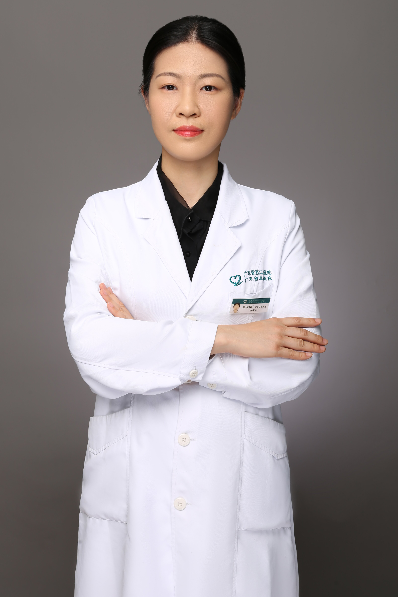

<!-- AUTO-GENERATED-BY: work/generate_obsidian_profiles.py -->

<!-- TEMPLATE: D:\workspace\信息收集整理\医生画像仓库\模板\医生画像模板.md -->

# 张彦卿

## 基础信息

| 字段 | 内容 |
|---|---|
| 姓名 | 张彦卿 |
| 医院 | 广东省第二人民医院 |
| 科室 | 中医科（琶洲院区） |
| 职称/身份 | 副主任中医师 |
| 来源链接 | [官网原文](https://gd2h.com/site/detail/42192.html) |
| 采集日期 | 2026-08-15 |

## 简介/擅长

擅长中西医结合治疗慢性代谢性疾病，如肥胖、脂肪肝等代谢性疾病；咳嗽、失眠等内科杂病及心脑血管疑难杂症。

## 科研项目与成果

- 专业方向和特长：擅长中西医结合治疗内分泌疾病，如糖尿病、甲亢、肥胖、脂肪肝等，以及其他内科杂病，中华中医药协会内分泌协会委员，广东省中医药学会内分泌专业委员会委员，参与市、院级科研课题5项，发表学术论文10余篇。

## 论文与学术产出

- 专业方向和特长：擅长中西医结合治疗内分泌疾病，如糖尿病、甲亢、肥胖、脂肪肝等，以及其他内科杂病，中华中医药协会内分泌协会委员，广东省中医药学会内分泌专业委员会委员，参与市、院级科研课题5项，发表学术论文10余篇。

## 可包装亮点

- 专业方向和特长：擅长中西医结合治疗内分泌疾病，如糖尿病、甲亢、肥胖、脂肪肝等，以及其他内科杂病，中华中医药协会内分泌协会委员，广东省中医药学会内分泌专业委员会委员，参与市、院级科研课题5项，发表学术论文10余篇。

## 重点疾病/人群标签

- 慢性病：糖尿病、慢性、代谢、疑难
- 肿瘤：
- 生殖疾病：
- 免疫/风湿：
- 术后恢复/康复：
- 疑难重症：糖尿病、慢性、代谢、疑难

## 证据摘录

> 只摘录官网公开信息中的短句或关键字段，不复制大段原文。

- 官网身份字段：副主任中医师
- 官网简介/擅长：擅长中西医结合治疗慢性代谢性疾病，如肥胖、脂肪肝等代谢性疾病；咳嗽、失眠等内科杂病及心脑血管疑难杂症。
- 官网亮眼经历线索：专业方向和特长：擅长中西医结合治疗内分泌疾病，如糖尿病、甲亢、肥胖、脂肪肝等，以及其他内科杂病，中华中医药协会内分泌协会委员，广东省中医药学会内分泌专业委员会委员，参与市、院级科研课题5项，发表学术论文10余篇。
- 来源链接：https://gd2h.com/site/detail/42192.html

## BD 画像摘要

张彦卿医生可作为慢性病、疑难重症方向的基础画像候选。后续 BD 使用应继续以官网来源和人工复核为准，不添加疗效承诺或无来源包装。

## 合规边界

- 仅使用医院官网、官方公众号、官方小程序等公开渠道。
- 不采集私人电话、私人微信、家庭住址、患者隐私或非公开排班信息。
- 不写“保证治愈”“疗效第一”“包治疑难杂症”等无法由官网证明的表述。
