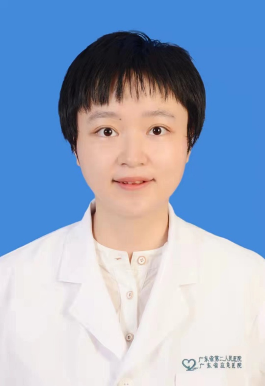

<!-- AUTO-GENERATED-BY: work/generate_obsidian_profiles.py -->

<!-- TEMPLATE: D:\workspace\信息收集整理\医生画像仓库\模板\医生画像模板.md -->

# 张晓雅

## 基础信息

| 字段 | 内容 |
|---|---|
| 姓名 | 张晓雅 |
| 医院 | 广东省第二人民医院 |
| 科室 | 康复医学中心（琶洲院区） |
| 职称/身份 | 主治医师 |
| 来源链接 | [官网原文](https://gd2h.com/site/detail/42067.html) |
| 采集日期 | 2026-08-15 |

## 简介/擅长

擅长颈肩腰腿疼痛、脑卒中及盆底功能障碍等疾病的康复诊治。

## 教育与进修经历

- 个人介绍 毕业于南方医科大学 医学博士 广东省第二人民医院康复医学科医疗组长 主治医师 广东省医学会物理医学与康复分会委员 广东省医院协会康复医学管理专业委员会委员 从事康复医学临床和科研工作，发表学术论文十余篇，研究方向为筋膜学的临床应用。

## 科研项目与成果

- 个人介绍 毕业于南方医科大学 医学博士 广东省第二人民医院康复医学科医疗组长 主治医师 广东省医学会物理医学与康复分会委员 广东省医院协会康复医学管理专业委员会委员 从事康复医学临床和科研工作，发表学术论文十余篇，研究方向为筋膜学的临床应用。

## 论文与学术产出

- 个人介绍 毕业于南方医科大学 医学博士 广东省第二人民医院康复医学科医疗组长 主治医师 广东省医学会物理医学与康复分会委员 广东省医院协会康复医学管理专业委员会委员 从事康复医学临床和科研工作，发表学术论文十余篇，研究方向为筋膜学的临床应用。

## 可包装亮点

- 个人介绍 毕业于南方医科大学 医学博士 广东省第二人民医院康复医学科医疗组长 主治医师 广东省医学会物理医学与康复分会委员 广东省医院协会康复医学管理专业委员会委员 从事康复医学临床和科研工作，发表学术论文十余篇，研究方向为筋膜学的临床应用。

## 重点疾病/人群标签

- 慢性病：
- 肿瘤：
- 生殖疾病：
- 免疫/风湿：
- 术后恢复/康复：康复、疼痛、功能障碍
- 疑难重症：

## 证据摘录

> 只摘录官网公开信息中的短句或关键字段，不复制大段原文。

- 官网身份字段：主治医师
- 官网简介/擅长：擅长颈肩腰腿疼痛、脑卒中及盆底功能障碍等疾病的康复诊治。
- 官网亮眼经历线索：个人介绍 毕业于南方医科大学 医学博士 广东省第二人民医院康复医学科医疗组长 主治医师 广东省医学会物理医学与康复分会委员 广东省医院协会康复医学管理专业委员会委员 从事康复医学临床和科研工作，发表学术论文十余篇，研究方向为筋膜学的临床应用。
- 来源链接：https://gd2h.com/site/detail/42067.html

## BD 画像摘要

张晓雅医生可作为术后恢复/康复方向的基础画像候选。后续 BD 使用应继续以官网来源和人工复核为准，不添加疗效承诺或无来源包装。

## 合规边界

- 仅使用医院官网、官方公众号、官方小程序等公开渠道。
- 不采集私人电话、私人微信、家庭住址、患者隐私或非公开排班信息。
- 不写“保证治愈”“疗效第一”“包治疑难杂症”等无法由官网证明的表述。
