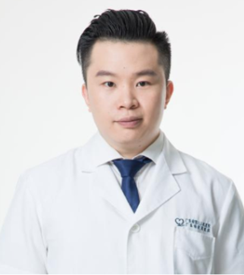

<!-- AUTO-GENERATED-BY: work/generate_obsidian_profiles.py -->

<!-- TEMPLATE: D:\workspace\信息收集整理\医生画像仓库\模板\医生画像模板.md -->

# 张有良

## 基础信息

| 字段 | 内容 |
|---|---|
| 姓名 | 张有良 |
| 医院 | 广东省第二人民医院 |
| 科室 | 整形美容科（琶洲院区） |
| 职称/身份 | 主治医师 |
| 来源链接 | [官网原文](https://gd2h.com/site/detail/42208.html) |
| 采集日期 | 2026-08-15 |

## 简介/擅长

注射美容，包括肉毒素注射、玻尿酸注射，如眼周年轻化、颈纹、面部除皱、面部提升等； 眼睑（双眼皮、眼袋、上睑松弛等）、颏整形美容； 脂肪相关手术，如抽脂、脂肪移植填充等； 唇腭裂相关唇、鼻畸形修复； 体表良、恶性肿瘤； 外伤、烧伤后瘢痕畸形。

## 可包装亮点

- 个人介绍 广东省第二人民医院整形美容科，主治医师，暨南大学讲师 中华医学会整形外科分会微创美容学组委员，中华医学会整形外科分会眼整形学组委员，中国整形美容协会精准与数字医学分会 乳房学组委员兼秘书，中国妇幼保健协会医学美容分会委员兼副秘书长，瘢痕学组、微创注射学组委员。

## 重点疾病/人群标签

- 慢性病：
- 肿瘤：肿瘤、烧伤
- 生殖疾病：
- 免疫/风湿：
- 术后恢复/康复：肿瘤、烧伤
- 疑难重症：

## 证据摘录

> 只摘录官网公开信息中的短句或关键字段，不复制大段原文。

- 官网身份字段：主治医师
- 官网简介/擅长：注射美容，包括肉毒素注射、玻尿酸注射，如眼周年轻化、颈纹、面部除皱、面部提升等； 眼睑（双眼皮、眼袋、上睑松弛等）、颏整形美容； 脂肪相关手术，如抽脂、脂肪移植填充等； 唇腭裂相关唇、鼻畸形修复； 体表良、恶性肿瘤； 外伤、烧伤后瘢痕畸形。
- 官网亮眼经历线索：个人介绍 广东省第二人民医院整形美容科，主治医师，暨南大学讲师 中华医学会整形外科分会微创美容学组委员，中华医学会整形外科分会眼整形学组委员，中国整形美容协会精准与数字医学分会 乳房学组委员兼秘书，中国妇幼保健协会医学美容分会委员兼副秘书长，瘢痕学组、微创注射学组委员。
- 来源链接：https://gd2h.com/site/detail/42208.html

## BD 画像摘要

张有良医生可作为肿瘤、术后恢复/康复方向的基础画像候选。后续 BD 使用应继续以官网来源和人工复核为准，不添加疗效承诺或无来源包装。

## 合规边界

- 仅使用医院官网、官方公众号、官方小程序等公开渠道。
- 不采集私人电话、私人微信、家庭住址、患者隐私或非公开排班信息。
- 不写“保证治愈”“疗效第一”“包治疑难杂症”等无法由官网证明的表述。
