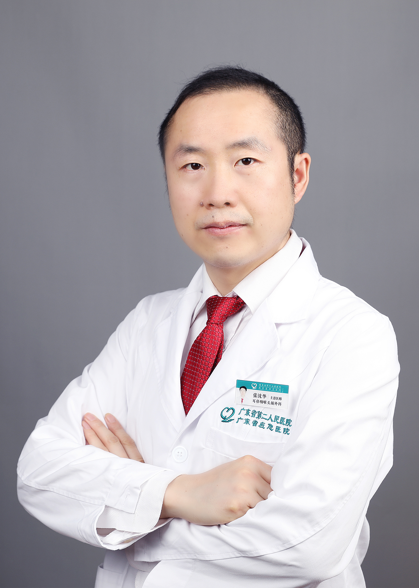

<!-- AUTO-GENERATED-BY: work/generate_obsidian_profiles.py -->

<!-- TEMPLATE: D:\workspace\信息收集整理\医生画像仓库\模板\医生画像模板.md -->

# 张沈华

## 基础信息

| 字段 | 内容 |
|---|---|
| 姓名 | 张沈华 |
| 医院 | 广东省第二人民医院 |
| 科室 | 耳鼻咽喉头颈外科（琶洲院区） |
| 职称/身份 | 主治医师 |
| 来源链接 | [官网原文](https://gd2h.com/site/detail/42032.html) |
| 采集日期 | 2026-08-15 |

## 简介/擅长

擅长：1、突发性耳聋及单耳持续性耳鸣的诊断、规范化治疗；2、外周性眩晕（耳石症、梅尼埃病、前庭神经元炎、前庭性偏头痛、前庭阵发症、听神经瘤、耳硬化、半规管瘘）的诊断及规范化治疗；3、儿童急慢性中耳炎、鼻炎、过敏性鼻炎规范化诊治及日常预防。

## 教育与进修经历

- 曾于中山大学孙逸仙纪念医院耳科进修，主要研究方向眩晕及耳聋耳鸣。

## 可包装亮点

- 现任广东省精准医学学会听觉与前庭障碍分会委员；
- 广东省中西医结合学会耳鼻咽喉专委会委员。
- 医院眩晕及耳聋多学科会诊（ MDT ）骨干，科室教学秘书。
- 曾于中山大学孙逸仙纪念医院耳科进修，主要研究方向眩晕及耳聋耳鸣。

## 重点疾病/人群标签

- 慢性病：慢性、瘤、多学科、MDT
- 肿瘤：慢性、瘤、多学科、MDT
- 生殖疾病：
- 免疫/风湿：
- 术后恢复/康复：
- 疑难重症：慢性、瘤、多学科、MDT

## 证据摘录

> 只摘录官网公开信息中的短句或关键字段，不复制大段原文。

- 官网身份字段：主治医师
- 官网简介/擅长：擅长：1、突发性耳聋及单耳持续性耳鸣的诊断、规范化治疗；2、外周性眩晕（耳石症、梅尼埃病、前庭神经元炎、前庭性偏头痛、前庭阵发症、听神经瘤、耳硬化、半规管瘘）的诊断及规范化治疗；3、儿童急慢性中耳炎、鼻炎、过敏性鼻炎规范化诊治及日常预防。
- 官网亮眼经历线索：现任广东省精准医学学会听觉与前庭障碍分会委员； 广东省中西医结合学会耳鼻咽喉专委会委员。 医院眩晕及耳聋多学科会诊（ MDT ）骨干，科室教学秘书。 曾于中山大学孙逸仙纪念医院耳科进修，主要研究方向眩晕及耳聋耳鸣。
- 来源链接：https://gd2h.com/site/detail/42032.html

## BD 画像摘要

张沈华医生可作为慢性病、肿瘤、疑难重症方向的基础画像候选。后续 BD 使用应继续以官网来源和人工复核为准，不添加疗效承诺或无来源包装。

## 合规边界

- 仅使用医院官网、官方公众号、官方小程序等公开渠道。
- 不采集私人电话、私人微信、家庭住址、患者隐私或非公开排班信息。
- 不写“保证治愈”“疗效第一”“包治疑难杂症”等无法由官网证明的表述。
