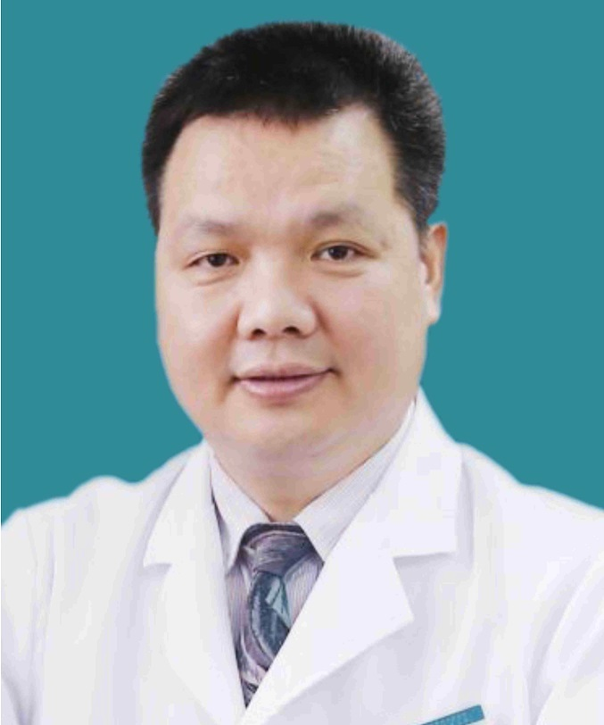

<!-- AUTO-GENERATED-BY: work/generate_obsidian_profiles.py -->

<!-- TEMPLATE: D:\workspace\信息收集整理\医生画像仓库\模板\医生画像模板.md -->

# 张辉

## 基础信息

| 字段 | 内容 |
|---|---|
| 姓名 | 张辉 |
| 医院 | 广东省第二人民医院 |
| 科室 | 脊柱骨科（琶洲院区） |
| 职称/身份 | 主任医师 |
| 来源链接 | [官网原文](https://gd2h.com/site/detail/41995.html) |
| 采集日期 | 2026-08-15 |

## 简介/擅长

擅长各种脊柱疾病的诊疗。

## 教育与进修经历

- 毕业于第一军医大学，曾赴欧洲比利时圣尼可拉斯Waasland医院、美国华盛顿大学医学院Barnes-Jewish医院(BJH)学习，在美学习期间师从北美颈椎外科协会主席DanielRiew教授，并得到了世界著名脊柱畸形专家Lenke教授的指导。

## 科研项目与成果

- 曾获广东省科技进步二等奖1项、全军医疗成果二等奖2项，主持省部级科研课题4项，发表论文40余篇，其中SCI论文7篇。

## 论文与学术产出

- 曾获广东省科技进步二等奖1项、全军医疗成果二等奖2项，主持省部级科研课题4项，发表论文40余篇，其中SCI论文7篇。

## 可包装亮点

- 个人介绍 张辉，科室主任、主任医师 、医学博士、博士研究生导师 广东省第二人民医院脊柱骨科学科带头人，现任南方医科大学及暨南大学博士研究生导师，主任医师。
- 毕业于第一军医大学，曾赴欧洲比利时圣尼可拉斯Waasland医院、美国华盛顿大学医学院Barnes-Jewish医院(BJH)学习，在美学习期间师从北美颈椎外科协会主席DanielRiew教授，并得到了世界著名脊柱畸形专家Lenke教授的指导。
- 曾获广东省科技进步二等奖1项、全军医疗成果二等奖2项，主持省部级科研课题4项，发表论文40余篇，其中SCI论文7篇。
- 现担任广东省医院协会脊柱外科专业委员会副主任委员；

## 重点疾病/人群标签

- 慢性病：
- 肿瘤：
- 生殖疾病：
- 免疫/风湿：
- 术后恢复/康复：
- 疑难重症：

## 证据摘录

> 只摘录官网公开信息中的短句或关键字段，不复制大段原文。

- 官网身份字段：主任医师
- 官网简介/擅长：擅长各种脊柱疾病的诊疗。
- 官网亮眼经历线索：个人介绍 张辉，科室主任、主任医师 、医学博士、博士研究生导师 广东省第二人民医院脊柱骨科学科带头人，现任南方医科大学及暨南大学博士研究生导师，主任医师。 毕业于第一军医大学，曾赴欧洲比利时圣尼可拉斯Waasland医院、美国华盛顿大学医学院Barnes-Jewish医院(BJH)学习，在美学习期间师从北美颈椎外科协会主席DanielRiew教授，并得到了世界著名脊柱畸形专家Lenke教授的指导。 曾获广东省科技进步二等奖1项、全军医…
- 异常提示：同名待甄别
- 来源链接：https://gd2h.com/site/detail/41995.html

## BD 画像摘要

张辉医生可作为广东省第二人民医院脊柱骨科（琶洲院区）的基础医生资料入库。当前重点方向以总底表标签为准，官网未展示的信息保持空白。

## 合规边界

- 仅使用医院官网、官方公众号、官方小程序等公开渠道。
- 不采集私人电话、私人微信、家庭住址、患者隐私或非公开排班信息。
- 不写“保证治愈”“疗效第一”“包治疑难杂症”等无法由官网证明的表述。
