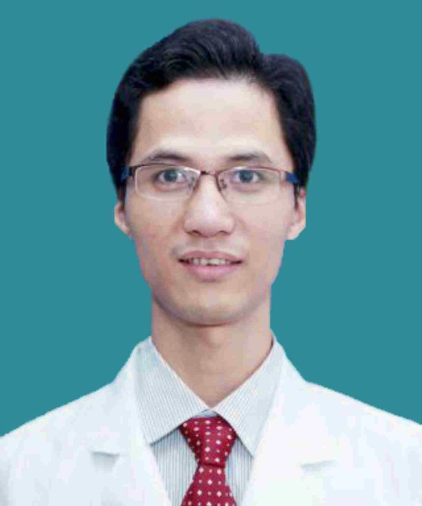

<!-- AUTO-GENERATED-BY: work/generate_obsidian_profiles.py -->

<!-- TEMPLATE: D:\workspace\信息收集整理\医生画像仓库\模板\医生画像模板.md -->

# 徐汪洋

## 基础信息

| 字段 | 内容 |
|---|---|
| 姓名 | 徐汪洋 |
| 医院 | 广东省第二人民医院 |
| 科室 | 脊柱骨科（琶洲院区） |
| 职称/身份 | 主任医师 |
| 来源链接 | [官网原文](https://gd2h.com/site/detail/41998.html) |
| 采集日期 | 2026-08-15 |

## 简介/擅长

擅长颈/腰椎间盘突出症、颈/腰椎管狭窄症、腰椎滑脱症、颈椎病、椎管内肿瘤、脊柱骨折脱位、脊髓损伤、脊柱结核等疾病的诊治。

## 教育与进修经历

- 个人介绍 徐汪洋，主任医师、医学本科 毕业于中山医科大学，从事脊柱疾病临床和教学工作近20年。

## 科研项目与成果

- 在国家及省级学术期刊上发表学术论文多篇，参与国家部省厅局级课题2项。

## 论文与学术产出

- 在国家及省级学术期刊上发表学术论文多篇，参与国家部省厅局级课题2项。

## 可包装亮点

- 个人介绍 徐汪洋，主任医师、医学本科 毕业于中山医科大学，从事脊柱疾病临床和教学工作近20年。
- 广东省康复医学会脊柱脊髓分会颈椎外科专业委员会第一届委员，广东省临床医学学会脊柱健康与疾病防治专业委员会第一届委员。
- 在国家及省级学术期刊上发表学术论文多篇，参与国家部省厅局级课题2项。

## 重点疾病/人群标签

- 慢性病：
- 肿瘤：肿瘤、感染、康复
- 生殖疾病：
- 免疫/风湿：肿瘤、感染、康复
- 术后恢复/康复：肿瘤、感染、康复
- 疑难重症：

## 证据摘录

> 只摘录官网公开信息中的短句或关键字段，不复制大段原文。

- 官网身份字段：主任医师
- 官网简介/擅长：擅长颈/腰椎间盘突出症、颈/腰椎管狭窄症、腰椎滑脱症、颈椎病、椎管内肿瘤、脊柱骨折脱位、脊髓损伤、脊柱结核等疾病的诊治。
- 官网亮眼经历线索：个人介绍 徐汪洋，主任医师、医学本科 毕业于中山医科大学，从事脊柱疾病临床和教学工作近20年。 广东省康复医学会脊柱脊髓分会颈椎外科专业委员会第一届委员，广东省临床医学学会脊柱健康与疾病防治专业委员会第一届委员。 在国家及省级学术期刊上发表学术论文多篇，参与国家部省厅局级课题2项。
- 来源链接：https://gd2h.com/site/detail/41998.html

## BD 画像摘要

徐汪洋医生可作为肿瘤、免疫/风湿/感染、术后恢复/康复方向的基础画像候选。后续 BD 使用应继续以官网来源和人工复核为准，不添加疗效承诺或无来源包装。

## 合规边界

- 仅使用医院官网、官方公众号、官方小程序等公开渠道。
- 不采集私人电话、私人微信、家庭住址、患者隐私或非公开排班信息。
- 不写“保证治愈”“疗效第一”“包治疑难杂症”等无法由官网证明的表述。
