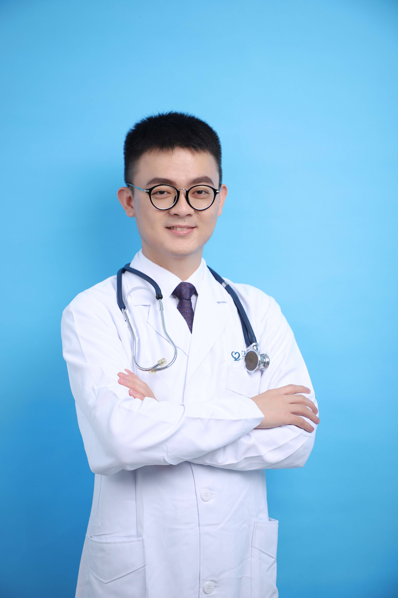

<!-- AUTO-GENERATED-BY: work/generate_obsidian_profiles.py -->

<!-- TEMPLATE: D:\workspace\信息收集整理\医生画像仓库\模板\医生画像模板.md -->

# 徐镭

## 基础信息

| 字段 | 内容 |
|---|---|
| 姓名 | 徐镭 |
| 医院 | 广东省第二人民医院 |
| 科室 | 创伤骨科（琶洲院区） |
| 职称/身份 | 医师 |
| 来源链接 | [官网原文](https://gd2h.com/site/detail/41976.html) |
| 采集日期 | 2026-08-15 |

## 简介/擅长

四肢骨折、骨科创面修复、难治性骨髓炎诊疗、肢体矫形与重建的基础及临床研究。

## 教育与进修经历

- 个人介绍 博士，纽约哥伦比亚大学访问学者。
- 毕业于香港大学医学院矫形与创伤医学系，获医学博士学位；

## 科研项目与成果

- 主持国家自然科学基金1项，广东省和广州市科技计划项目各1项。

## 论文与学术产出

- 至今以（非共同）第一作者/通信作者在包括《BONE》、《Osteoarthritis and Cartilage》、《Journal of Orthopedic Translation》等国际知名骨科期刊上发表SCI论文十余篇。

## 可包装亮点

- 个人介绍 博士，纽约哥伦比亚大学访问学者。
- 至今以（非共同）第一作者/通信作者在包括《BONE》、《Osteoarthritis and Cartilage》、《Journal of Orthopedic Translation》等国际知名骨科期刊上发表SCI论文十余篇。
- 主持国家自然科学基金1项，广东省和广州市科技计划项目各1项。

## 重点疾病/人群标签

- 慢性病：
- 肿瘤：
- 生殖疾病：
- 免疫/风湿：
- 术后恢复/康复：创面、难治
- 疑难重症：创面、难治

## 证据摘录

> 只摘录官网公开信息中的短句或关键字段，不复制大段原文。

- 官网身份字段：医师
- 官网简介/擅长：四肢骨折、骨科创面修复、难治性骨髓炎诊疗、肢体矫形与重建的基础及临床研究。
- 官网亮眼经历线索：个人介绍 博士，纽约哥伦比亚大学访问学者。 至今以（非共同）第一作者/通信作者在包括《BONE》、《Osteoarthritis and Cartilage》、《Journal of Orthopedic Translation》等国际知名骨科期刊上发表SCI论文十余篇。 主持国家自然科学基金1项，广东省和广州市科技计划项目各1项。
- 来源链接：https://gd2h.com/site/detail/41976.html

## BD 画像摘要

徐镭医生可作为术后恢复/康复、疑难重症方向的基础画像候选。后续 BD 使用应继续以官网来源和人工复核为准，不添加疗效承诺或无来源包装。

## 合规边界

- 仅使用医院官网、官方公众号、官方小程序等公开渠道。
- 不采集私人电话、私人微信、家庭住址、患者隐私或非公开排班信息。
- 不写“保证治愈”“疗效第一”“包治疑难杂症”等无法由官网证明的表述。
