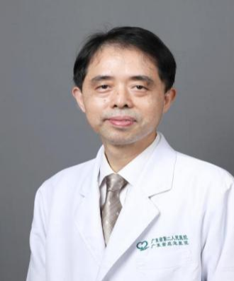

<!-- AUTO-GENERATED-BY: work/generate_obsidian_profiles.py -->

<!-- TEMPLATE: D:\workspace\信息收集整理\医生画像仓库\模板\医生画像模板.md -->

# 曾祥见

## 基础信息

| 字段 | 内容 |
|---|---|
| 姓名 | 曾祥见 |
| 医院 | 广东省第二人民医院 |
| 科室 | 泌尿外科（民航院区） |
| 职称/身份 | 副主任医师 |
| 来源链接 | [官网原文](https://gd2h.com/site/detail/3113c0faab594f81b0e9f55a2087264a.html) |
| 采集日期 | 2026-08-15 |

## 简介/擅长

擅长泌尿系肿瘤、泌尿系统结石、前列腺增生症、慢性前列腺炎及男科疾病等泌尿系统常见病与疑难病的诊断与综合治疗。

## 教育与进修经历

- 毕业于中山大学临床医学专业，曾于1989—1990年在北京大学第一附属医院泌尿外科进修深造，理论基础扎实，临床技艺精湛。

## 可包装亮点

- 曾祥见 广东省第二人民医院民航院区泌尿外科副主任医师。
- 毕业于中山大学临床医学专业，曾于1989—1990年在北京大学第一附属医院泌尿外科进修深造，理论基础扎实，临床技艺精湛。
- 拥有30余年丰富临床经验，擅长泌尿系肿瘤、泌尿系统结石、前列腺增生症、慢性前列腺炎及男科疾病等泌尿系统常见病与疑难病的诊断与综合治疗。

## 重点疾病/人群标签

- 慢性病：慢性、肿瘤、癌、疑难
- 肿瘤：慢性、肿瘤、癌、疑难
- 生殖疾病：
- 免疫/风湿：
- 术后恢复/康复：
- 疑难重症：慢性、肿瘤、癌、疑难

## 证据摘录

> 只摘录官网公开信息中的短句或关键字段，不复制大段原文。

- 官网身份字段：副主任医师
- 官网简介/擅长：擅长泌尿系肿瘤、泌尿系统结石、前列腺增生症、慢性前列腺炎及男科疾病等泌尿系统常见病与疑难病的诊断与综合治疗。
- 官网亮眼经历线索：曾祥见 广东省第二人民医院民航院区泌尿外科副主任医师。 毕业于中山大学临床医学专业，曾于1989—1990年在北京大学第一附属医院泌尿外科进修深造，理论基础扎实，临床技艺精湛。 拥有30余年丰富临床经验，擅长泌尿系肿瘤、泌尿系统结石、前列腺增生症、慢性前列腺炎及男科疾病等泌尿系统常见病与疑难病的诊断与综合治疗。
- 来源链接：https://gd2h.com/site/detail/3113c0faab594f81b0e9f55a2087264a.html

## BD 画像摘要

曾祥见医生可作为慢性病、肿瘤、疑难重症方向的基础画像候选。后续 BD 使用应继续以官网来源和人工复核为准，不添加疗效承诺或无来源包装。

## 合规边界

- 仅使用医院官网、官方公众号、官方小程序等公开渠道。
- 不采集私人电话、私人微信、家庭住址、患者隐私或非公开排班信息。
- 不写“保证治愈”“疗效第一”“包治疑难杂症”等无法由官网证明的表述。
