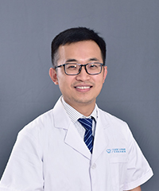

<!-- AUTO-GENERATED-BY: work/generate_obsidian_profiles.py -->

<!-- TEMPLATE: D:\workspace\信息收集整理\医生画像仓库\模板\医生画像模板.md -->

# 李业海

## 基础信息

| 字段 | 内容 |
|---|---|
| 姓名 | 李业海 |
| 医院 | 广东省第二人民医院 |
| 科室 | 神经医学中心（琶洲院区） |
| 职称/身份 | 副主任医师 |
| 来源链接 | [官网原文](https://gd2h.com/site/detail/42419.html) |
| 采集日期 | 2026-08-15 |

## 简介/擅长

擅长微创及显微镜下治疗各种脑肿瘤（胶质瘤、脑膜瘤、垂体瘤、听神经瘤、转移瘤、胆脂瘤等）和各种脑血管病（血管畸形、动脉瘤、高血压脑出血、烟雾病、颈内动脉狭窄等），并在重型颅脑损伤救治、昏迷促醒治疗、中枢神经系统感染、复杂脑积水分流搭桥术、特殊材料颅骨修复等方面，具有丰富的经验和独到见解，参与完成各类脑科手术5000余台。

## 教育与进修经历

- 毕业于南方医科大学，长期从事神经外科临床与科研工作，具备扎实的理论功底和丰富的临床经验，擅长微创及显微镜下治疗各种脑肿瘤（胶质瘤、脑膜瘤、垂体瘤、听神经瘤、转移瘤、胆脂瘤等）和各种脑血管病（血管畸形、动脉瘤、高血压脑出血、烟雾病、颈内动脉狭窄等），并在重型颅脑损伤救治、昏迷促醒治疗、中枢神经系统感染、复杂脑积水分流搭桥术、特殊材料颅骨修复等方面，具有丰富的经验和独到见解，参与完成各类脑科手术5000余台。

## 科研项目与成果

- 毕业于南方医科大学，长期从事神经外科临床与科研工作，具备扎实的理论功底和丰富的临床经验，擅长微创及显微镜下治疗各种脑肿瘤（胶质瘤、脑膜瘤、垂体瘤、听神经瘤、转移瘤、胆脂瘤等）和各种脑血管病（血管畸形、动脉瘤、高血压脑出血、烟雾病、颈内动脉狭窄等），并在重型颅脑损伤救治、昏迷促醒治疗、中枢神经系统感染、复杂脑积水分流搭桥术、特殊材料颅骨修复等方面，具有丰富的经验和独到见解，参与完成各类脑科手术5000余台。
- 在各级期刊发表学术论文10余篇，实用专利1项；

## 论文与学术产出

- 在各级期刊发表学术论文10余篇，实用专利1项；
- 参编专著：《高血压脑出血微创治疗学》；

## 可包装亮点

- 个人介绍 医学硕士，副主任医师，民航院区神经外科负责人。
- 现任广东省医疗行业协会神经外科管理分会委员、广东省中西医结合围手术期专委会委员、广东省脑发育与脑病防治学会脑病精准诊疗与修复分会委员、广东省基层医药学会神经外科专委会委员、中国颅神经疾患诊疗协作组经皮球囊压迫组委员。
- 在各级期刊发表学术论文10余篇，实用专利1项；
- 副主译：《内镜经鼻蝶外科手术学实践指南》；

## 重点疾病/人群标签

- 慢性病：
- 肿瘤：
- 生殖疾病：
- 免疫/风湿：
- 术后恢复/康复：
- 疑难重症：

## 证据摘录

> 只摘录官网公开信息中的短句或关键字段，不复制大段原文。

- 官网身份字段：副主任医师
- 官网简介/擅长：擅长微创及显微镜下治疗各种脑肿瘤（胶质瘤、脑膜瘤、垂体瘤、听神经瘤、转移瘤、胆脂瘤等）和各种脑血管病（血管畸形、动脉瘤、高血压脑出血、烟雾病、颈内动脉狭窄等），并在重型颅脑损伤救治、昏迷促醒治疗、中枢神经系统感染、复杂脑积水分流搭桥术、特殊材料颅骨修复等方面，具有丰富的经验和独到见解，参与完成各类脑科手术5000余台。
- 官网亮眼经历线索：个人介绍 医学硕士，副主任医师，民航院区神经外科负责人。 现任广东省医疗行业协会神经外科管理分会委员、广东省中西医结合围手术期专委会委员、广东省脑发育与脑病防治学会脑病精准诊疗与修复分会委员、广东省基层医药学会神经外科专委会委员、中国颅神经疾患诊疗协作组经皮球囊压迫组委员。 在各级期刊发表学术论文10余篇，实用专利1项； 副主译：《内镜经鼻蝶外科手术学实践指南》；
- 异常提示：同名待甄别
- 来源链接：https://gd2h.com/site/detail/42419.html

## BD 画像摘要

李业海医生可作为广东省第二人民医院神经医学中心（琶洲院区）的基础医生资料入库。当前重点方向以总底表标签为准，官网未展示的信息保持空白。

## 合规边界

- 仅使用医院官网、官方公众号、官方小程序等公开渠道。
- 不采集私人电话、私人微信、家庭住址、患者隐私或非公开排班信息。
- 不写“保证治愈”“疗效第一”“包治疑难杂症”等无法由官网证明的表述。
