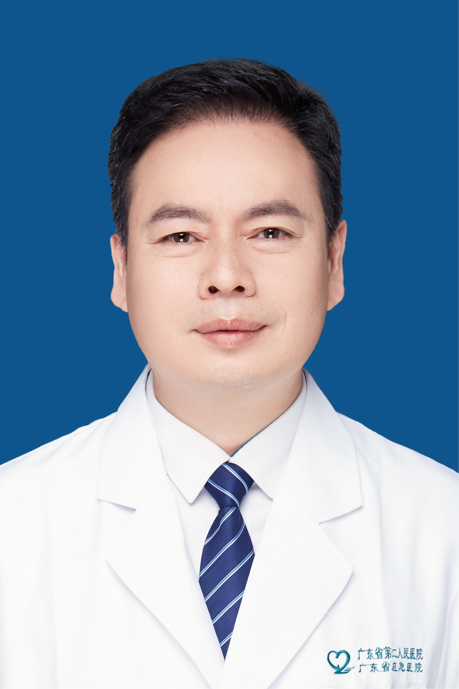

<!-- AUTO-GENERATED-BY: work/generate_obsidian_profiles.py -->

<!-- TEMPLATE: D:\workspace\信息收集整理\医生画像仓库\模板\医生画像模板.md -->

# 李天旺

## 基础信息

| 字段 | 内容 |
|---|---|
| 姓名 | 李天旺 |
| 医院 | 广东省第二人民医院 |
| 科室 | 风湿免疫科（琶洲院区） |
| 职称/身份 | 主任医师 |
| 来源链接 | [官网原文](https://gd2h.com/site/detail/42037.html) |
| 采集日期 | 2026-08-15 |

## 简介/擅长

擅长强直性脊柱炎、银屑病关节炎及反应性关节炎等血清阴性脊柱关节炎、痛风、系统性红斑狼疮、类风湿关节炎、干燥综合征、皮肌炎、多发性肌炎、白塞病、成人斯蒂尔病、骨关节炎、硬皮病、系统性血管炎、骨质疏松症等风湿免疫性疾病的诊治。

## 教育与进修经历

- 个人介绍 风湿免疫科主任，教授，主任医师，医学博士，硕士生导师，美国哈佛大学医学院访问学者，中华医学会风湿病学分会第九届青年委员，广东省临床医学学会风湿免疫分会、省中西医结合学会风湿病学分会副主任委员，广东省医学会内科学分会常委、风湿病学分会委员，广东省医师协会风湿病学分会委员，广东省医院协会临床科主任分会常委，广东省免疫学会临床免疫学分会常委，广东省健康管理学会风湿免疫学与康复专业委员会常委。
- 1995年中山医科大学本科毕业后开始从事风湿病临床、教学与科研工作，2002与2009年分别获中山大学内科学硕士、博士学位。

## 科研项目与成果

- 1995年中山医科大学本科毕业后开始从事风湿病临床、教学与科研工作，2002与2009年分别获中山大学内科学硕士、博士学位。
- 主要研究方向为强直性脊柱炎的基础与临床，曾主持及参与国家、省、局厅级科研课题10余项，发表科研论文50余篇，其中以第一作者或通讯作者发表SCI收录论文13篇，主编《透视强直性脊柱炎与脊柱关节炎》与《治好痛风并不难》，参编风湿病专著2本。

## 论文与学术产出

- 主要研究方向为强直性脊柱炎的基础与临床，曾主持及参与国家、省、局厅级科研课题10余项，发表科研论文50余篇，其中以第一作者或通讯作者发表SCI收录论文13篇，主编《透视强直性脊柱炎与脊柱关节炎》与《治好痛风并不难》，参编风湿病专著2本。

## 可包装亮点

- 个人介绍 风湿免疫科主任，教授，主任医师，医学博士，硕士生导师，美国哈佛大学医学院访问学者，中华医学会风湿病学分会第九届青年委员，广东省临床医学学会风湿免疫分会、省中西医结合学会风湿病学分会副主任委员，广东省医学会内科学分会常委、风湿病学分会委员，广东省医师协会风湿病学分会委员，广东省医院协会临床科主任分会常委，广东省免疫学会临床免疫学分会常委，广东省健康…
- 主要研究方向为强直性脊柱炎的基础与临床，曾主持及参与国家、省、局厅级科研课题10余项，发表科研论文50余篇，其中以第一作者或通讯作者发表SCI收录论文13篇，主编《透视强直性脊柱炎与脊柱关节炎》与《治好痛风并不难》，参编风湿病专著2本。

## 重点疾病/人群标签

- 慢性病：
- 肿瘤：
- 生殖疾病：
- 免疫/风湿：风湿、免疫、红斑狼疮、类风湿、强直性脊柱炎、康复
- 术后恢复/康复：风湿、免疫、红斑狼疮、类风湿、强直性脊柱炎、康复
- 疑难重症：

## 证据摘录

> 只摘录官网公开信息中的短句或关键字段，不复制大段原文。

- 官网身份字段：主任医师
- 官网简介/擅长：擅长强直性脊柱炎、银屑病关节炎及反应性关节炎等血清阴性脊柱关节炎、痛风、系统性红斑狼疮、类风湿关节炎、干燥综合征、皮肌炎、多发性肌炎、白塞病、成人斯蒂尔病、骨关节炎、硬皮病、系统性血管炎、骨质疏松症等风湿免疫性疾病的诊治。
- 官网亮眼经历线索：个人介绍 风湿免疫科主任，教授，主任医师，医学博士，硕士生导师，美国哈佛大学医学院访问学者，中华医学会风湿病学分会第九届青年委员，广东省临床医学学会风湿免疫分会、省中西医结合学会风湿病学分会副主任委员，广东省医学会内科学分会常委、风湿病学分会委员，广东省医师协会风湿病学分会委员，广东省医院协会临床科主任分会常委，广东省免疫学会临床免疫学分会常委，广东省健康管理学会风湿免疫学与康复专业委员会常委。 主要研究方向为强直性脊柱炎的基础与临床…
- 来源链接：https://gd2h.com/site/detail/42037.html

## BD 画像摘要

李天旺医生可作为免疫/风湿/感染、术后恢复/康复方向的基础画像候选。后续 BD 使用应继续以官网来源和人工复核为准，不添加疗效承诺或无来源包装。

## 合规边界

- 仅使用医院官网、官方公众号、官方小程序等公开渠道。
- 不采集私人电话、私人微信、家庭住址、患者隐私或非公开排班信息。
- 不写“保证治愈”“疗效第一”“包治疑难杂症”等无法由官网证明的表述。
