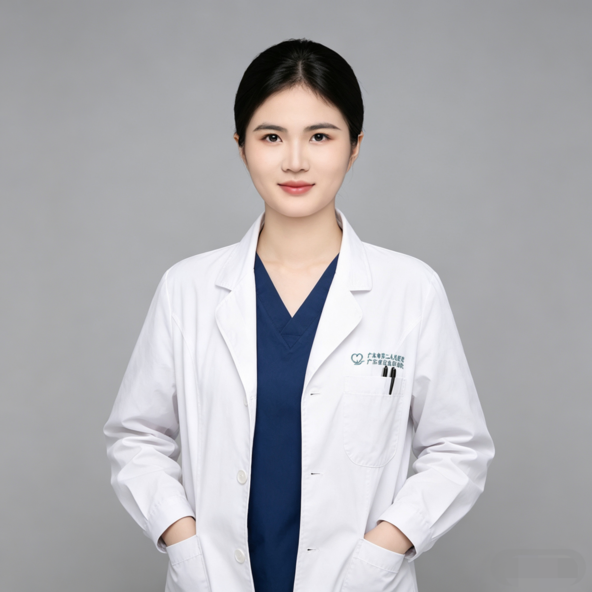

<!-- AUTO-GENERATED-BY: work/generate_obsidian_profiles.py -->

<!-- TEMPLATE: D:\workspace\信息收集整理\医生画像仓库\模板\医生画像模板.md -->

# 李娜

## 基础信息

| 字段 | 内容 |
|---|---|
| 姓名 | 李娜 |
| 医院 | 广东省第二人民医院 |
| 科室 | 胸壁外科（民航院区） |
| 职称/身份 | 主治医师 |
| 来源链接 | [官网原文](https://gd2h.com/site/detail/c6f679ab57ba446c8a26e89273ab0ec3.html) |
| 采集日期 | 2026-08-15 |

## 简介/擅长

擅长胸壁畸形矫正、乳房疾病的临床诊治、乳房整形。

## 教育与进修经历

- 毕业于暨南大学。

## 科研项目与成果

- 李娜 广东省第二人民医院胸壁外科研究院医师，胸壁外科创始人王文林教授团队成员。

## 可包装亮点

- 现任广东省胸部疾病学会胸壁外科专业委员会委员，国际胸壁外科组织成员。

## 重点疾病/人群标签

- 慢性病：
- 肿瘤：
- 生殖疾病：
- 免疫/风湿：
- 术后恢复/康复：
- 疑难重症：

## 证据摘录

> 只摘录官网公开信息中的短句或关键字段，不复制大段原文。

- 官网身份字段：主治医师
- 官网简介/擅长：擅长胸壁畸形矫正、乳房疾病的临床诊治、乳房整形。
- 官网亮眼经历线索：现任广东省胸部疾病学会胸壁外科专业委员会委员，国际胸壁外科组织成员。
- 来源链接：https://gd2h.com/site/detail/c6f679ab57ba446c8a26e89273ab0ec3.html

## BD 画像摘要

李娜医生可作为广东省第二人民医院胸壁外科（民航院区）的基础医生资料入库。当前重点方向以总底表标签为准，官网未展示的信息保持空白。

## 合规边界

- 仅使用医院官网、官方公众号、官方小程序等公开渠道。
- 不采集私人电话、私人微信、家庭住址、患者隐私或非公开排班信息。
- 不写“保证治愈”“疗效第一”“包治疑难杂症”等无法由官网证明的表述。
