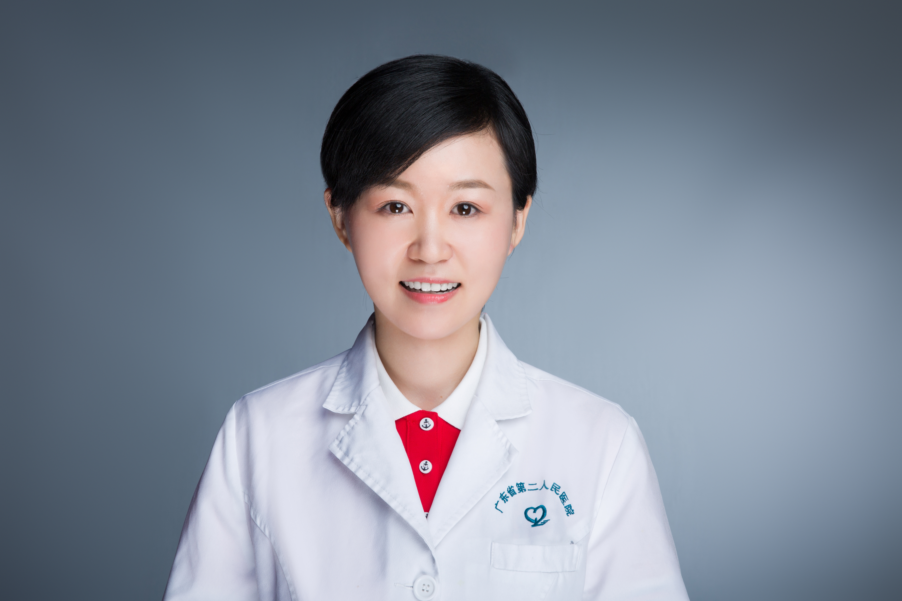

<!-- AUTO-GENERATED-BY: work/generate_obsidian_profiles.py -->

<!-- TEMPLATE: D:\workspace\信息收集整理\医生画像仓库\模板\医生画像模板.md -->

# 李婷

## 基础信息

| 字段 | 内容 |
|---|---|
| 姓名 | 李婷 |
| 医院 | 广东省第二人民医院 |
| 科室 | 皮肤性病科（琶洲院区） |
| 职称/身份 | 主治医师 |
| 来源链接 | [官网原文](https://gd2h.com/site/detail/42116.html) |
| 采集日期 | 2026-08-15 |

## 简介/擅长

熟练掌握尖锐湿疣的诊治，对雀斑、文身及脂溢性角化病的皮秒激光、痤疮疤痕的点阵激光及黄金微针经验丰富。

## 可包装亮点

- 广东省医学会皮肤性病学分会微整形与注射学组委员，广东省预防医学会皮肤性病防治专业委员会免疫学组委员，广东省保健协会皮肤保健与美容分会委员，广东省中西医结合学会皮肤性病专业委员会委员，荣获“广东省第二人民医院先进个人”“广东省第二人民医院优秀住院医师”等荣誉称号。

## 重点疾病/人群标签

- 慢性病：
- 肿瘤：
- 生殖疾病：
- 免疫/风湿：免疫
- 术后恢复/康复：
- 疑难重症：

## 证据摘录

> 只摘录官网公开信息中的短句或关键字段，不复制大段原文。

- 官网身份字段：主治医师
- 官网简介/擅长：熟练掌握尖锐湿疣的诊治，对雀斑、文身及脂溢性角化病的皮秒激光、痤疮疤痕的点阵激光及黄金微针经验丰富。
- 官网亮眼经历线索：广东省医学会皮肤性病学分会微整形与注射学组委员，广东省预防医学会皮肤性病防治专业委员会免疫学组委员，广东省保健协会皮肤保健与美容分会委员，广东省中西医结合学会皮肤性病专业委员会委员，荣获“广东省第二人民医院先进个人”“广东省第二人民医院优秀住院医师”等荣誉称号。
- 来源链接：https://gd2h.com/site/detail/42116.html

## BD 画像摘要

李婷医生可作为免疫/风湿/感染方向的基础画像候选。后续 BD 使用应继续以官网来源和人工复核为准，不添加疗效承诺或无来源包装。

## 合规边界

- 仅使用医院官网、官方公众号、官方小程序等公开渠道。
- 不采集私人电话、私人微信、家庭住址、患者隐私或非公开排班信息。
- 不写“保证治愈”“疗效第一”“包治疑难杂症”等无法由官网证明的表述。
