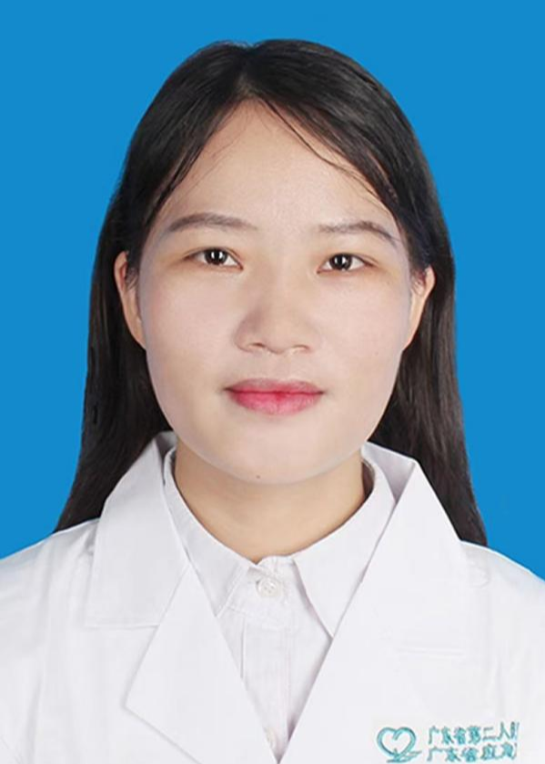

<!-- AUTO-GENERATED-BY: work/generate_obsidian_profiles.py -->

<!-- TEMPLATE: D:\workspace\信息收集整理\医生画像仓库\模板\医生画像模板.md -->

# 李少娟

## 基础信息

| 字段 | 内容 |
|---|---|
| 姓名 | 李少娟 |
| 医院 | 广东省第二人民医院 |
| 科室 | 中西医结合临床诊疗中心（民航院区） |
| 职称/身份 | 主治医师 |
| 来源链接 | [官网原文](https://gd2h.com/site/detail/7766a6969a9148f1b4cb566367a7b742.html) |
| 采集日期 | 2026-08-15 |

## 简介/擅长

擅长运用1.刃针治疗痛症；2.臭氧大自血疗3.超声引导下臭氧定点注射治疗膝骨关节炎、腰椎间盘突出等；4各类特色针法如靳三针、醒脑开窍针法、岭南火针、穴位埋线、温针灸、穴位注射等。

## 教育与进修经历

- 毕业于广州中医药大学，获硕士学位。

## 科研项目与成果

- 参与省市级课题研究多项。

## 论文与学术产出

- 在《广州中医药大学学报》等国内权威医学期刊上以第一作者发表高质量论文3篇。

## 可包装亮点

- 多次荣获院级“先进个人称号”“工会活动积极分子”等称号，先后获得省市级科普视频大赛、案例大赛“优秀奖”及医患沟通大赛“团队优秀奖”等。
- 现任广东省针灸学会常委、广东省传统医学会中医康复技术分会常委等重要职务。
- 在《广州中医药大学学报》等国内权威医学期刊上以第一作者发表高质量论文3篇。

## 重点疾病/人群标签

- 慢性病：
- 肿瘤：
- 生殖疾病：月经、康复
- 免疫/风湿：
- 术后恢复/康复：月经、康复
- 疑难重症：

## 证据摘录

> 只摘录官网公开信息中的短句或关键字段，不复制大段原文。

- 官网身份字段：主治医师
- 官网简介/擅长：擅长运用1.刃针治疗痛症；2.臭氧大自血疗3.超声引导下臭氧定点注射治疗膝骨关节炎、腰椎间盘突出等；4各类特色针法如靳三针、醒脑开窍针法、岭南火针、穴位埋线、温针灸、穴位注射等。
- 官网亮眼经历线索：多次荣获院级“先进个人称号”“工会活动积极分子”等称号，先后获得省市级科普视频大赛、案例大赛“优秀奖”及医患沟通大赛“团队优秀奖”等。 现任广东省针灸学会常委、广东省传统医学会中医康复技术分会常委等重要职务。 在《广州中医药大学学报》等国内权威医学期刊上以第一作者发表高质量论文3篇。
- 来源链接：https://gd2h.com/site/detail/7766a6969a9148f1b4cb566367a7b742.html

## BD 画像摘要

李少娟医生可作为生殖疾病、术后恢复/康复方向的基础画像候选。后续 BD 使用应继续以官网来源和人工复核为准，不添加疗效承诺或无来源包装。

## 合规边界

- 仅使用医院官网、官方公众号、官方小程序等公开渠道。
- 不采集私人电话、私人微信、家庭住址、患者隐私或非公开排班信息。
- 不写“保证治愈”“疗效第一”“包治疑难杂症”等无法由官网证明的表述。
