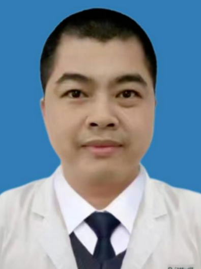

<!-- AUTO-GENERATED-BY: work/generate_obsidian_profiles.py -->

<!-- TEMPLATE: D:\workspace\信息收集整理\医生画像仓库\模板\医生画像模板.md -->

# 李昌海

## 基础信息

| 字段 | 内容 |
|---|---|
| 姓名 | 李昌海 |
| 医院 | 广东省第二人民医院 |
| 科室 | 健康管理（体检）科（民航院区） |
| 职称/身份 | 副主任医师 |
| 来源链接 | [官网原文](https://gd2h.com/site/detail/01a7a106bc054fd5bd0e79d2af1b026d.html) |
| 采集日期 | 2026-08-15 |

## 简介/擅长

擅长耳鼻咽喉科常见病及多发病的精准诊断与规范化治疗

## 教育与进修经历

- 广东省第二人民医院民航院区健康管理（体检）科 （耳鼻咽喉科学）副主任医师，毕业于广西医科大学临床医学系。
- 从事耳鼻咽喉科临床工作近20年，曾在中山大学附属第一医院耳鼻喉科深造进修1年，系统掌握了耳鼻咽喉头颈外科前沿诊疗技术。

## 可包装亮点

- 广东省第二人民医院民航院区健康管理（体检）科 （耳鼻咽喉科学）副主任医师，毕业于广西医科大学临床医学系。
- 从事耳鼻咽喉科临床工作近20年，曾在中山大学附属第一医院耳鼻喉科深造进修1年，系统掌握了耳鼻咽喉头颈外科前沿诊疗技术。
- 擅长耳鼻咽喉科常见病及多发病的精准诊断与规范化治疗，在慢性鼻窦炎、过敏性鼻炎、突发性耳聋、眩晕症等领域积累了丰富的临床经验。
- 2022年被民航局委任为航空耳鼻喉科体检医师，熟练掌握空勤人员及空中交通管制人员的航空体检耳鼻喉科专项鉴定工作，在航空性耳鼻咽喉疾病（如航空性中耳炎、气压创伤性鼻窦炎、噪声性听力损伤等）的精准诊断与航空医学鉴定方面具有独到经验，为航空安全提供专业保障。

## 重点疾病/人群标签

- 慢性病：慢性
- 肿瘤：
- 生殖疾病：
- 免疫/风湿：
- 术后恢复/康复：
- 疑难重症：

## 证据摘录

> 只摘录官网公开信息中的短句或关键字段，不复制大段原文。

- 官网身份字段：副主任医师
- 官网简介/擅长：擅长耳鼻咽喉科常见病及多发病的精准诊断与规范化治疗
- 官网亮眼经历线索：广东省第二人民医院民航院区健康管理（体检）科 （耳鼻咽喉科学）副主任医师，毕业于广西医科大学临床医学系。 从事耳鼻咽喉科临床工作近20年，曾在中山大学附属第一医院耳鼻喉科深造进修1年，系统掌握了耳鼻咽喉头颈外科前沿诊疗技术。 擅长耳鼻咽喉科常见病及多发病的精准诊断与规范化治疗，在慢性鼻窦炎、过敏性鼻炎、突发性耳聋、眩晕症等领域积累了丰富的临床经验。 2022年被民航局委任为航空耳鼻喉科体检医师，熟练掌握空勤人员及空中交通管制人员的航空…
- 来源链接：https://gd2h.com/site/detail/01a7a106bc054fd5bd0e79d2af1b026d.html

## BD 画像摘要

李昌海医生可作为慢性病方向的基础画像候选。后续 BD 使用应继续以官网来源和人工复核为准，不添加疗效承诺或无来源包装。

## 合规边界

- 仅使用医院官网、官方公众号、官方小程序等公开渠道。
- 不采集私人电话、私人微信、家庭住址、患者隐私或非公开排班信息。
- 不写“保证治愈”“疗效第一”“包治疑难杂症”等无法由官网证明的表述。
