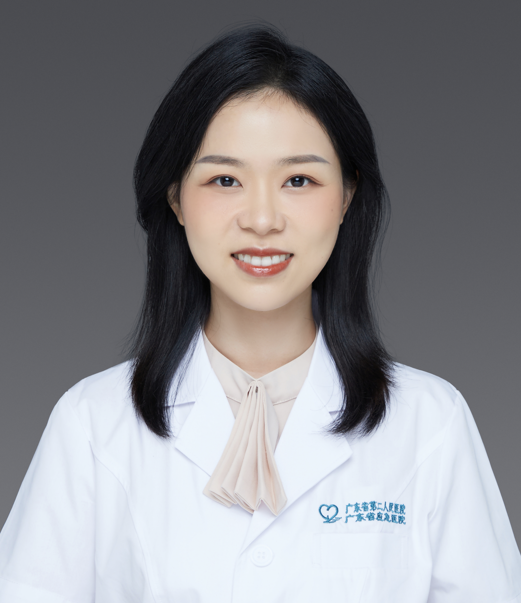

<!-- AUTO-GENERATED-BY: work/generate_obsidian_profiles.py -->

<!-- TEMPLATE: D:\workspace\信息收集整理\医生画像仓库\模板\医生画像模板.md -->

# 李瑶

## 基础信息

| 字段 | 内容 |
|---|---|
| 姓名 | 李瑶 |
| 医院 | 广东省第二人民医院 |
| 科室 | 整形美容科（琶洲院区） |
| 职称/身份 | 医生 |
| 来源链接 | [官网原文](https://gd2h.com/site/detail/42209.html) |
| 采集日期 | 2026-08-15 |

## 简介/擅长

痤疮、痤疮炎症后色素沉着以及痤疮瘢痕的治疗，在雀斑、晒斑、黄褐斑、老年斑、太田痣、鲜红斑痣等色素性、血管性皮肤病及瘢痕的无创微创修复等诊疗方面具有丰富的临床经验。精通射频、肉毒素除皱及提升，玻尿酸填充塑形等面部年轻化定制治疗。

## 可包装亮点

- 个人介绍 广东省第二人民医院整形美容激光中心医师 广东省整形美容协会皮肤美容分会委员 广州市光协会激光医学分会委员 南方医科大学皮肤学医学博士，擅长于痤疮、痤疮炎症后色素沉着以及痤疮瘢痕的治疗，在雀斑、晒斑、黄褐斑、老年斑、太田痣、鲜红斑痣等色素性、血管性皮肤病及瘢痕的无创微创修复等诊疗方面具有丰富的临床经验。

## 重点疾病/人群标签

- 慢性病：
- 肿瘤：
- 生殖疾病：
- 免疫/风湿：
- 术后恢复/康复：
- 疑难重症：

## 证据摘录

> 只摘录官网公开信息中的短句或关键字段，不复制大段原文。

- 官网身份字段：医生
- 官网简介/擅长：痤疮、痤疮炎症后色素沉着以及痤疮瘢痕的治疗，在雀斑、晒斑、黄褐斑、老年斑、太田痣、鲜红斑痣等色素性、血管性皮肤病及瘢痕的无创微创修复等诊疗方面具有丰富的临床经验。精通射频、肉毒素除皱及提升，玻尿酸填充塑形等面部年轻化定制治疗。
- 官网亮眼经历线索：个人介绍 广东省第二人民医院整形美容激光中心医师 广东省整形美容协会皮肤美容分会委员 广州市光协会激光医学分会委员 南方医科大学皮肤学医学博士，擅长于痤疮、痤疮炎症后色素沉着以及痤疮瘢痕的治疗，在雀斑、晒斑、黄褐斑、老年斑、太田痣、鲜红斑痣等色素性、血管性皮肤病及瘢痕的无创微创修复等诊疗方面具有丰富的临床经验。
- 异常提示：职称/身份需人工复核
- 来源链接：https://gd2h.com/site/detail/42209.html

## BD 画像摘要

李瑶医生可作为广东省第二人民医院整形美容科（琶洲院区）的基础医生资料入库。当前重点方向以总底表标签为准，官网未展示的信息保持空白。

## 合规边界

- 仅使用医院官网、官方公众号、官方小程序等公开渠道。
- 不采集私人电话、私人微信、家庭住址、患者隐私或非公开排班信息。
- 不写“保证治愈”“疗效第一”“包治疑难杂症”等无法由官网证明的表述。
