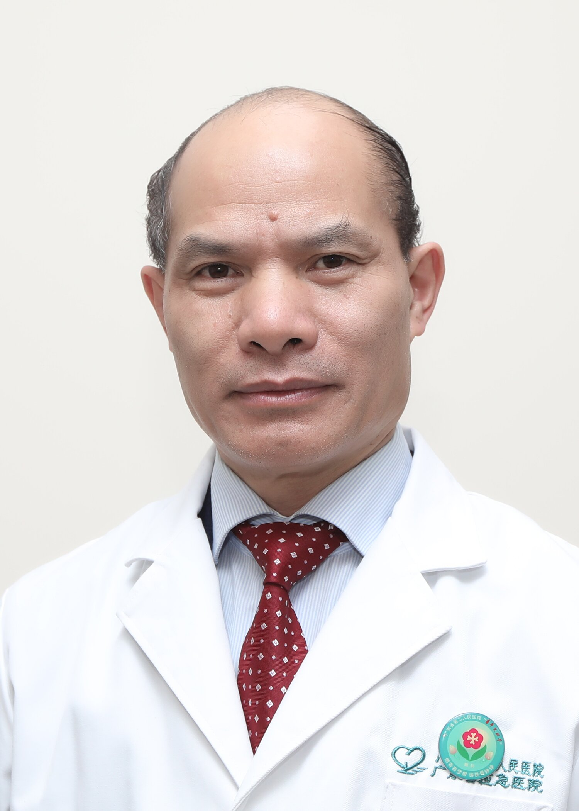

<!-- AUTO-GENERATED-BY: work/generate_obsidian_profiles.py -->

<!-- TEMPLATE: D:\workspace\信息收集整理\医生画像仓库\模板\医生画像模板.md -->

# 李贵涛

## 基础信息

| 字段 | 内容 |
|---|---|
| 姓名 | 李贵涛 |
| 医院 | 广东省第二人民医院 |
| 科室 | 关节骨一科（琶洲院区） |
| 职称/身份 | 主任医师 |
| 来源链接 | [官网原文](https://gd2h.com/site/detail/41977.html) |
| 采集日期 | 2026-08-15 |

## 简介/擅长

医学博士，从事骨科临床工作30多年，擅长复杂膝、髋、肩、肘等骨关节疾病的治疗，熟悉颈、肩、腰腿疼痛和四肢骨关节疾病与创伤的诊断治疗。

## 可包装亮点

- 主任医师（返聘专家）、医学博士。
- 社会任职：中国康复医学会骨与关节分会委员，广东省医学会骨科学会副主任委员，国务院特殊津贴专家、全国科技评价专家。

## 重点疾病/人群标签

- 慢性病：
- 肿瘤：
- 生殖疾病：
- 免疫/风湿：
- 术后恢复/康复：康复、疼痛、复杂
- 疑难重症：康复、疼痛、复杂

## 证据摘录

> 只摘录官网公开信息中的短句或关键字段，不复制大段原文。

- 官网身份字段：主任医师
- 官网简介/擅长：医学博士，从事骨科临床工作30多年，擅长复杂膝、髋、肩、肘等骨关节疾病的治疗，熟悉颈、肩、腰腿疼痛和四肢骨关节疾病与创伤的诊断治疗。
- 官网亮眼经历线索：主任医师（返聘专家）、医学博士。 社会任职：中国康复医学会骨与关节分会委员，广东省医学会骨科学会副主任委员，国务院特殊津贴专家、全国科技评价专家。
- 来源链接：https://gd2h.com/site/detail/41977.html

## BD 画像摘要

李贵涛医生可作为术后恢复/康复、疑难重症方向的基础画像候选。后续 BD 使用应继续以官网来源和人工复核为准，不添加疗效承诺或无来源包装。

## 合规边界

- 仅使用医院官网、官方公众号、官方小程序等公开渠道。
- 不采集私人电话、私人微信、家庭住址、患者隐私或非公开排班信息。
- 不写“保证治愈”“疗效第一”“包治疑难杂症”等无法由官网证明的表述。
