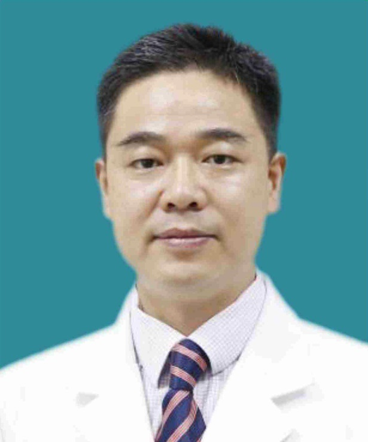

<!-- AUTO-GENERATED-BY: work/generate_obsidian_profiles.py -->

<!-- TEMPLATE: D:\workspace\信息收集整理\医生画像仓库\模板\医生画像模板.md -->

# 李超

## 基础信息

| 字段 | 内容 |
|---|---|
| 姓名 | 李超 |
| 医院 | 广东省第二人民医院 |
| 科室 | 脊柱骨科（琶洲院区） |
| 职称/身份 | 主治医师 |
| 来源链接 | [官网原文](https://gd2h.com/site/detail/42000.html) |
| 采集日期 | 2026-08-15 |

## 简介/擅长

具有丰富的临床经验，对颈椎病、颈椎管狭窄、脊柱结核、脊柱骨折脱位、腰椎间盘突出症、腰椎管狭窄症、腰椎滑脱症等脊柱脊髓疾病有独到的见解和丰富的治疗经验。

## 教育与进修经历

- 个人介绍 李超，主治医师、医学硕士 德国慕尼黑Harlaching骨科专科医院访问学者，主攻脊柱及脊柱微创专业。

## 科研项目与成果

- 发表论文数篇，获广东省医学科研基金二项。

## 论文与学术产出

- 发表论文数篇，获广东省医学科研基金二项。

## 可包装亮点

- 个人介绍 李超，主治医师、医学硕士 德国慕尼黑Harlaching骨科专科医院访问学者，主攻脊柱及脊柱微创专业。
- 发表论文数篇，获广东省医学科研基金二项。

## 重点疾病/人群标签

- 慢性病：
- 肿瘤：肿瘤、感染
- 生殖疾病：
- 免疫/风湿：肿瘤、感染
- 术后恢复/康复：
- 疑难重症：

## 证据摘录

> 只摘录官网公开信息中的短句或关键字段，不复制大段原文。

- 官网身份字段：主治医师
- 官网简介/擅长：具有丰富的临床经验，对颈椎病、颈椎管狭窄、脊柱结核、脊柱骨折脱位、腰椎间盘突出症、腰椎管狭窄症、腰椎滑脱症等脊柱脊髓疾病有独到的见解和丰富的治疗经验。
- 官网亮眼经历线索：个人介绍 李超，主治医师、医学硕士 德国慕尼黑Harlaching骨科专科医院访问学者，主攻脊柱及脊柱微创专业。 发表论文数篇，获广东省医学科研基金二项。
- 来源链接：https://gd2h.com/site/detail/42000.html

## BD 画像摘要

李超医生可作为肿瘤、免疫/风湿/感染方向的基础画像候选。后续 BD 使用应继续以官网来源和人工复核为准，不添加疗效承诺或无来源包装。

## 合规边界

- 仅使用医院官网、官方公众号、官方小程序等公开渠道。
- 不采集私人电话、私人微信、家庭住址、患者隐私或非公开排班信息。
- 不写“保证治愈”“疗效第一”“包治疑难杂症”等无法由官网证明的表述。
