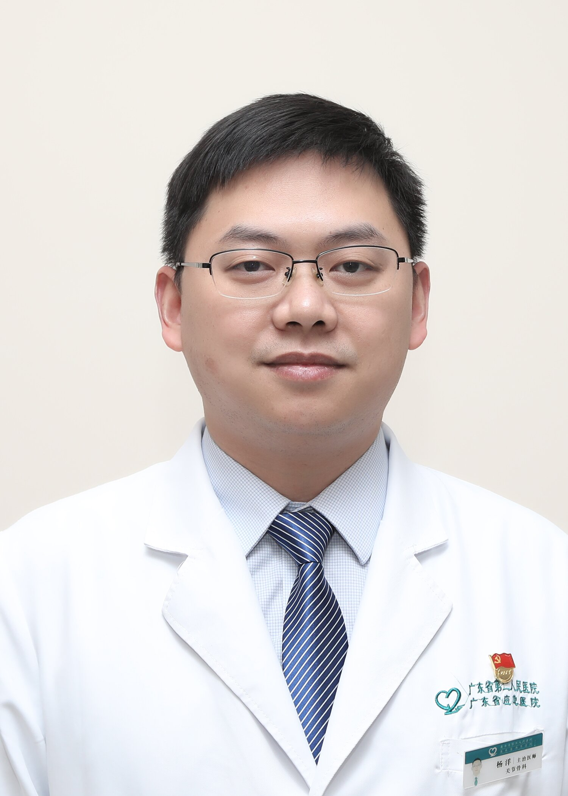

<!-- AUTO-GENERATED-BY: work/generate_obsidian_profiles.py -->

<!-- TEMPLATE: D:\workspace\信息收集整理\医生画像仓库\模板\医生画像模板.md -->

# 杨洋

## 基础信息

| 字段 | 内容 |
|---|---|
| 姓名 | 杨洋 |
| 医院 | 广东省第二人民医院 |
| 科室 | 关节骨一科（琶洲院区） |
| 职称/身份 | 副主任医师 |
| 来源链接 | [官网原文](https://gd2h.com/site/detail/41983.html) |
| 采集日期 | 2026-08-15 |

## 简介/擅长

擅长髋、膝、肩关节置换术，微创保肩、保髋及保膝手术，肩、髋、膝及踝关节的微创关节镜手术。对肩袖损伤、肩周炎、肩关节盂唇损伤、肩关节骨性关节炎、肩关节习惯性脱位等肩关节疾病的诊治具有丰富经验。

## 科研项目与成果

- 社会任职：中国老年学和老年医学学会骨科分会委员，广东省医师协会骨关节外科医师分会委员，广东省医学会创伤学分会委员，广东省康复医学会委员 科研：主持厅级及省级科研基金各一项，发表SCI及中文期刊十余篇。

## 论文与学术产出

- 社会任职：中国老年学和老年医学学会骨科分会委员，广东省医师协会骨关节外科医师分会委员，广东省医学会创伤学分会委员，广东省康复医学会委员 科研：主持厅级及省级科研基金各一项，发表SCI及中文期刊十余篇。

## 可包装亮点

- 副主任医师，医学博士，暨南大学硕士研究生导师，保肩治疗组组长。
- 社会任职：中国老年学和老年医学学会骨科分会委员，广东省医师协会骨关节外科医师分会委员，广东省医学会创伤学分会委员，广东省康复医学会委员 科研：主持厅级及省级科研基金各一项，发表SCI及中文期刊十余篇。

## 重点疾病/人群标签

- 慢性病：
- 肿瘤：
- 生殖疾病：
- 免疫/风湿：
- 术后恢复/康复：康复
- 疑难重症：

## 证据摘录

> 只摘录官网公开信息中的短句或关键字段，不复制大段原文。

- 官网身份字段：副主任医师
- 官网简介/擅长：擅长髋、膝、肩关节置换术，微创保肩、保髋及保膝手术，肩、髋、膝及踝关节的微创关节镜手术。对肩袖损伤、肩周炎、肩关节盂唇损伤、肩关节骨性关节炎、肩关节习惯性脱位等肩关节疾病的诊治具有丰富经验。
- 官网亮眼经历线索：副主任医师，医学博士，暨南大学硕士研究生导师，保肩治疗组组长。 社会任职：中国老年学和老年医学学会骨科分会委员，广东省医师协会骨关节外科医师分会委员，广东省医学会创伤学分会委员，广东省康复医学会委员 科研：主持厅级及省级科研基金各一项，发表SCI及中文期刊十余篇。
- 来源链接：https://gd2h.com/site/detail/41983.html

## BD 画像摘要

杨洋医生可作为术后恢复/康复方向的基础画像候选。后续 BD 使用应继续以官网来源和人工复核为准，不添加疗效承诺或无来源包装。

## 合规边界

- 仅使用医院官网、官方公众号、官方小程序等公开渠道。
- 不采集私人电话、私人微信、家庭住址、患者隐私或非公开排班信息。
- 不写“保证治愈”“疗效第一”“包治疑难杂症”等无法由官网证明的表述。
