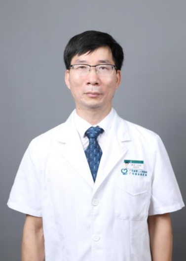

<!-- AUTO-GENERATED-BY: work/generate_obsidian_profiles.py -->

<!-- TEMPLATE: D:\workspace\信息收集整理\医生画像仓库\模板\医生画像模板.md -->

# 林浩

## 基础信息

| 字段 | 内容 |
|---|---|
| 姓名 | 林浩 |
| 医院 | 广东省第二人民医院 |
| 科室 | 骨科（民航院区） |
| 职称/身份 | 主任医师 |
| 来源链接 | [官网原文](https://gd2h.com/site/detail/97b67c1937474da6bd3829b5883b5144.html) |
| 采集日期 | 2026-08-15 |

## 简介/擅长

擅长四肢严重复杂骨折、小儿及老年人骨折、肢体严重创伤、手足外伤、断肢（指）再植（造）、骨感染、骨不连、四肢复合皮肤组织缺损创面、溃疡创面、糖尿病足、周围神经损伤、烧伤、瘢痕整形、肢体畸形矫形的诊断与治疗，掌握断肢（指）再植再造、复杂创面修复、糖尿病足保肢、周围神经修复、骨折微创固定、瘢痕整形矫形等尖端、特色、创新核心技术，尤其在肢体严重创伤修复、慢性难愈创面（糖尿病足）治疗、手足显微外科重建方面经验独到

## 教育与进修经历

- 曾于北京积水潭医院系统进修学习创伤骨科。
- 毕业于广东医学院，现任广东省健康管理创面修复委员会常务委员、广东省医疗行业协会伤口管理分会副主任委员、广东医学会显微外科分会委员及手外科组副组长、广东省医师学会烧伤外科分会常务委员、广东省及广州市医学会医疗鉴定专家，长期致力于创伤骨科、显微外科、创面修复、手外科、烧伤整形领域研究。

## 科研项目与成果

- 主持或主要参与完成省部级、市级课题研究多项，其中已完成部级课题1项、广东省医学科研基金2项；

## 论文与学术产出

- 在国内外各类核心医学期刊发表论文30余篇。

## 可包装亮点

- 林浩，广东省第二人民医院民航院区骨科副主任（主持工作），主任医师，深耕骨科临床20余年，早年专注创伤显微骨科，现全面负责大骨科诊疗工作，以创伤手术、关节置换为技术核心，累计完成各类手术超30000台。
- 曾于北京积水潭医院系统进修学习创伤骨科。
- 毕业于广东医学院，现任广东省健康管理创面修复委员会常务委员、广东省医疗行业协会伤口管理分会副主任委员、广东医学会显微外科分会委员及手外科组副组长、广东省医师学会烧伤外科分会常务委员、广东省及广州市医学会医疗鉴定专家，长期致力于创伤骨科、显微外科、创面修复、手外科、烧伤整形领域研究。
- 荣获广东省科技进步二等奖2项、中华医学科技奖二等奖1项；

## 重点疾病/人群标签

- 慢性病：糖尿病、慢性、感染、创面、烧伤、伤口、复杂
- 肿瘤：
- 生殖疾病：
- 免疫/风湿：糖尿病、慢性、感染、创面、烧伤、伤口、复杂
- 术后恢复/康复：糖尿病、慢性、感染、创面、烧伤、伤口、复杂
- 疑难重症：糖尿病、慢性、感染、创面、烧伤、伤口、复杂

## 证据摘录

> 只摘录官网公开信息中的短句或关键字段，不复制大段原文。

- 官网身份字段：主任医师
- 官网简介/擅长：擅长四肢严重复杂骨折、小儿及老年人骨折、肢体严重创伤、手足外伤、断肢（指）再植（造）、骨感染、骨不连、四肢复合皮肤组织缺损创面、溃疡创面、糖尿病足、周围神经损伤、烧伤、瘢痕整形、肢体畸形矫形的诊断与治疗，掌握断肢（指）再植再造、复杂创面修复、糖尿病足保肢、周围神经修复、骨折微创固定、瘢痕整形矫形等尖端、特色、创新核心技术，尤其在肢体严重创伤修复、慢性难愈创面（糖尿病足）治疗、手足显微外科重建方面经验独到
- 官网亮眼经历线索：林浩，广东省第二人民医院民航院区骨科副主任（主持工作），主任医师，深耕骨科临床20余年，早年专注创伤显微骨科，现全面负责大骨科诊疗工作，以创伤手术、关节置换为技术核心，累计完成各类手术超30000台。 曾于北京积水潭医院系统进修学习创伤骨科。 毕业于广东医学院，现任广东省健康管理创面修复委员会常务委员、广东省医疗行业协会伤口管理分会副主任委员、广东医学会显微外科分会委员及手外科组副组长、广东省医师学会烧伤外科分会常务委员、广东省及广州…
- 来源链接：https://gd2h.com/site/detail/97b67c1937474da6bd3829b5883b5144.html

## BD 画像摘要

林浩医生可作为慢性病、免疫/风湿/感染、术后恢复/康复、疑难重症方向的基础画像候选。后续 BD 使用应继续以官网来源和人工复核为准，不添加疗效承诺或无来源包装。

## 合规边界

- 仅使用医院官网、官方公众号、官方小程序等公开渠道。
- 不采集私人电话、私人微信、家庭住址、患者隐私或非公开排班信息。
- 不写“保证治愈”“疗效第一”“包治疑难杂症”等无法由官网证明的表述。
