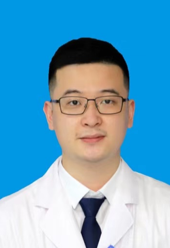

<!-- AUTO-GENERATED-BY: work/generate_obsidian_profiles.py -->

<!-- TEMPLATE: D:\workspace\信息收集整理\医生画像仓库\模板\医生画像模板.md -->

# 桂博南

## 基础信息

| 字段 | 内容 |
|---|---|
| 姓名 | 桂博南 |
| 医院 | 广东省第二人民医院 |
| 科室 | 中西医结合临床诊疗中心（民航院区） |
| 职称/身份 | 中医师 |
| 来源链接 | [官网原文](https://gd2h.com/site/detail/80dd71ff0e914ab384955bb93af72aa3.html) |
| 采集日期 | 2026-08-15 |

## 简介/擅长

擅长运用龙式整脊手法结合传统疗法（药棒疗法、浮针、岭南火针、穴位注射、董氏奇穴、穴位埋线、穴位放血）等治疗颈椎退行性变、椎间盘突出、难治性肩周炎、脊柱小关节紊乱、脊柱侧弯等颈肩腰腿各类痛症。

## 教育与进修经历

- 毕业于广州中医药大学，针灸推拿学专业。

## 可包装亮点

- 现任广东省中西医结合学会脊柱康复学会会员，广东省针灸学会针推分会会员。

## 重点疾病/人群标签

- 慢性病：
- 肿瘤：
- 生殖疾病：
- 免疫/风湿：
- 术后恢复/康复：康复、疼痛、难治
- 疑难重症：康复、疼痛、难治

## 证据摘录

> 只摘录官网公开信息中的短句或关键字段，不复制大段原文。

- 官网身份字段：中医师
- 官网简介/擅长：擅长运用龙式整脊手法结合传统疗法（药棒疗法、浮针、岭南火针、穴位注射、董氏奇穴、穴位埋线、穴位放血）等治疗颈椎退行性变、椎间盘突出、难治性肩周炎、脊柱小关节紊乱、脊柱侧弯等颈肩腰腿各类痛症。
- 官网亮眼经历线索：现任广东省中西医结合学会脊柱康复学会会员，广东省针灸学会针推分会会员。
- 来源链接：https://gd2h.com/site/detail/80dd71ff0e914ab384955bb93af72aa3.html

## BD 画像摘要

桂博南医生可作为术后恢复/康复、疑难重症方向的基础画像候选。后续 BD 使用应继续以官网来源和人工复核为准，不添加疗效承诺或无来源包装。

## 合规边界

- 仅使用医院官网、官方公众号、官方小程序等公开渠道。
- 不采集私人电话、私人微信、家庭住址、患者隐私或非公开排班信息。
- 不写“保证治愈”“疗效第一”“包治疑难杂症”等无法由官网证明的表述。
