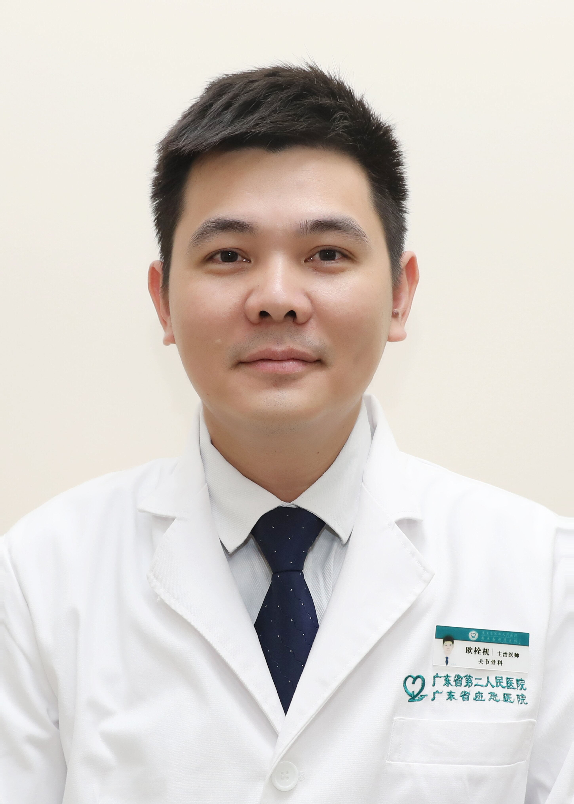

<!-- AUTO-GENERATED-BY: work/generate_obsidian_profiles.py -->

<!-- TEMPLATE: D:\workspace\信息收集整理\医生画像仓库\模板\医生画像模板.md -->

# 欧栓机

## 基础信息

| 字段 | 内容 |
|---|---|
| 姓名 | 欧栓机 |
| 医院 | 广东省第二人民医院 |
| 科室 | 关节骨一科（琶洲院区） |
| 职称/身份 | 副主任医师 |
| 来源链接 | [官网原文](https://gd2h.com/site/detail/41988.html) |
| 采集日期 | 2026-08-15 |

## 简介/擅长

从事临床工作10余年，专注早、中、晚期膝关节骨关节炎的微创及保膝治疗。擅长胫骨高位截骨、单髁置换，在膝关节骨性关节炎的阶梯治疗积累了较多的临床经验，可以根据力线和磨损特点为患者制定个性化的治疗方式，最大程度保护患者自身膝关节结构恢复患者的膝关节功能。擅长治疗O型腿及X型腿。擅长髋、膝、肩、肘、踝关节疾病的微创关节镜治疗，擅长微创髋膝关节置换，擅长股骨头坏死保髋治疗。

## 科研项目与成果

- 科研：近年来主持省部级、厅局级、院级课题3项，发表SCI、核心期刊论文20余篇，获专利3项。

## 论文与学术产出

- 科研：近年来主持省部级、厅局级、院级课题3项，发表SCI、核心期刊论文20余篇，获专利3项。

## 可包装亮点

- 广东省第二人民医院关节骨一科矫形保膝治疗组组长，副主任医师，硕士。
- 社会任职：广东省医学会关节外科学分会青年委员，广东省基层医药学会数字骨科分会常务委员，广东省基层医药学会骨关节外科分会委员。
- 科研：近年来主持省部级、厅局级、院级课题3项，发表SCI、核心期刊论文20余篇，获专利3项。

## 重点疾病/人群标签

- 慢性病：
- 肿瘤：
- 生殖疾病：
- 免疫/风湿：
- 术后恢复/康复：恢复
- 疑难重症：

## 证据摘录

> 只摘录官网公开信息中的短句或关键字段，不复制大段原文。

- 官网身份字段：副主任医师
- 官网简介/擅长：从事临床工作10余年，专注早、中、晚期膝关节骨关节炎的微创及保膝治疗。擅长胫骨高位截骨、单髁置换，在膝关节骨性关节炎的阶梯治疗积累了较多的临床经验，可以根据力线和磨损特点为患者制定个性化的治疗方式，最大程度保护患者自身膝关节结构恢复患者的膝关节功能。擅长治疗O型腿及X型腿。擅长髋、膝、肩、肘、踝关节疾病的微创关节镜治疗，擅长微创髋膝关节置换，擅长股骨头坏死保髋治疗。
- 官网亮眼经历线索：广东省第二人民医院关节骨一科矫形保膝治疗组组长，副主任医师，硕士。 社会任职：广东省医学会关节外科学分会青年委员，广东省基层医药学会数字骨科分会常务委员，广东省基层医药学会骨关节外科分会委员。 科研：近年来主持省部级、厅局级、院级课题3项，发表SCI、核心期刊论文20余篇，获专利3项。
- 来源链接：https://gd2h.com/site/detail/41988.html

## BD 画像摘要

欧栓机医生可作为术后恢复/康复方向的基础画像候选。后续 BD 使用应继续以官网来源和人工复核为准，不添加疗效承诺或无来源包装。

## 合规边界

- 仅使用医院官网、官方公众号、官方小程序等公开渠道。
- 不采集私人电话、私人微信、家庭住址、患者隐私或非公开排班信息。
- 不写“保证治愈”“疗效第一”“包治疑难杂症”等无法由官网证明的表述。
