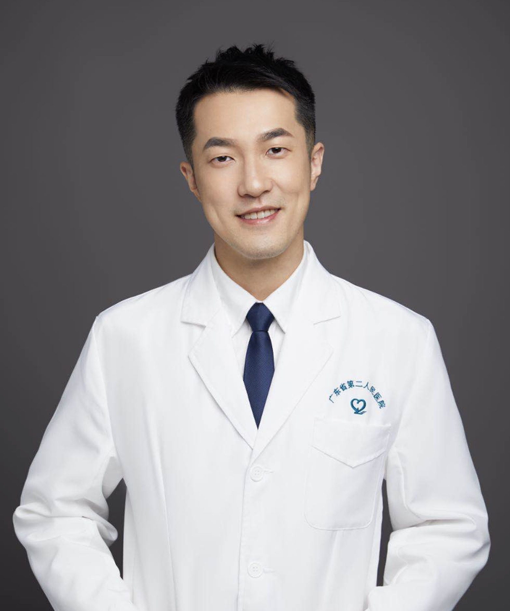

<!-- AUTO-GENERATED-BY: work/generate_obsidian_profiles.py -->

<!-- TEMPLATE: D:\workspace\信息收集整理\医生画像仓库\模板\医生画像模板.md -->

# 洪伟晋

## 基础信息

| 字段 | 内容 |
|---|---|
| 姓名 | 洪伟晋 |
| 医院 | 广东省第二人民医院 |
| 科室 | 整形美容科（琶洲院区） |
| 职称/身份 | 主治医师 |
| 来源链接 | [官网原文](https://gd2h.com/site/detail/42207.html) |
| 采集日期 | 2026-08-15 |

## 简介/擅长

微创注射：玻尿酸、肉毒素注射，注射相关并发症，相关疾病（如手足多汗症、腋下多汗症等）的注射治疗；皮肤年轻化管理，注射并发症处理；体表肿物、瘢痕等；乳房整形：假体隆乳、假体取出、乳房下垂、巨乳缩小等；

## 可包装亮点

- 个人介绍 医学博士 主治医师 广东省第二人民医院整形外科博士微创融合团队负责人 暨南大学讲师 广东省第二届实力中青年医师 中国整形医师协会乳房分会委员 中国妇幼保健协会医疗美容分会委员 广东省整形美容协会青年学术委员会委员 广东省精准医学应用学会精准医美分会常务委员 擅长：微创注射：玻尿酸、肉毒素注射，注射相关并发症，相关疾病（如手足多汗症、腋下多汗症等）…

## 重点疾病/人群标签

- 慢性病：
- 肿瘤：
- 生殖疾病：
- 免疫/风湿：
- 术后恢复/康复：
- 疑难重症：

## 证据摘录

> 只摘录官网公开信息中的短句或关键字段，不复制大段原文。

- 官网身份字段：主治医师
- 官网简介/擅长：微创注射：玻尿酸、肉毒素注射，注射相关并发症，相关疾病（如手足多汗症、腋下多汗症等）的注射治疗；皮肤年轻化管理，注射并发症处理；体表肿物、瘢痕等；乳房整形：假体隆乳、假体取出、乳房下垂、巨乳缩小等；
- 官网亮眼经历线索：个人介绍 医学博士 主治医师 广东省第二人民医院整形外科博士微创融合团队负责人 暨南大学讲师 广东省第二届实力中青年医师 中国整形医师协会乳房分会委员 中国妇幼保健协会医疗美容分会委员 广东省整形美容协会青年学术委员会委员 广东省精准医学应用学会精准医美分会常务委员 擅长：微创注射：玻尿酸、肉毒素注射，注射相关并发症，相关疾病（如手足多汗症、腋下多汗症等）的注射治疗；
- 来源链接：https://gd2h.com/site/detail/42207.html

## BD 画像摘要

洪伟晋医生可作为广东省第二人民医院整形美容科（琶洲院区）的基础医生资料入库。当前重点方向以总底表标签为准，官网未展示的信息保持空白。

## 合规边界

- 仅使用医院官网、官方公众号、官方小程序等公开渠道。
- 不采集私人电话、私人微信、家庭住址、患者隐私或非公开排班信息。
- 不写“保证治愈”“疗效第一”“包治疑难杂症”等无法由官网证明的表述。
