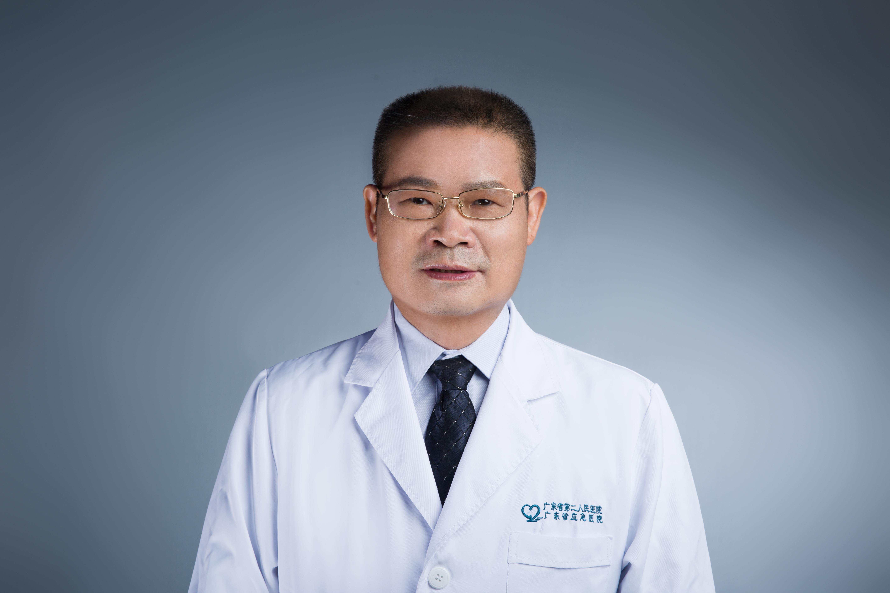

<!-- AUTO-GENERATED-BY: work/generate_obsidian_profiles.py -->

<!-- TEMPLATE: D:\workspace\信息收集整理\医生画像仓库\模板\医生画像模板.md -->

# 温炬

## 基础信息

| 字段 | 内容 |
|---|---|
| 姓名 | 温炬 |
| 医院 | 广东省第二人民医院 |
| 科室 | 皮肤性病科（琶洲院区） |
| 职称/身份 | 主任医师 |
| 来源链接 | [官网原文](https://gd2h.com/site/detail/42111.html) |
| 采集日期 | 2026-08-15 |

## 简介/擅长

擅长免疫性皮肤病、皮肤美容、皮肤肿瘤、白癜风、银屑病、性病；对罕少见疑难皮肤病的诊治有丰富的临床经验。

## 科研项目与成果

- 先后主持和参与各类基金课题20余项；

## 可包装亮点

- 个人介绍 科主任，医学博士，教授，博士生导师，中国医师协会皮肤科分会委员，广东省医学会皮肤科学分会副主委，广东省医师协会皮肤科分会副主委，广东省中西医结合皮肤性病学专业委员会副主委，广东省医学护肤品专业委员会副主委，广东省医疗行业协会皮肤性病管理委员会副主委；
- 广东省性病诊疗质控中心专家，广东省预防接种异常反应调查诊断专家组专家，广东省医学会医学鉴定专家，广州市性病防治技术指导组专家，广州市医学会医疗事故技术鉴定专家；
- 从事皮肤病与性病专业工作30多年，擅长皮肤性病学各类疾病的诊治，对罕少见疑难皮肤病的诊治有丰富的临床经验，对中西医结合诊治皮肤病也有较深入的研究；
- 获广东省科学技术奖三等奖一项，广州市科技进步二等奖一项，广州市科技进步奖三等奖一项；

## 重点疾病/人群标签

- 慢性病：
- 肿瘤：肿瘤、免疫、疑难
- 生殖疾病：
- 免疫/风湿：肿瘤、免疫、疑难
- 术后恢复/康复：
- 疑难重症：肿瘤、免疫、疑难

## 证据摘录

> 只摘录官网公开信息中的短句或关键字段，不复制大段原文。

- 官网身份字段：主任医师
- 官网简介/擅长：擅长免疫性皮肤病、皮肤美容、皮肤肿瘤、白癜风、银屑病、性病；对罕少见疑难皮肤病的诊治有丰富的临床经验。
- 官网亮眼经历线索：个人介绍 科主任，医学博士，教授，博士生导师，中国医师协会皮肤科分会委员，广东省医学会皮肤科学分会副主委，广东省医师协会皮肤科分会副主委，广东省中西医结合皮肤性病学专业委员会副主委，广东省医学护肤品专业委员会副主委，广东省医疗行业协会皮肤性病管理委员会副主委； 广东省性病诊疗质控中心专家，广东省预防接种异常反应调查诊断专家组专家，广东省医学会医学鉴定专家，广州市性病防治技术指导组专家，广州市医学会医疗事故技术鉴定专家； 从事皮肤病与性…
- 来源链接：https://gd2h.com/site/detail/42111.html

## BD 画像摘要

温炬医生可作为肿瘤、免疫/风湿/感染、疑难重症方向的基础画像候选。后续 BD 使用应继续以官网来源和人工复核为准，不添加疗效承诺或无来源包装。

## 合规边界

- 仅使用医院官网、官方公众号、官方小程序等公开渠道。
- 不采集私人电话、私人微信、家庭住址、患者隐私或非公开排班信息。
- 不写“保证治愈”“疗效第一”“包治疑难杂症”等无法由官网证明的表述。
