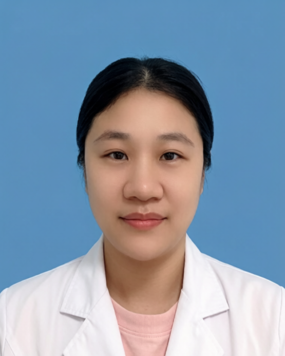

<!-- AUTO-GENERATED-BY: work/generate_obsidian_profiles.py -->

<!-- TEMPLATE: D:\workspace\信息收集整理\医生画像仓库\模板\医生画像模板.md -->

# 潘彧

## 基础信息

| 字段 | 内容 |
|---|---|
| 姓名 | 潘彧 |
| 医院 | 广东省第二人民医院 |
| 科室 | 健康管理（体检）科（民航院区） |
| 职称/身份 | 主治医师 |
| 来源链接 | [官网原文](https://gd2h.com/site/detail/b53652f17be24888a6fa79cb117ae294.html) |
| 采集日期 | 2026-08-15 |

## 简介/擅长

在耳鼻咽喉常见病、多发病的诊治方面积累了扎实的临床经验，尤其专注于航空医学鉴定领域。

## 教育与进修经历

- 广东省第二人民医院民航院区健康管理（体检）科主治医师，毕业于广东医科大学。

## 可包装亮点

- 长期负责飞行员、空乘人员等特殊职业群体的耳鼻咽喉专项体检与健康评估，对航空性耳鼻咽喉疾病（如航空性中耳炎、气压创伤性鼻窦炎、噪声性听力损伤等）的精准诊断与鉴定标准有深入掌握。
- 在耳鼻咽喉科疑难病症的体检鉴定方面积累了丰富而独到的经验，能精准识别潜在风险，为航空安全提供专业保障，同时在变应性鼻炎、慢性鼻窦炎、咽喉反流性疾病的综合治疗方面亦有丰富临床实践。

## 重点疾病/人群标签

- 慢性病：慢性、疑难
- 肿瘤：
- 生殖疾病：
- 免疫/风湿：
- 术后恢复/康复：
- 疑难重症：慢性、疑难

## 证据摘录

> 只摘录官网公开信息中的短句或关键字段，不复制大段原文。

- 官网身份字段：主治医师
- 官网简介/擅长：在耳鼻咽喉常见病、多发病的诊治方面积累了扎实的临床经验，尤其专注于航空医学鉴定领域。
- 官网亮眼经历线索：长期负责飞行员、空乘人员等特殊职业群体的耳鼻咽喉专项体检与健康评估，对航空性耳鼻咽喉疾病（如航空性中耳炎、气压创伤性鼻窦炎、噪声性听力损伤等）的精准诊断与鉴定标准有深入掌握。 在耳鼻咽喉科疑难病症的体检鉴定方面积累了丰富而独到的经验，能精准识别潜在风险，为航空安全提供专业保障，同时在变应性鼻炎、慢性鼻窦炎、咽喉反流性疾病的综合治疗方面亦有丰富临床实践。
- 来源链接：https://gd2h.com/site/detail/b53652f17be24888a6fa79cb117ae294.html

## BD 画像摘要

潘彧医生可作为慢性病、疑难重症方向的基础画像候选。后续 BD 使用应继续以官网来源和人工复核为准，不添加疗效承诺或无来源包装。

## 合规边界

- 仅使用医院官网、官方公众号、官方小程序等公开渠道。
- 不采集私人电话、私人微信、家庭住址、患者隐私或非公开排班信息。
- 不写“保证治愈”“疗效第一”“包治疑难杂症”等无法由官网证明的表述。
