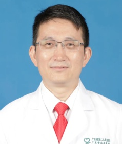

<!-- AUTO-GENERATED-BY: work/generate_obsidian_profiles.py -->

<!-- TEMPLATE: D:\workspace\信息收集整理\医生画像仓库\模板\医生画像模板.md -->

# 焦勇钢

## 基础信息

| 字段 | 内容 |
|---|---|
| 姓名 | 焦勇钢 |
| 医院 | 广东省第二人民医院 |
| 科室 | 神经医学中心（琶洲院区） |
| 职称/身份 | 博士，硕导，副主任医师 |
| 来源链接 | [官网原文](https://gd2h.com/site/detail/42264.html) |
| 采集日期 | 2026-08-15 |

## 简介/擅长

擅长脑血管病及重症脑血管病诊疗，在卒中病房管理及脑卒中中心建设方面有较丰富经验；重点从事缺血性脑卒中超早期静脉溶栓、DSA造影、机械取栓、颅内外血管成形术、动脉溶栓等血管内介入开通治疗，颅内动脉瘤栓塞术、脑出血颅内血肿碎吸术与侧脑室穿刺术等脑血管病超早期微创治疗。

## 科研项目与成果

- 申请到广东省自然科学基金等省市级各类课题7项、主持4项；

## 论文与学术产出

- 在SCI源期刊、中文核心期刊等发表论著近20篇。

## 可包装亮点

- 个人介绍 焦勇钢，广东省第二人民医院神经内科（民航院区）负责人，广东省第二人民医院阳山医院卒中中心建设负责人；
- 博士，副主任医师，硕士研究生导师。
- 广东省中西医结合学会卫生应急学专业委员会副主任委员，广东省基层医药学会脑出血专委会常务委员，广东省临床医学学会认知睡眠障碍防治与脑健康管理专业委员会常务委员，广东省中西医学会神经科专业委员会委员，广东省医院协会神经内科专业委员会委员。
- 在SCI源期刊、中文核心期刊等发表论著近20篇。

## 重点疾病/人群标签

- 慢性病：
- 肿瘤：
- 生殖疾病：
- 免疫/风湿：
- 术后恢复/康复：
- 疑难重症：

## 证据摘录

> 只摘录官网公开信息中的短句或关键字段，不复制大段原文。

- 官网身份字段：博士，硕导，副主任医师
- 官网简介/擅长：擅长脑血管病及重症脑血管病诊疗，在卒中病房管理及脑卒中中心建设方面有较丰富经验；重点从事缺血性脑卒中超早期静脉溶栓、DSA造影、机械取栓、颅内外血管成形术、动脉溶栓等血管内介入开通治疗，颅内动脉瘤栓塞术、脑出血颅内血肿碎吸术与侧脑室穿刺术等脑血管病超早期微创治疗。
- 官网亮眼经历线索：个人介绍 焦勇钢，广东省第二人民医院神经内科（民航院区）负责人，广东省第二人民医院阳山医院卒中中心建设负责人； 博士，副主任医师，硕士研究生导师。 广东省中西医结合学会卫生应急学专业委员会副主任委员，广东省基层医药学会脑出血专委会常务委员，广东省临床医学学会认知睡眠障碍防治与脑健康管理专业委员会常务委员，广东省中西医学会神经科专业委员会委员，广东省医院协会神经内科专业委员会委员。 在SCI源期刊、中文核心期刊等发表论著近20篇。
- 异常提示：同名待甄别
- 来源链接：https://gd2h.com/site/detail/42264.html

## BD 画像摘要

焦勇钢医生可作为广东省第二人民医院神经医学中心（琶洲院区）的基础医生资料入库。当前重点方向以总底表标签为准，官网未展示的信息保持空白。

## 合规边界

- 仅使用医院官网、官方公众号、官方小程序等公开渠道。
- 不采集私人电话、私人微信、家庭住址、患者隐私或非公开排班信息。
- 不写“保证治愈”“疗效第一”“包治疑难杂症”等无法由官网证明的表述。
