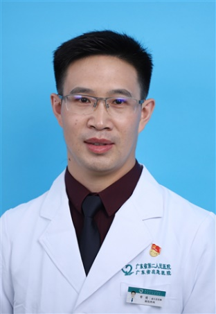

<!-- AUTO-GENERATED-BY: work/generate_obsidian_profiles.py -->

<!-- TEMPLATE: D:\workspace\信息收集整理\医生画像仓库\模板\医生画像模板.md -->

# 牟勇

## 基础信息

| 字段 | 内容 |
|---|---|
| 姓名 | 牟勇 |
| 医院 | 广东省第二人民医院 |
| 科室 | 显微修复骨科（琶洲院区） |
| 职称/身份 | 主任医师 |
| 来源链接 | [官网原文](https://gd2h.com/site/detail/42195.html) |
| 采集日期 | 2026-08-15 |

## 简介/擅长

擅长手术:1. 各种皮肤软组织缺损与难治性创面显微皮瓣修复；2. 各种原因导致的四肢骨折骨不连、骨缺损显微修复；3. 先天性多指、并指矫形；4.四肢血管、神经损伤诊治；5.各种复杂性手、足外伤显微修复重建；6.断肢/指再植与手指缺损的足趾移植再造；7.股骨头坏死诊断与显微修复。

## 科研项目与成果

- 发表学术论文15篇，主持广东省医学科研基金2项，获广东省医学科技进步二等奖2项，中华医学科技二等奖1项。

## 论文与学术产出

- 发表学术论文15篇，主持广东省医学科研基金2项，获广东省医学科技进步二等奖2项，中华医学科技二等奖1项。

## 可包装亮点

- 个人介绍 显微修复骨科负责人，博士研究生，主任医师，暨南大学兼职教授。
- 发表学术论文15篇，主持广东省医学科研基金2项，获广东省医学科技进步二等奖2项，中华医学科技二等奖1项。
- 现任广东省医学会显微外科分会常委，广州市医学会显微外科分会常委，广东省医疗行业协会创伤骨科管理分会常委，SICOT中国部显微修复专业委员会第三届委员会委员，中国医师协会显微外科分会四肢骨缺损组委员，广东省医学会手外科学分会创面修复组委员，广东省医师协会手外科学会委员，广东省临床医学会重症创伤专业委员会委员。

## 重点疾病/人群标签

- 慢性病：糖尿病、慢性、创面、重症、难治、复杂
- 肿瘤：
- 生殖疾病：
- 免疫/风湿：
- 术后恢复/康复：糖尿病、慢性、创面、重症、难治、复杂
- 疑难重症：糖尿病、慢性、创面、重症、难治、复杂

## 证据摘录

> 只摘录官网公开信息中的短句或关键字段，不复制大段原文。

- 官网身份字段：主任医师
- 官网简介/擅长：擅长手术:1. 各种皮肤软组织缺损与难治性创面显微皮瓣修复；2. 各种原因导致的四肢骨折骨不连、骨缺损显微修复；3. 先天性多指、并指矫形；4.四肢血管、神经损伤诊治；5.各种复杂性手、足外伤显微修复重建；6.断肢/指再植与手指缺损的足趾移植再造；7.股骨头坏死诊断与显微修复。
- 官网亮眼经历线索：个人介绍 显微修复骨科负责人，博士研究生，主任医师，暨南大学兼职教授。 发表学术论文15篇，主持广东省医学科研基金2项，获广东省医学科技进步二等奖2项，中华医学科技二等奖1项。 现任广东省医学会显微外科分会常委，广州市医学会显微外科分会常委，广东省医疗行业协会创伤骨科管理分会常委，SICOT中国部显微修复专业委员会第三届委员会委员，中国医师协会显微外科分会四肢骨缺损组委员，广东省医学会手外科学分会创面修复组委员，广东省医师协会手外科学…
- 来源链接：https://gd2h.com/site/detail/42195.html

## BD 画像摘要

牟勇医生可作为慢性病、术后恢复/康复、疑难重症方向的基础画像候选。后续 BD 使用应继续以官网来源和人工复核为准，不添加疗效承诺或无来源包装。

## 合规边界

- 仅使用医院官网、官方公众号、官方小程序等公开渠道。
- 不采集私人电话、私人微信、家庭住址、患者隐私或非公开排班信息。
- 不写“保证治愈”“疗效第一”“包治疑难杂症”等无法由官网证明的表述。
