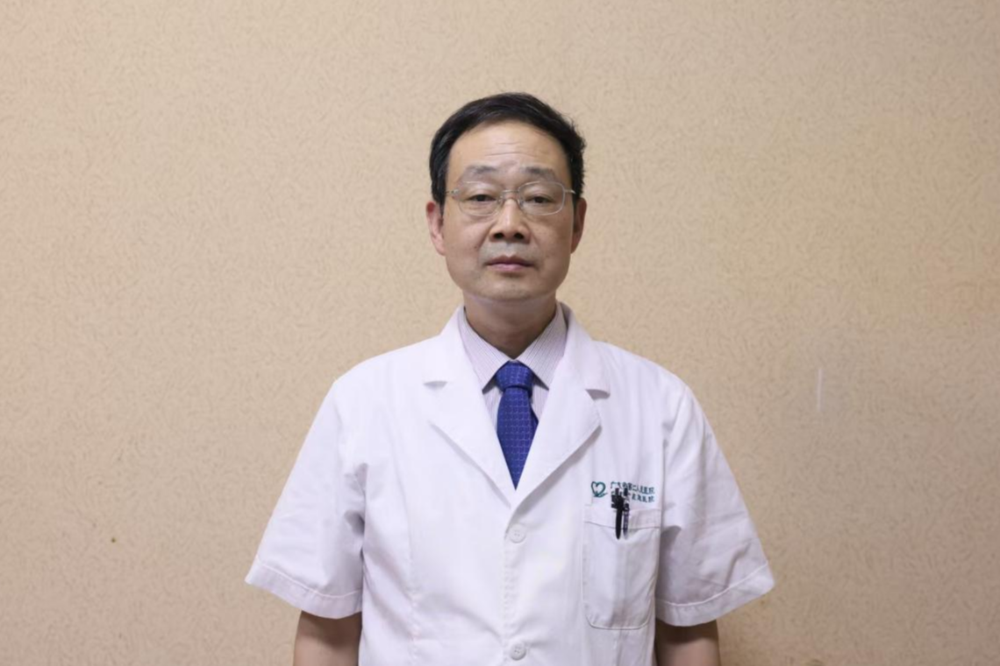

<!-- AUTO-GENERATED-BY: work/generate_obsidian_profiles.py -->

<!-- TEMPLATE: D:\workspace\信息收集整理\医生画像仓库\模板\医生画像模板.md -->

# 王雪峰

## 基础信息

| 字段 | 内容 |
|---|---|
| 姓名 | 王雪峰 |
| 医院 | 广东省第二人民医院 |
| 科室 | 创面再生与修复外科（琶洲院区） |
| 职称/身份 | 副主任医师 |
| 来源链接 | [官网原文](https://gd2h.com/site/detail/be4f48faae1248deaa505618a34b93c6.html) |
| 采集日期 | 2026-08-15 |

## 简介/擅长

## 可包装亮点

- 王雪峰 副主任医师 硕士研究生 专长：各种原因所致烧烫伤的全身治疗、创面修复及瘢痕、畸形的手术治疗；

## 重点疾病/人群标签

- 慢性病：糖尿病、慢性、肿瘤、创面
- 肿瘤：糖尿病、慢性、肿瘤、创面
- 生殖疾病：
- 免疫/风湿：
- 术后恢复/康复：糖尿病、慢性、肿瘤、创面
- 疑难重症：

## 证据摘录

> 只摘录官网公开信息中的短句或关键字段，不复制大段原文。

- 官网身份字段：副主任医师
- 官网亮眼经历线索：王雪峰 副主任医师 硕士研究生 专长：各种原因所致烧烫伤的全身治疗、创面修复及瘢痕、畸形的手术治疗；
- 来源链接：https://gd2h.com/site/detail/be4f48faae1248deaa505618a34b93c6.html

## BD 画像摘要

王雪峰医生可作为慢性病、肿瘤、术后恢复/康复方向的基础画像候选。后续 BD 使用应继续以官网来源和人工复核为准，不添加疗效承诺或无来源包装。

## 合规边界

- 仅使用医院官网、官方公众号、官方小程序等公开渠道。
- 不采集私人电话、私人微信、家庭住址、患者隐私或非公开排班信息。
- 不写“保证治愈”“疗效第一”“包治疑难杂症”等无法由官网证明的表述。
