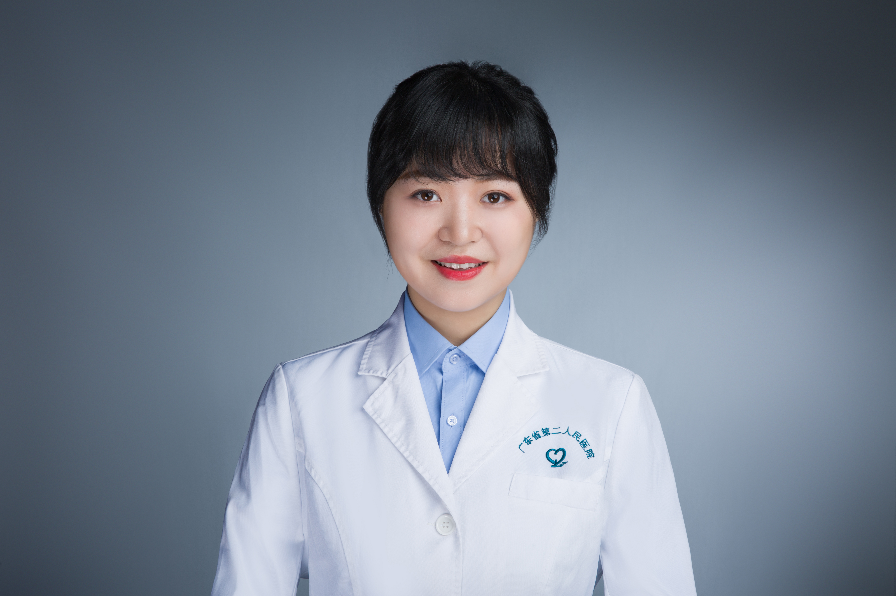

<!-- AUTO-GENERATED-BY: work/generate_obsidian_profiles.py -->

<!-- TEMPLATE: D:\workspace\信息收集整理\医生画像仓库\模板\医生画像模板.md -->

# 秦思

## 基础信息

| 字段 | 内容 |
|---|---|
| 姓名 | 秦思 |
| 医院 | 广东省第二人民医院 |
| 科室 | 皮肤性病科（琶洲院区） |
| 职称/身份 | 副主任医师 |
| 来源链接 | [官网原文](https://gd2h.com/site/detail/42115.html) |
| 采集日期 | 2026-08-15 |

## 简介/擅长

，擅长痤疮、脱发、尖锐湿疣及皮肤光老化（色斑、皱纹、毛孔粗大等）的综合治疗。

## 教育与进修经历

- 南方医科大学皮肤病与性病学硕士毕业，在职博士研究生。

## 科研项目与成果

- 参与省、市级科研基金项目6项。

## 论文与学术产出

- 在国内外发表学术论文20余篇，其中SCI 5篇。

## 可包装亮点

- 个人介绍 副教授，硕士生导师。
- 在国内外发表学术论文20余篇，其中SCI 5篇。
- 学术任职：广东省医学会皮肤性病学分会银屑病学组副组长、广东省中西医结合学会皮肤性病专业委员会常务委员、广东省保健协会皮肤保健与美容分会常务委员、广东省医学会激光医学分会青年委员、广东省整形美容协会青年委员会委员、广东省临床医学学会互联网医院专业委员会委员、《Medical Exploration》编委等。
- 获中华医学会皮肤性病学分会“抗疫先进个人”称号。

## 重点疾病/人群标签

- 慢性病：
- 肿瘤：肿瘤
- 生殖疾病：
- 免疫/风湿：
- 术后恢复/康复：
- 疑难重症：

## 证据摘录

> 只摘录官网公开信息中的短句或关键字段，不复制大段原文。

- 官网身份字段：副主任医师
- 官网简介/擅长：，擅长痤疮、脱发、尖锐湿疣及皮肤光老化（色斑、皱纹、毛孔粗大等）的综合治疗。
- 官网亮眼经历线索：个人介绍 副教授，硕士生导师。 在国内外发表学术论文20余篇，其中SCI 5篇。 学术任职：广东省医学会皮肤性病学分会银屑病学组副组长、广东省中西医结合学会皮肤性病专业委员会常务委员、广东省保健协会皮肤保健与美容分会常务委员、广东省医学会激光医学分会青年委员、广东省整形美容协会青年委员会委员、广东省临床医学学会互联网医院专业委员会委员、《Medical Exploration》编委等。 获中华医学会皮肤性病学分会“抗疫先进个人”称号。
- 来源链接：https://gd2h.com/site/detail/42115.html

## BD 画像摘要

秦思医生可作为肿瘤方向的基础画像候选。后续 BD 使用应继续以官网来源和人工复核为准，不添加疗效承诺或无来源包装。

## 合规边界

- 仅使用医院官网、官方公众号、官方小程序等公开渠道。
- 不采集私人电话、私人微信、家庭住址、患者隐私或非公开排班信息。
- 不写“保证治愈”“疗效第一”“包治疑难杂症”等无法由官网证明的表述。
