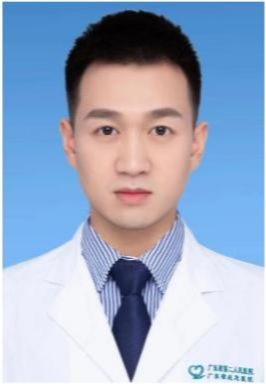

<!-- AUTO-GENERATED-BY: work/generate_obsidian_profiles.py -->

<!-- TEMPLATE: D:\workspace\信息收集整理\医生画像仓库\模板\医生画像模板.md -->

# 章泽稷

## 基础信息

| 字段 | 内容 |
|---|---|
| 姓名 | 章泽稷 |
| 医院 | 广东省第二人民医院 |
| 科室 | 肿瘤微创综合治疗中心（民航院区） |
| 职称/身份 | 住院医师 |
| 来源链接 | [官网原文](https://gd2h.com/site/detail/5d5810120a774bc8be10155fbd43708b.html) |
| 采集日期 | 2026-08-15 |

## 简介/擅长

甲状腺癌及结节腔镜微创手术（经乳晕/经口无痕手术）、乳腺肿瘤麦默通微创旋切术、甲状旁腺疾病精准微创治疗及晚期实体肿瘤多学科综合管理（MDT）。

## 教育与进修经历

- 毕业于中山大学医学院并获医学硕士学位，现任广州市抗癌协会委员。

## 科研项目与成果

- 立足临床与科研双轮驱动，将前沿微创技术与快速康复外科（ERAS）理念应用于临床，以精湛医术与人文匠心护佑患者生理与心理健康。

## 论文与学术产出

- 紧跟国际实体肿瘤规范化诊疗指南，在国内外权威期刊发表多篇学术论文（含IF=4的高质量SCI论文）。

## 可包装亮点

- 践行“微创、无痛、保留功能与美观”的现代医疗理念，专注于甲状腺、乳腺等实体肿瘤的微创与规范化诊疗，致力于为患者提供精准、无痕、舒适的高质量医疗服务。
- 依托MDT多学科诊疗平台，为消化道及各类晚期实体肿瘤患者制定靶向、免疫及微创综合治疗方案。
- 毕业于中山大学医学院并获医学硕士学位，现任广州市抗癌协会委员。
- 紧跟国际实体肿瘤规范化诊疗指南，在国内外权威期刊发表多篇学术论文（含IF=4的高质量SCI论文）。

## 重点疾病/人群标签

- 慢性病：
- 肿瘤：肿瘤、癌、瘤、靶向、免疫、康复、多学科、MDT
- 生殖疾病：
- 免疫/风湿：肿瘤、癌、瘤、靶向、免疫、康复、多学科、MDT
- 术后恢复/康复：肿瘤、癌、瘤、靶向、免疫、康复、多学科、MDT
- 疑难重症：肿瘤、癌、瘤、靶向、免疫、康复、多学科、MDT

## 证据摘录

> 只摘录官网公开信息中的短句或关键字段，不复制大段原文。

- 官网身份字段：住院医师
- 官网简介/擅长：甲状腺癌及结节腔镜微创手术（经乳晕/经口无痕手术）、乳腺肿瘤麦默通微创旋切术、甲状旁腺疾病精准微创治疗及晚期实体肿瘤多学科综合管理（MDT）。
- 官网亮眼经历线索：践行“微创、无痛、保留功能与美观”的现代医疗理念，专注于甲状腺、乳腺等实体肿瘤的微创与规范化诊疗，致力于为患者提供精准、无痕、舒适的高质量医疗服务。 依托MDT多学科诊疗平台，为消化道及各类晚期实体肿瘤患者制定靶向、免疫及微创综合治疗方案。 毕业于中山大学医学院并获医学硕士学位，现任广州市抗癌协会委员。 紧跟国际实体肿瘤规范化诊疗指南，在国内外权威期刊发表多篇学术论文（含IF=4的高质量SCI论文）。
- 来源链接：https://gd2h.com/site/detail/5d5810120a774bc8be10155fbd43708b.html

## BD 画像摘要

章泽稷医生可作为肿瘤、免疫/风湿/感染、术后恢复/康复、疑难重症方向的基础画像候选。后续 BD 使用应继续以官网来源和人工复核为准，不添加疗效承诺或无来源包装。

## 合规边界

- 仅使用医院官网、官方公众号、官方小程序等公开渠道。
- 不采集私人电话、私人微信、家庭住址、患者隐私或非公开排班信息。
- 不写“保证治愈”“疗效第一”“包治疑难杂症”等无法由官网证明的表述。
