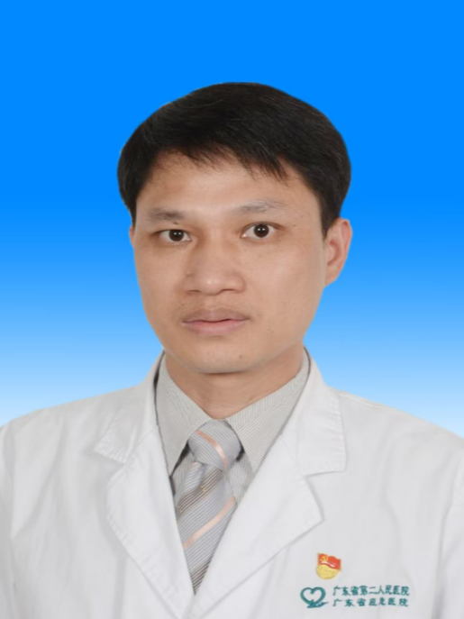

<!-- AUTO-GENERATED-BY: work/generate_obsidian_profiles.py -->

<!-- TEMPLATE: D:\workspace\信息收集整理\医生画像仓库\模板\医生画像模板.md -->

# 罗伟丰

## 基础信息

| 字段 | 内容 |
|---|---|
| 姓名 | 罗伟丰 |
| 医院 | 广东省第二人民医院 |
| 科室 | 骨科（民航院区） |
| 职称/身份 | 主治医师 |
| 来源链接 | [官网原文](https://gd2h.com/site/detail/9f78964b3e4e4238af17a730772172e0.html) |
| 采集日期 | 2026-08-15 |

## 简介/擅长

擅长直接前方入路（DAA）及后外侧入路全髋关节、人工股骨头置换术；膝关节微创单髁置换（UKA）及全膝关节置换术；肩、肘、踝关节置换术；关节镜微创手术；骨质疏松及骨质疏松性骨折（脊柱椎体骨折经皮椎体成形术、髋部骨折内固定及关节置换术等）的综合治疗。

## 可包装亮点

- 现任广东省医学会显微外科学分会青年委员会委员、广东省基层医药学会骨关节外科专业委员会委员、广东省医疗行业协会伤口管理分会委员、广州市医院协会运动医学专业工作委员会委员。

## 重点疾病/人群标签

- 慢性病：糖尿病、慢性、康复、创面、伤口
- 肿瘤：
- 生殖疾病：
- 免疫/风湿：
- 术后恢复/康复：糖尿病、慢性、康复、创面、伤口
- 疑难重症：

## 证据摘录

> 只摘录官网公开信息中的短句或关键字段，不复制大段原文。

- 官网身份字段：主治医师
- 官网简介/擅长：擅长直接前方入路（DAA）及后外侧入路全髋关节、人工股骨头置换术；膝关节微创单髁置换（UKA）及全膝关节置换术；肩、肘、踝关节置换术；关节镜微创手术；骨质疏松及骨质疏松性骨折（脊柱椎体骨折经皮椎体成形术、髋部骨折内固定及关节置换术等）的综合治疗。
- 官网亮眼经历线索：现任广东省医学会显微外科学分会青年委员会委员、广东省基层医药学会骨关节外科专业委员会委员、广东省医疗行业协会伤口管理分会委员、广州市医院协会运动医学专业工作委员会委员。
- 来源链接：https://gd2h.com/site/detail/9f78964b3e4e4238af17a730772172e0.html

## BD 画像摘要

罗伟丰医生可作为慢性病、术后恢复/康复方向的基础画像候选。后续 BD 使用应继续以官网来源和人工复核为准，不添加疗效承诺或无来源包装。

## 合规边界

- 仅使用医院官网、官方公众号、官方小程序等公开渠道。
- 不采集私人电话、私人微信、家庭住址、患者隐私或非公开排班信息。
- 不写“保证治愈”“疗效第一”“包治疑难杂症”等无法由官网证明的表述。
