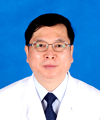

<!-- AUTO-GENERATED-BY: work/generate_obsidian_profiles.py -->

<!-- TEMPLATE: D:\workspace\信息收集整理\医生画像仓库\模板\医生画像模板.md -->

# 罗盛康

## 基础信息

| 字段 | 内容 |
|---|---|
| 姓名 | 罗盛康 |
| 医院 | 广东省第二人民医院 |
| 科室 | 整形美容科（琶洲院区） |
| 职称/身份 | 主任医师 |
| 来源链接 | [官网原文](https://gd2h.com/site/detail/42197.html) |
| 采集日期 | 2026-08-15 |

## 简介/擅长

从事整形美容外科专业30余年，在乳房整形、显微外科皮瓣移植、面部无创注射美容及并发症处理等方面具有丰富的临床经验。

## 教育与进修经历

- 曾在瑞士洛桑大学医学院(CHUV)整形外科、美国加州大学圣地亚哥分校医学院(UCSD)整形外科从事临床、科研工作，获得瑞士洛桑大学医学院(CHUV)整形外科博士学位。

## 科研项目与成果

- 曾在瑞士洛桑大学医学院(CHUV)整形外科、美国加州大学圣地亚哥分校医学院(UCSD)整形外科从事临床、科研工作，获得瑞士洛桑大学医学院(CHUV)整形外科博士学位。
- 从事整形美容外科专业30余年，在乳房整形、显微外科皮瓣移植、面部无创注射美容及并发症处理等方面具有丰富的临床经验，手术技巧精湛，获军队、省级科技进步二等奖4项，军队、省级科技进步三等奖3项，主持国家、省级科研课题4项，在国内外著名专业杂志发表论文80余篇，其中SCI论文15篇。

## 论文与学术产出

- 从事整形美容外科专业30余年，在乳房整形、显微外科皮瓣移植、面部无创注射美容及并发症处理等方面具有丰富的临床经验，手术技巧精湛，获军队、省级科技进步二等奖4项，军队、省级科技进步三等奖3项，主持国家、省级科研课题4项，在国内外著名专业杂志发表论文80余篇，其中SCI论文15篇。
- 现任：中国整形美容协会乳房整形分会会长、中国整形美容协会脂肪医学分会副会长、中国整形美容协会微创与皮肤整形美容分会副会长、中华医学会整形外科学分会乳房整形美容学组副组长、中国整形美容协会常务理事、广东省医学会医学美容学分会前任主任委员,《中华显微外科杂志》、《中国临床解剖杂志》、美国整形外科杂志《Plastic and Reconstructive Surgery》（PRS）特约审稿人，《中华医学美学美容杂志》2019年度期刊专栏执行主编，《中华整形外科杂志》第六届编辑委员会编辑委员，《中国美容整形外科杂志》第八…

## 可包装亮点

- 个人介绍 整形美容科主任，主任医师，博士研究生导师，国务院特殊津贴专家。
- 曾在瑞士洛桑大学医学院(CHUV)整形外科、美国加州大学圣地亚哥分校医学院(UCSD)整形外科从事临床、科研工作，获得瑞士洛桑大学医学院(CHUV)整形外科博士学位。
- 从事整形美容外科专业30余年，在乳房整形、显微外科皮瓣移植、面部无创注射美容及并发症处理等方面具有丰富的临床经验，手术技巧精湛，获军队、省级科技进步二等奖4项，军队、省级科技进步三等奖3项，主持国家、省级科研课题4项，在国内外著名专业杂志发表论文80余篇，其中SCI论文15篇。
- 现任：中国整形美容协会乳房整形分会会长、中国整形美容协会脂肪医学分会副会长、中国整形美容协会微创与皮肤整形美容分会副会长、中华医学会整形外科学分会乳房整形美容学组副组长、中国整形美容协会常务理事、广东省医学会医学美容学分会前任主任委员,《中华显微外科杂志》、《中国临床解剖杂志》、美国整形外科杂志《Plastic...

## 重点疾病/人群标签

- 慢性病：
- 肿瘤：
- 生殖疾病：
- 免疫/风湿：
- 术后恢复/康复：
- 疑难重症：

## 证据摘录

> 只摘录官网公开信息中的短句或关键字段，不复制大段原文。

- 官网身份字段：主任医师
- 官网简介/擅长：从事整形美容外科专业30余年，在乳房整形、显微外科皮瓣移植、面部无创注射美容及并发症处理等方面具有丰富的临床经验。
- 官网亮眼经历线索：个人介绍 整形美容科主任，主任医师，博士研究生导师，国务院特殊津贴专家。 曾在瑞士洛桑大学医学院(CHUV)整形外科、美国加州大学圣地亚哥分校医学院(UCSD)整形外科从事临床、科研工作，获得瑞士洛桑大学医学院(CHUV)整形外科博士学位。 从事整形美容外科专业30余年，在乳房整形、显微外科皮瓣移植、面部无创注射美容及并发症处理等方面具有丰富的临床经验，手术技巧精湛，获军队、省级科技进步二等奖4项，军队、省级科技进步三等奖3项，主持国…
- 来源链接：https://gd2h.com/site/detail/42197.html

## BD 画像摘要

罗盛康医生可作为广东省第二人民医院整形美容科（琶洲院区）的基础医生资料入库。当前重点方向以总底表标签为准，官网未展示的信息保持空白。

## 合规边界

- 仅使用医院官网、官方公众号、官方小程序等公开渠道。
- 不采集私人电话、私人微信、家庭住址、患者隐私或非公开排班信息。
- 不写“保证治愈”“疗效第一”“包治疑难杂症”等无法由官网证明的表述。
