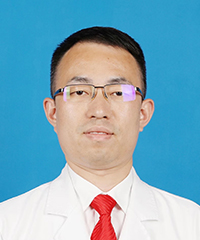

<!-- AUTO-GENERATED-BY: work/generate_obsidian_profiles.py -->

<!-- TEMPLATE: D:\workspace\信息收集整理\医生画像仓库\模板\医生画像模板.md -->

# 聂大奥

## 基础信息

| 字段 | 内容 |
|---|---|
| 姓名 | 聂大奥 |
| 医院 | 广东省第二人民医院 |
| 科室 | 神经医学中心（琶洲院区） |
| 职称/身份 | 主任医师 |
| 来源链接 | [官网原文](https://gd2h.com/site/detail/42256.html) |
| 采集日期 | 2026-08-15 |

## 简介/擅长

擅长脑血管病、脑炎、睡眠障碍、痴呆、颅内感染等疾病的诊断与治疗。中国医药教育协会脑卒中血运重建专业委员会委员;中国微循环学会神经变性病专业委员会脑积水学组委员

## 教育与进修经历

- 曾在首都医学大学宣武医院进修，熟练开展脑血管病的介入治疗，擅长脑血管病、脑炎、睡眠障碍、痴呆、颅内感染等疾病的诊断与治疗。

## 科研项目与成果

- 个人介绍 神经内科组负责人，神经内科副主任医师，硕士生导师，主持及参与多项国家自然基金、广东省医学科研基金、广东省科技计划项目及医院青年基金支持项目的研究工作，在各类期刊发表多篇学术论文。

## 论文与学术产出

- 个人介绍 神经内科组负责人，神经内科副主任医师，硕士生导师，主持及参与多项国家自然基金、广东省医学科研基金、广东省科技计划项目及医院青年基金支持项目的研究工作，在各类期刊发表多篇学术论文。

## 可包装亮点

- 个人介绍 神经内科组负责人，神经内科副主任医师，硕士生导师，主持及参与多项国家自然基金、广东省医学科研基金、广东省科技计划项目及医院青年基金支持项目的研究工作，在各类期刊发表多篇学术论文。
- 曾在首都医学大学宣武医院进修，熟练开展脑血管病的介入治疗，擅长脑血管病、脑炎、睡眠障碍、痴呆、颅内感染等疾病的诊断与治疗。
- 中国医药教育协会脑卒中血运重建专业委员会委员;
- 中国微循环学会神经变性病专业委员会脑积水学组委员

## 重点疾病/人群标签

- 慢性病：
- 肿瘤：
- 生殖疾病：
- 免疫/风湿：感染
- 术后恢复/康复：
- 疑难重症：

## 证据摘录

> 只摘录官网公开信息中的短句或关键字段，不复制大段原文。

- 官网身份字段：主任医师
- 官网简介/擅长：擅长脑血管病、脑炎、睡眠障碍、痴呆、颅内感染等疾病的诊断与治疗。中国医药教育协会脑卒中血运重建专业委员会委员;中国微循环学会神经变性病专业委员会脑积水学组委员
- 官网亮眼经历线索：个人介绍 神经内科组负责人，神经内科副主任医师，硕士生导师，主持及参与多项国家自然基金、广东省医学科研基金、广东省科技计划项目及医院青年基金支持项目的研究工作，在各类期刊发表多篇学术论文。 曾在首都医学大学宣武医院进修，熟练开展脑血管病的介入治疗，擅长脑血管病、脑炎、睡眠障碍、痴呆、颅内感染等疾病的诊断与治疗。 中国医药教育协会脑卒中血运重建专业委员会委员; 中国微循环学会神经变性病专业委员会脑积水学组委员
- 来源链接：https://gd2h.com/site/detail/42256.html

## BD 画像摘要

聂大奥医生可作为免疫/风湿/感染方向的基础画像候选。后续 BD 使用应继续以官网来源和人工复核为准，不添加疗效承诺或无来源包装。

## 合规边界

- 仅使用医院官网、官方公众号、官方小程序等公开渠道。
- 不采集私人电话、私人微信、家庭住址、患者隐私或非公开排班信息。
- 不写“保证治愈”“疗效第一”“包治疑难杂症”等无法由官网证明的表述。
